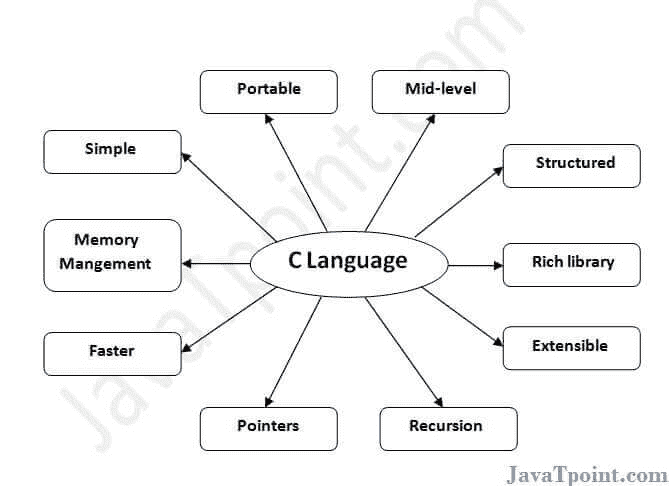

# C 语言的特点

> 原文：<https://www.javatpoint.com/features-of-c-language>

c 是广泛使用的语言。它提供了许多**功能**，如下所示。

1.  简单的
2.  独立于机器还是便携式
3.  中级编程语言
4.  结构化程序设计语言
5.  丰富的图书馆
6.  内存管理
7.  快速
8.  两颗北极指极星
9.  递归
10.  可扩张的

* * *

## 1)简单

c 是一种简单的语言，因为它提供了一种**结构化方法**(将问题分解成若干部分)**丰富的库函数集**、**数据类型**等。

* * *

## 2)机器独立或便携式

与汇编语言不同，c 程序**可以在不同的机器**上执行，但有一些机器特定的变化。因此，C 语言是一种独立于机器的语言。

* * *

## 3)中级编程语言

虽然，C 是**意在做低级编程**。用于开发系统应用，如内核、驱动等。它**也支持高级语言**的特性。这就是为什么它被称为中级语言。

* * *

## 4)结构化编程语言

c 是一种结构化的编程语言，从这个意义上来说**我们可以使用函数**将程序分解成多个部分。所以，很容易理解和修改。函数还提供代码可重用性。

* * *

## 5)丰富的图书馆

C **提供了很多内置的功能**让开发变得很快。

* * *

## 6)内存管理

支持**动态内存分配**功能。在 C 语言中，我们可以通过调用 **free()** 函数随时释放分配的内存。

* * *

## 7)速度

C 语言的编译和执行时间很快，因为内置函数较少，因此开销较小。

* * *

## 8)指针

c 提供了指针的特性。我们可以使用指针直接与内存交互。我们**可以将指针用于内存、结构、函数、数组**等。

* * *

## 9)递归

在 C 语言中，我们**可以调用函数**内的函数。它为每个功能提供代码可重用性。递归使我们能够使用回溯的方法。

* * *

## 10)可扩展

c 语言是可扩展的，因为它**可以很容易地采用新的特性**。

* * *