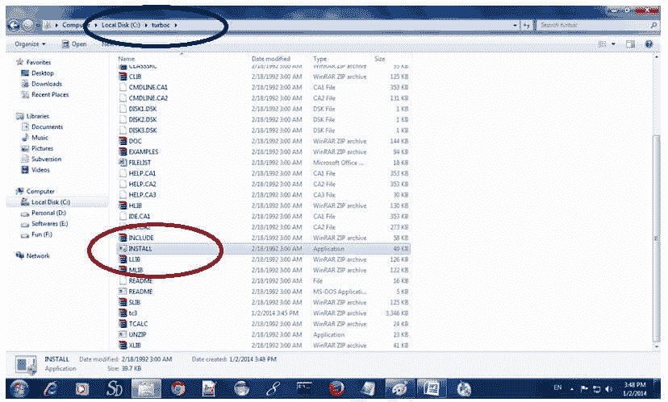
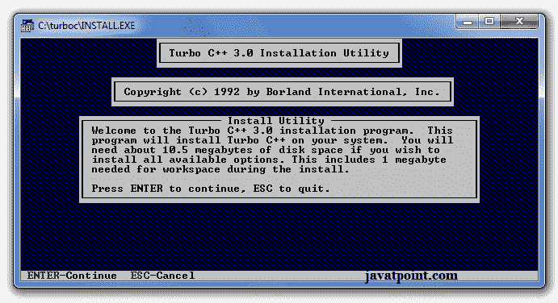
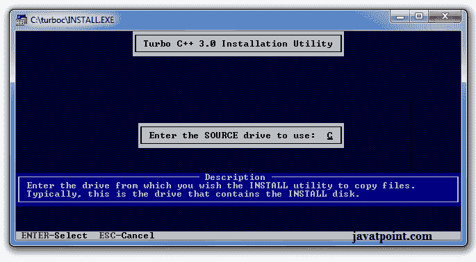
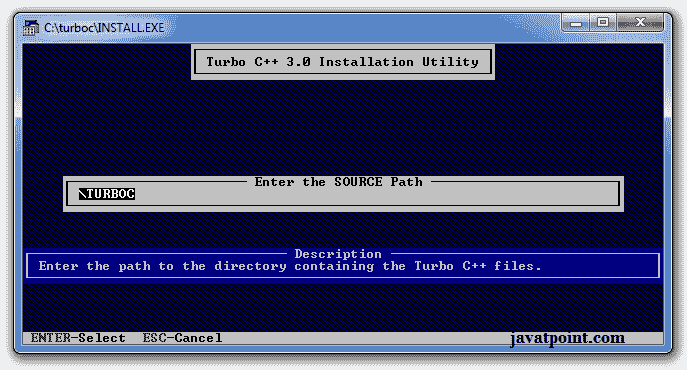
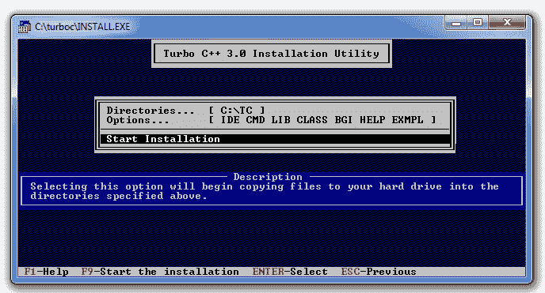
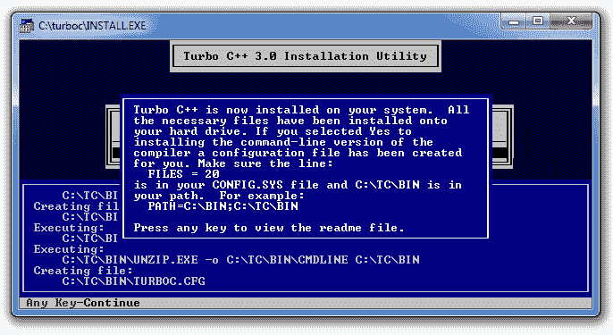
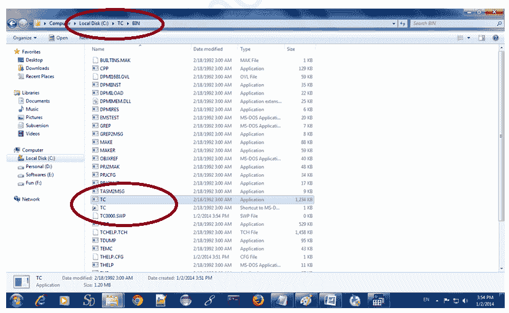
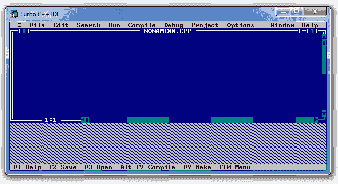

# 如何安装

> 原文：<https://www.javatpoint.com/how-to-install-c>

有许多编译器可用于 c 和 c++。你需要下载任何一个。在这里，我们将使用 **Turbo C++** 。它将适用于 C 和 C++。要安装 Turbo C 软件，您需要遵循以下步骤。

1.  下载 Turbo C++
2.  在 c drive 中创建涡轮目录，并提取 c:\涡轮中的 tc3.zip
3.  双击 install.exe 文件
4.  点击 c:\tc\BIN 里面的 TC 应用文件，编写 c 程序

## 1)下载 Turbo C++ 软件

你可以从很多网站下载 turbo c++。[下载 Turbo c++](https://static.javatpoint.com/cpages/software/tc3.zip)

## 2)在 c 盘创建涡轮目录，并提取 tc3.zip

现在，您需要在 c: drive 内部创建一个新的目录涡轮。现在提取 c:\truboc 目录中的 tc3.zip 文件。

## 3)双击 install.exe 文件并按照步骤操作

现在，点击位于 c:\涡轮内部的安装图标

它会要求你安装 c 与否，按回车键安装。

把你的驱动器换成 c，按 c。

按 enter 键，它将在 c:\ turbo 目录中查找所需的文件。

通过向下箭头键选择开始安装，然后按回车键。

现在安装了 C，按回车键阅读文档或关闭软件。

## 4)点击位于 c:\tc\BIN 中的 TC 应用程序

现在双击位于 c:\tc\BIN 目录中的 TC 图标来编写 c 程序。

在 windows 7 或 windows 8 中，它会显示一个对话框来忽略和关闭应用程序，因为不支持全屏模式。点击忽略按钮。

现在它将显示以下控制台。

* * *