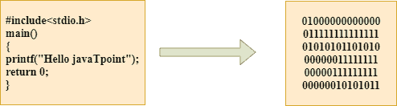

# c 语言编译过程

> 原文：<https://www.javatpoint.com/compilation-process-in-c>

## 什么是编译？

编译是将源代码转换为目标代码的过程。这是在编译器的帮助下完成的。编译器检查源代码的语法或结构错误，如果源代码没有错误，则生成目标代码。



c 编译过程将作为输入的源代码转换成目标代码或机器代码。编译过程可以分为四个步骤，即预处理、编译、组装和链接。

预处理器将源代码作为输入，并从源代码中移除所有注释。预处理器接受预处理器指令并解释它。例如，如果 **< stdio.h >、**指令在程序中可用，那么预处理器解释该指令并用**“stdio . h”**文件的内容替换该指令。

以下是我们的程序在转换成可执行形式之前所经过的阶段:

*   **预处理器**
*   **编译器**
*   **组装工**
*   **左**


### 预处理程序

源代码是在文本编辑器中编写的代码，源代码文件有扩展名”。c”。这个源代码首先被传递给预处理器，然后预处理器扩展这个代码。扩展代码后，扩展的代码被传递给编译器。

### 编译程序

由预处理器扩展的代码被传递给编译器。编译器将此代码转换为汇编代码。或者我们可以说 C 编译器把预处理过的代码转换成汇编代码。

### 装配工

汇编代码通过使用汇编程序转换成目标代码。汇编程序生成的目标文件的名称与源文件相同。DOS 中目标文件的扩展名为“”。在 UNIX 中，扩展名是“o”。如果源文件的名称是**‘hello . c’，**，那么目标文件的名称将是‘hello . obj’。

### 连接物

主要是所有用 C 写的程序都用库函数。这些库函数是预编译的，这些库文件的目标代码是用'存储的。lib '(或'。a’)扩展。链接器的主要工作是将库文件的目标代码与我们程序的目标代码相结合。有时，当我们的程序引用其他文件中定义的函数时，就会出现这种情况；那么链接器在其中起着非常重要的作用。它将这些文件的目标代码链接到我们的程序。因此，我们得出结论，链接器的工作是将我们程序的目标代码与库文件和其他文件的目标代码链接起来。链接器的输出是可执行文件。可执行文件的名称与源文件相同，只是扩展名不同。在 DOS 下，可执行文件的扩展名是' '。在 UNIX 中，可执行文件可以命名为“a.out”。例如，如果我们在程序中使用 printf()函数，则链接器会在输出文件中添加其关联代码。

**我们通过一个例子来了解一下。**

**哈啰 c**

```

#include int main()
{
    printf("Hello javaTpoint");
    return 0;
} 
```

**现在，我们将创建上述程序的流程图:**


**在上述流程图中，执行程序采取以下步骤:**

*   首先将输入文件，即 **hello.c、**传递给预处理器，预处理器将源代码转换为扩展源代码。扩展源代码的扩展将是**你好，我是**
*   扩展的源代码被传递给编译器，编译器将这个扩展的源代码转换成汇编代码。汇编代码的扩展将是 **hello.s.**
*   这个汇编代码然后被发送到汇编器，汇编器将汇编代码转换成目标代码。
*   创建目标代码后，链接器创建可执行文件。然后，加载程序将加载可执行文件以供执行。

* * *