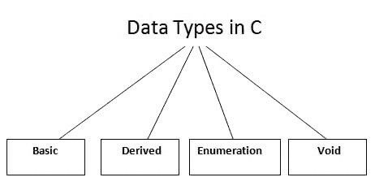

# C 语言中的数据类型

> 原文：<https://www.javatpoint.com/data-types-in-c>

数据类型指定变量可以存储的数据类型，如整数、浮点、字符等。

C 语言中有以下数据类型。

| 类型 | 数据类型 |
| 基本数据类型 | int、char、float、double |
| 派生数据类型 | 数组、指针、结构、联合 |
| 枚举数据类型 | 列举型别 |
| 无效数据类型 | 空的 |

## 基本数据类型

基本数据类型是基于整数和基于浮点的。c 语言支持有符号和无符号文字。

基本数据类型的内存大小可能会根据 32 位或 64 位操作系统而变化。

让我们看看基本的数据类型。其大小根据 32 位架构给出**。**

| 数据类型 | 存储容量 | 范围 |
| **充电** | 1 字节 | 128 至 127 |
| 有符号字符 | 1 字节 | 128 至 127 |
| 无符号字符 | 1 字节 | 0 到 255 |
| **短** | 2 字节 | 32，768 至 32，767 |
| 签名短 | 2 字节 | 32，768 至 32，767 |
| 无符号短 | 2 字节 | 0 至 65，535 |
| **int** | 2 字节 | 32，768 至 32，767 |
| 带符号整数 | 2 字节 | 32，768 至 32，767 |
| 无符号整数 | 2 字节 | 0 至 65，535 |
| **短整型** | 2 字节 | 32，768 至 32，767 |
| 带符号短整型 | 2 字节 | 32，768 至 32，767 |
| 无符号短整型 | 2 字节 | 0 至 65，535 |
| **长 int** | 4 字节 | -2，147，483，648 至 2，147，483，647 |
| 带符号长整型 | 4 字节 | -2，147，483，648 至 2，147，483，647 |
| 无符号长整型 | 4 字节 | 0 至 4，294，967，295 |
| **浮动** | 4 字节 |  |
| **加倍** | 8 字节 |  |
| **长双** | 10 字节 |  |