# C 格式说明符

> 原文：<https://www.javatpoint.com/c-format-specifier>

格式说明符是格式化输入和输出函数中使用的字符串。格式字符串决定了输入和输出的格式。格式字符串总是以“%”字符开头。

**printf()函数中常用的格式说明符有:**

| 格式规范 | 描述 |
| %d 或%i | 它用于打印有符号整数值，其中有符号整数值意味着变量可以同时包含正值和负值。 |
| %u | 它用于打印无符号整数值，其中无符号整数表示变量只能保存正值。 |
| %o | 它用于打印八进制无符号整数，其中八进制整数值总是以 0 值开始。 |
| %x | 它用于打印十六进制无符号整数，其中十六进制整数值总是以 0x 值开始。在这种情况下，字母字符以小字母打印，如 a、b、c 等。 |
| %X | 它用于打印十六进制无符号整数，但%X 打印大写字母字符，如 A、B、C 等。 |
| %f | 它用于打印十进制浮点值。默认情况下，它在“.”后打印 6 个值。 |
| %e/%E | 它用于科学符号。它也被称为尾数或指数。 |
| %g | 它用于打印十进制浮点值，并使用固定精度，即输入中小数点后的值将与输出中的值完全相同。 |
| %p | 它用于以十六进制形式打印地址。 |
| %c | 它用于打印无符号字符。 |
| %s | 它用于打印字符串。 |
| %ld | 它用于打印长符号整数值。 |

**我们通过一个例子来详细了解格式说明符。**

*   **%d**

```
int main()
{
  int b=6;
  int c=8;
  printf("Value of b is:%d", b);
  printf("\nValue of c is:%d",c);

    return 0;
}

```

在上面的代码中，我们通过使用%d 说明符来打印 b 和 c 的整数值。

**输出**

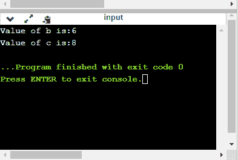

*   **%u**

```
int main()
{
  int b=10;
  int c= -10;
  printf("Value of b is:%u", b);
  printf("\nValue of c is:%u",c);

    return 0;
}

```

在上面的程序中，我们通过使用无符号格式说明符，即%u 来显示 b 和 c 的值，b 的值是正的，所以%u 说明符打印 b 的精确值，但它不打印 c 的值，因为 c 包含负值。

**输出**

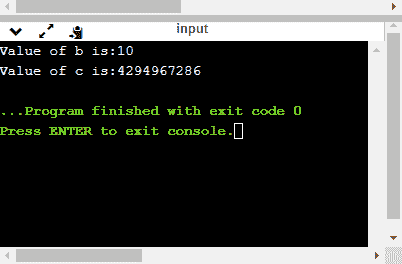

*   **%o**

```
int main()
{
  int a=0100;
  printf("Octal value of a is: %o", a);
  printf("\nInteger value of a is: %d",a);
  return 0;
}

```

在上面的代码中，我们显示了 a 的八进制值和整数值。

**输出**

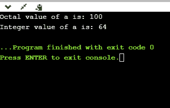

*   **%x 和%X**

```
int main()
{
  int y=0xA;
  printf("Hexadecimal value of y is: %x", y);
  printf("\nHexadecimal value of y is: %X",y);
  printf("\nInteger value of y is: %d",y);
    return 0;
}

```

在上面的代码中，y 包含十六进制值“A”。我们以两种格式显示 y 的十六进制值。我们使用%x 和%X 来打印十六进制值，其中%x 以小写字母显示值，即“A”，而%X 以大写字母显示值，即“A”。

**输出**

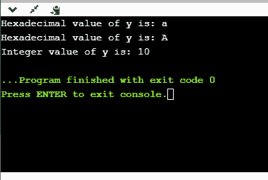

*   **%f**

```
int main()
{
  float y=3.4;
  printf("Floating point value of y is: %f", y);
  return 0;
}

```

上面的代码打印 y 的浮点值。

**输出**

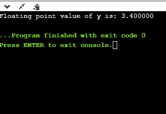

*   **%e**

```
int main()
{
  float y=3;
  printf("Exponential value of y is: %e", y);
  return 0;
}

```

**输出**

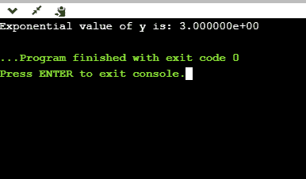

*   **%E**

```
int main()
{
  float y=3;
  printf("Exponential value of y is: %E", y);
  return 0;
}

```

**输出**

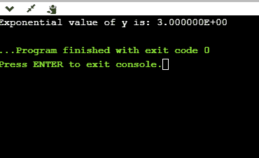

*   **%g**

```
int main()
{
  float y=3.8;
  printf("Float value of y is: %g", y);
  return 0;
}

```

在上面的代码中，我们使用%g 说明符显示 y 的浮点值。%g 说明符以相同的精度显示与输入相同的输出。

**输出**

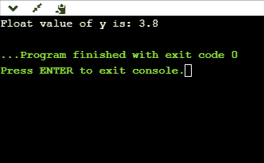

*   **%p**

```
int main()
{
  int y=5;
  printf("Address value of y in hexadecimal form is: %p", &y);
  return 0;
}

```

**输出**

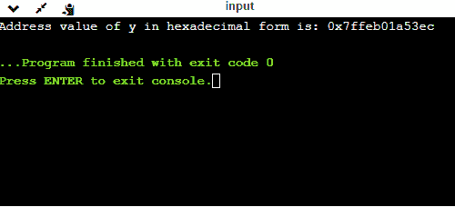

*   **%c**

```
int main()
{
  char a='c';
  printf("Value of a is: %c", a);
  return 0;
}

```

**输出**

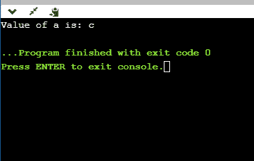

*   **%s**

```
int main()
{
  printf("%s", "javaTpoint");
  return 0;
}

```

**输出**

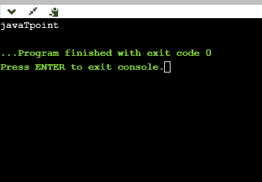

## 最小字段宽度说明符

假设我们想要在屏幕上显示一个占用最少空间的输出。您可以通过在格式说明符的百分号后显示一个整数来实现这一点。

```
int main()
{
 int x=900;
  printf("%8d", x);
  printf("\n%-8d",x);
  return 0;
}

```

在上面的程序中，%8d 说明符在 8 个空格后显示值，而%-8d 说明符将使值左对齐。

**输出**

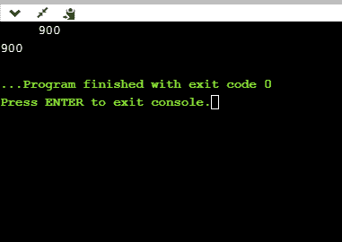

**现在我们来看看如何填充空格。如下图所示:**

```
int main()
{
 int x=12;
  printf("%08d", x);
  return 0;
}

```

在上面的程序中，%08d 表示空格用零填充。

**输出**

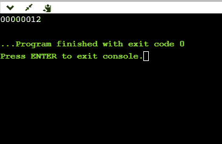

## 指定精度

我们可以使用“.”来指定精度(点)运算符，后跟整数和格式说明符。

```
int main()
{
 float x=12.2;
  printf("%.2f", x);
  return 0;
} 

```

**输出**

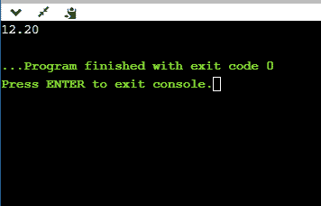

* * *