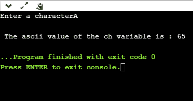
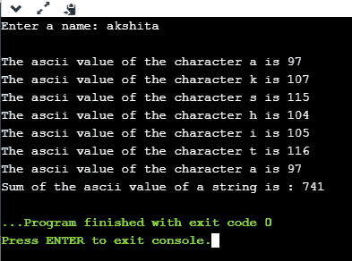

# 用 C 表示的 ASCII 值

> 原文：<https://www.javatpoint.com/ascii-value-in-c>

## 什么是 ASCII 码？

ASCII 的完整形式是**美国信息交换标准代码**。这是一种用于电子通信的字符编码方案。每个字符或一个特殊字符由一些 ascii 码表示，每个 ASCII 码占用内存 7 位。

在 [C 编程语言](https://www.javatpoint.com/c-programming-language-tutorial)中，字符变量本身不包含字符值，而是字符变量的 ascii 值。ascii 值表示数字中的字符变量，每个字符变量都被分配了 0 到 127 之间的某个数字。例如，“A”的 ascii 值为 65。

在上面的例子中，我们为 ascii 值为 65 的字符变量分配了“A”，因此 65 将存储在字符变量中，而不是“A”。

**我们通过一个例子来了解一下。**

**我们将创建一个[程序](https://www.javatpoint.com/c-programs)，它将显示字符变量的 ascii 值。**

```

#include <stdio.h>
int main()
{
    char ch;    // variable declaration
    printf("Enter a character");
    scanf("%c",&ch);  // user input
    printf("\n The ascii value of the ch variable is : %d", ch);
    return 0;
}

```

在上面的代码中，第一个用户将给出字符输入，输入将被存储在' ch '变量中。如果我们使用%c 格式说明符打印“ch”变量的值，那么它将显示“A”，因为我们已经将字符输入指定为“A”，如果我们使用%d 格式说明符，那么它的 ascii 值将显示，即 65。

**输出**



上面的输出显示用户给出的输入为‘A’，给出输入后，会打印出‘A’的 ascii 值，即 65。

现在，我们将创建一个显示所有字符的 ascii 值的程序。

```

#include <stdio.h>
int main()
{
 int k;   // variable declaration 
 for(int k=0;k<=255;k++)  // for loop from 0-255
 {
     printf("\nThe ascii value of %c is %d", k,k);
 }
return 0;
}

```

上述程序将显示所有字符的 ascii 值。因为我们知道所有字符的 ascii 值从 0 开始，到 255 结束，所以我们从 0 到 255 迭代 for 循环。

现在我们将创建一个程序，它将对一个字符串的 ascii 值求和。

```

#include <stdio.h>
int main()
{
    int sum=0;  // variable initialization
    char name[20];  // variable initialization
    int i=0;  // variable initialization
    printf("Enter a name: ");
    scanf("%s", name);
    while(name[i]!='\0')  // while loop
    {
        printf("\nThe ascii value of the character %c is %d", name[i],name[i]);
        sum=sum+name[i];
        i++;
    }
    printf("\nSum of the ascii value of a string is : %d", sum);
    return 0;
}

```

在上面的代码中，我们将用户输入作为一个字符串。接受用户输入后，我们执行 **while** 循环，该循环将字符串中所有字符的 ascii 值相加，并将其存储在一个“ **sum** 变量中。

**输出**



* * *