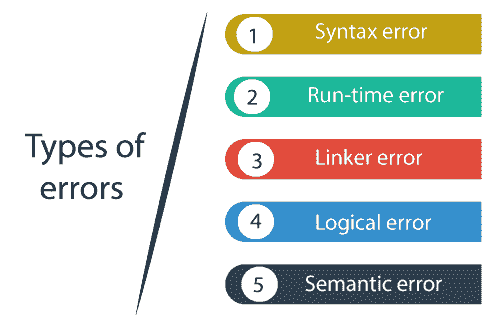
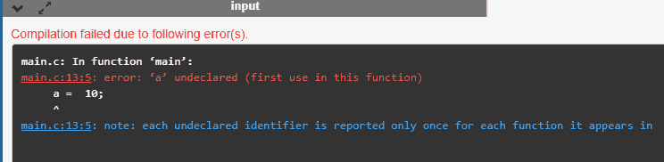
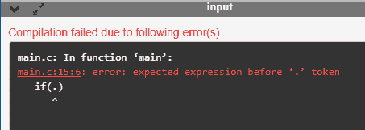
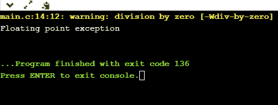
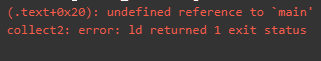
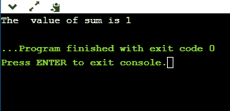
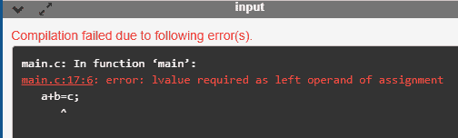

# C 语言中的编程错误

> 原文：<https://www.javatpoint.com/programming-errors-in-c>

错误是程序中出现的问题或故障，使程序的行为异常，有经验的开发人员也可以使这些故障。编程错误也称为 bug 或故障，清除这些 bug 的过程称为**调试**。

这些错误是在编译或执行期间检测到的。因此，为了成功执行程序，必须从程序中删除错误。

**C 编程主要存在五种错误:**

*   **语法错误**
*   **运行时错误**
*   **链接器错误**
*   **逻辑错误**
*   **语义错误**



### 语法错误

语法错误也称为编译错误，因为它们发生在编译时，或者我们可以说语法错误是由编译器抛出的。这些错误主要是由于键入时的错误或不遵循指定编程语言的语法造成的。这些错误通常是初学者犯的，只是因为他们对这门语言不熟悉。这些错误很容易调试或纠正。

**例如:**

```

If we want to declare the variable of type integer,
int a; // this is the correct form
Int a; // this is an incorrect form.

```

常见的语法错误有:

*   如果我们在编写代码时遗漏了括号(})。
*   显示不带声明的变量值。
*   如果我们错过了分号(；)在语句的末尾。

**我们通过一个例子来了解一下。**

```

#include <stdio.h>
int main()
{
    a = 10;
    printf("The value of a is : %d", a);
   return 0;
}

```

**输出**



在上面的输出中，我们观察到代码抛出了“a”未声明的错误。这个错误只是语法错误。

可能存在语法错误的另一种可能性，即如果我们在基本构造中出错。让我们通过一个例子来理解这个场景。

```

#include <stdio.h>
int main()
{
  int a=2;
  if(.)  // syntax error

  printf("a is greater than 1");
   return 0;
}

```

在上面的代码中，我们把(。)而不是“if”中的条件，因此这将生成如下截图所示的语法错误。

**输出**



### 运行时错误

有时，即使在成功编译之后，错误也存在于执行期间，这就是所谓的运行时错误。程序运行时，它不能执行操作是导致运行时错误的主要原因。被零除是运行时错误的常见例子。这些错误很难找到，因为编译器不会指出这些错误。

**我们通过一个例子来了解一下。**

```

#include <stdio.h>
int main()
{
    int a=2;
    int b=2/0;
    printf("The value of b is : %d", b);
    return 0;
}

```

**输出**



在上面的输出中，我们观察到代码显示了运行时错误，即被零除。

### 链接器错误

链接器错误主要是在程序的可执行文件没有创建时产生的。这可能是由于错误的函数原型或者使用了错误的头文件。例如， **main.c** 文件包含 **sub()** 函数，该函数的声明和定义在其他文件中完成，如**func**。编译过程中，编译器在**func**文件中找到 **sub()** 函数，因此生成两个目标文件，即 **main.o** 和 **func.o** 。在执行时，如果在 **func.o** 文件中没有找到 **sub()** 函数的定义，则会抛出链接器错误。最常见的链接器错误是我们使用 **Main()** 代替 **main()。**

**我们通过一个简单的例子来理解。**

```

#include <stdio.h>
int Main()
{
    int a=78;
    printf("The value of a is : %d", a);
    return 0;
}

```

**输出**



### 逻辑误差

逻辑错误是导致不希望的输出的错误。这些错误会产生不正确的输出，但它们是无错误的，称为逻辑错误。这些类型的错误主要是初学者犯的。这些错误的发生主要取决于开发人员的逻辑思维。如果程序员听起来逻辑良好，那么出现这些错误的机会就会减少。

**我们通过一个例子来了解一下。**

```

#include <stdio.h>
int main()
{
   int sum=0; // variable initialization
   int k=1;
   for(int i=1;i<=10;i++); // logical error, as we put the semicolon after loop
   {
       sum=sum+k;
       k++;
   }
printf("The  value of sum is %d", sum);
    return 0;
}

```

**输出**



在上面的代码中，我们试图打印 10 位数的总和，但是我们得到了错误的输出，因为我们放了分号(；)放在 for 循环之后，因此 for 循环的内部语句不会执行。这会产生错误的输出。

### 语义误差

语义错误是编译器无法理解语句时出现的错误。

以下是语义错误的情况:

*   使用未初始化的变量。
    int I；
    I = I+2；
*   类型兼容性
    int b = " javatpoint "；
*   表达式
    中的错误 int a，b，c；
    a+b = c；
*   数组索引超出界限
    int a[10]；
    a[10]= 34；

**我们通过一个例子来了解一下。**

```

#include <stdio.h>
int main()
{
int a,b,c;
a=2;
b=3;
c=1;
a+b=c; // semantic error
return 0;
}

```

在上面的代码中，我们使用了语句 **a+b =c** ，这是不正确的，因为我们不能使用左侧的两个操作数。

**输出**



* * *