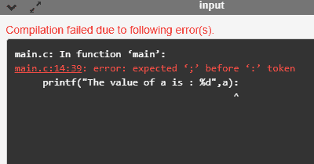
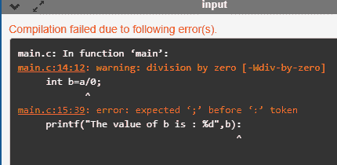

# 编译时与运行时

> 原文：<https://www.javatpoint.com/compile-time-vs-runtime>

编译时和运行时是软件开发中使用的两个编程术语。编译时是源代码转换为可执行代码的时间，而运行时是可执行代码开始运行的时间。编译时和运行时都涉及不同类型的错误。

### 编译时错误

编译时错误是当我们写错语法时发生的错误。如果我们写错了任何编程语言的语法或语义，那么编译器就会抛出编译时错误。编译器将不允许运行程序，直到从程序中删除所有错误。当所有的错误都从程序中删除后，编译器将生成可执行文件。

编译时错误可能是:

*   句法误差
*   语义错误

### 句法误差

当程序员不遵循任何编程语言的语法时，编译器就会抛出语法错误。

例如，

int a，b:

上面的声明产生了编译时错误，就像在 C 语言中一样，每个语句都以分号结束，但是我们在语句的末尾放了一个冒号(:)。

### 语义错误

当语句对编译器没有意义时，就存在语义错误。

例如，

a+b = c；

上面的语句抛出了一个编译时错误。在上面的语句中，我们将“C”的值赋给“a”和“b”的总和，这在 C 编程语言中是不可能的，因为它只能在赋值运算符的左侧包含一个变量，而赋值运算符的右侧可以包含多个变量。

上述声明可以改写为:

c = a+b；

### 运行时错误

运行时错误是在执行期间和编译之后发生的错误。运行时错误的例子有除以零等。这些错误不容易检测，因为编译器不会指出这些错误。

**我们来看看编译时和运行时的区别:**

| 编译时 | 运行时间 |
| 编译时错误是编译时产生的错误，由编译器检测。 | 运行时错误是不是由编译器生成的错误，并在执行时产生不可预测的结果。 |
| 在这种情况下，如果编译器在程序中检测到错误，它会阻止代码执行。 | 在这种情况下，编译器不会检测到错误，因此无法阻止代码执行。 |
| 它包含语法和语义错误，例如语句末尾缺少分号。 | 它包含诸如除以零、确定负数的平方根等错误。 |

**编译时错误示例**

```

#include <stdio.h>
int main()
{
    int a=20;
    printf("The value of a is : %d",a):
    return 0;
}

```

在上面的代码中，我们试图打印“a”的值，但是它抛出了一个错误。我们将冒号放在语句的末尾，而不是分号，因此这段代码会生成一个编译时错误。

**输出**



**运行时错误示例**

```

#include <stdio.h>
int main()
{
    int a=20;
    int b=a/0; // division by zero
    printf("The value of b is : %d",b):
    return 0;
}

```

在上面的代码中，我们试图将“b”的值除以零，这将引发运行时错误。

**输出**



* * *