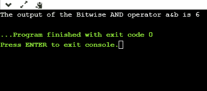
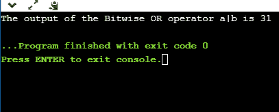
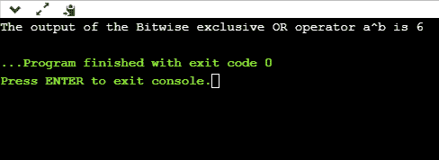
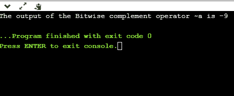
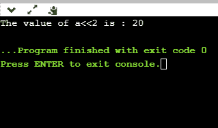
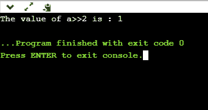

# C 语言中的按位运算符

> 原文：<https://www.javatpoint.com/bitwise-operator-in-c>

按位运算符是用于在位级别对数据执行操作的运算符。当我们执行按位运算时，它也被称为位级编程。它由两位数字组成，0 或 1。它主要用于数值计算，以加快计算速度。

在 C 编程语言中，我们有不同类型的按位运算符。以下是按位运算符的列表:

| 操作员 | 运算符的含义 |
| & | 按位“与”运算符 |
| &#124; | 按位或运算符 |
| ^ | 按位异或运算符 |
| ~ | 补码运算符(一元运算符) |
| << | 左移操作符 |
| >> | 右移位运算符 |

**我们来看看按位运算符的真值表。**

| X | Y | 移动速度 | X&#124;Y | X^Y |
| Zero | Zero | Zero | Zero | Zero |
| Zero | one | Zero | one | one |
| one | Zero | Zero | one | one |
| one | one | one | one | one |

### 按位“与”运算符

按位“与”运算符由单个&符号(&)表示。两个整数操作数写在(&)运算符的两侧。如果两个操作数的对应位都为 1，则按位“与”运算的输出为 1；否则，输出将为 0。

例如，

```

We have two variables a and b.
a =6;
b=4;
The binary representation of the above two variables are given below:
a = 0110
b = 0100
When we apply the bitwise AND operation in the above two variables, i.e., a&b, the output would be:
Result = 0100

```

从上面的结果我们可以观察到，两个变量的位被逐一比较。如果两个变量的位都是 1，则输出为 1，否则为 0。

让我们通过程序来理解按位“与”运算符。

```

#include <stdio.h>
int main()
{
   int a=6, b=14;  // variable declarations
   printf("The output of the Bitwise AND operator a&b is %d",a&b);
   return 0;
}

```

在上面的代码中，我们创建了两个变量，即‘a’和‘b’。“a”和“b”的值分别是 6 和 14。“a”和“b”的二进制值分别是 0110 和 1110。当我们在这两个变量之间应用 AND 运算符时，

**a 和 b = 0110&T3】1110 = 0110**

**输出**



### 按位或运算符

按位“或”运算符由一个垂直符号(|)表示。两个整数操作数写在(|)符号的两侧。如果任何操作数的位值为 1，则输出为 1，否则为 0。

例如，

```

We consider two variables,
a = 23;
b = 10;
The binary representation of the above two variables would be:
a = 0001 0111
b = 0000 1010
When we apply the bitwise OR operator in the above two variables, i.e., a|b , then the output would be:
Result = 0001 1111

```

从上面的结果我们可以观察到，两个操作数的位被逐一比较；如果任一位的值为 1，则输出为 1，否则为 0。

**让我们通过一个程序来理解按位 OR 运算符。**

```

#include <stdio.h>
int main()
{
   int a=23,b=10;  // variable declarations
   printf("The output of the Bitwise OR operator a|b is %d",a|b);
   return 0;
}

```

**输出**



### 按位异或运算符

按位异或运算符由(^)符号表示。两个操作数写在异或运算符的两边。如果任何操作数的对应位为 1，则输出为 1，否则为 0。

例如，

```

We consider two variables a and b,
a = 12;
b = 10;
The binary representation of the above two variables would be:
a = 0000 1100
b = 0000 1010
When we apply the bitwise exclusive OR operator in the above two variables (a^b), then the result would be:
Result = 0000 1110

```

从上面的结果我们可以观察到，两个操作数的位被逐一比较；如果任何操作数的相应位值为 1，则输出为 1，否则为 0。

**让我们通过一个程序来理解按位异或运算符。**

```

#include <stdio.h>
int main()
{
   int a=12,b=10;  // variable declarations
   printf("The output of the Bitwise exclusive OR operator a^b is %d",a^b);
   return 0;
}

```

**输出**



### 按位补码运算符

按位补码运算符也称为补码运算符。它由符号颚化符(~)表示。它只接受一个操作数或变量，并对操作数执行补码操作。当我们对任意位进行补码运算时，0 变成 1，1 变成 0。

例如，

```

If we have a variable named 'a',
a = 8;
The binary representation of the above variable is given below:
a = 1000
When we apply the bitwise complement operator to the operand, then the output would be:
Result = 0111

```

从上面的结果我们可以观察到，如果该位是 1，那么它就会变成 0，否则就会变成 1。

**我们通过一个程序来了解补码运算符。**

```

#include <stdio.h>
int main()
{
   int a=8;  // variable declarations
   printf("The output of the Bitwise complement operator ~a is %d",~a);
   return 0;
}

```

**输出**



### 按位移位运算符

C 编程中存在两种类型的按位移位运算符。按位移位运算符将移位左侧或右侧的位。因此，我们可以说按位移位运算符分为两类:

*   左移运算符
*   右移运算符

**左移操作员**

它是一个将位数向左移动的运算符。

**左移运算符的语法如下:**

```

Operand << n

```

**在哪里，**

**操作数是一个整数表达式，我们对其进行左移操作。**

**n 是要移位的位数。**

在左移位运算符的情况下，“n”位将在左侧移位。左侧的“n”位将被弹出，右侧的“n”位用 0 填充。

**例如**

```

Suppose we have a statement:
int a = 5;
The binary representation of 'a' is given below:
a = 0101
If we want to left-shift the above representation by 2, then the statement would be: 
a << 2;
0101<<2 = 00010100

```

**我们通过一个程序来了解一下。**

```

#include <stdio.h>
int main()
{
    int a=5; // variable initialization
    printf("The value of a<<2 is : %d ", a<<2);
    return 0;
}

```

**输出**



**右移操作员**

它是一个将位数向右移动的运算符。

**右移运算符的语法如下:**

```

Operand >> n;

```

**在哪里，**

操作数是一个整数表达式，我们对其应用右移操作。

n 是要移位的位数。

在右移运算符的情况下，“n”位将移至右侧。右侧的“n”位将弹出，左侧的“n”位用 0 填充。

**例如**

```

Suppose we have a statement,
int a = 7;
The binary representation of the above variable would be:
a = 0111
If we want to right-shift the above representation by 2, then the statement would be:
a>>2;
0000 0111 >> 2 = 0000 0001

```

**我们通过一个程序来了解一下。**

```

#include <stdio.h>
int main()
{
    int a=7; // variable initialization
    printf("The value of a>>2 is : %d ", a>>2);
    return 0;
}

```

**输出**



* * *