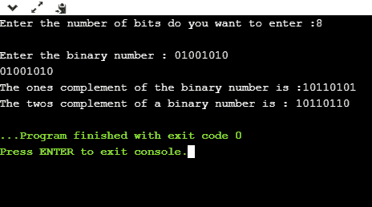

# C 中的 2s 补码是什么？

> 原文：<https://www.javatpoint.com/2s-complement-in-c>

C 中的 2s 补码是由 C 中的 1s 补码生成的，正如我们所知，二进制数的 1s 补码是通过将位 1 转换为 0 和 0 转换为 1 而生成的；二进制数的 2s 补码是通过将二进制数的 1s 补码加 1 而生成的。

简而言之，我们可以说 C 中的 2s 补码定义为 C 中的一个补码和一个补码的和。


在上图中，二进制数等于 00010100，其 1 的补码是通过将 1 转换为 0 和 0 转换为 1 来计算的，反之亦然。所以，一的补码就变成了 11101011。在计算一的补数后，我们通过在一的补数上加 1 来计算二的补数，结果是 11101100。

让我们创建一个 2s 补码的程序。

```

#include <stdio.h>
int main()
{
   int n;  // variable declaration
   printf("Enter the number of bits do you want to enter :");
   scanf("%d",&n);
   char binary[n+1];  // binary array declaration; 
   char onescomplement[n+1]; // onescomplement array declaration 
   char twoscomplement[n+1]; // twoscomplement array declaration
   int carry=1; // variable initialization
   printf("\nEnter the binary number : ");
   scanf("%s", binary);
   printf("%s", binary);
   printf("\nThe ones complement of the binary number is :");

   // Finding onescomplement in C
   for(int i=0;i<n;i++)
   {
       if(binary[i]=='0')
       onescomplement[i]='1';
       else if(binary[i]=='1')
       onescomplement[i]='0';
   }
   onescomplement[n]='\0';
   printf("%s",onescomplement);

printf("\nThe twos complement of a binary number is : ");

// Finding twoscomplement in C
for(int i=n-1; i>=0; i--)
    {
        if(onescomplement[i] == '1' && carry == 1)
        {
            twoscomplement[i] = '0';
        }
        else if(onescomplement[i] == '0' && carry == 1)
        {
            twoscomplement[i] = '1';
            carry = 0;
        }
        else
        {
            twoscomplement[i] = onescomplement[i];
        }
    }
twoscomplement[n]='\0';
printf("%s",twoscomplement);
return 0;
}

```

**输出**



### 分析上述程序，

*   首先，我们输入位数，并将其存储在“ **n** 变量中。
*   输入位数后，我们声明字符数组，即 **char binary[n+1]，**保存二进制数。“ **n** 是我们在上一步输入的位数；它基本上定义了数组的大小。
*   我们声明另外两个数组，即**一补码【n+1】**和**二补码【n+1】。**T4 一进制补码[n+1] 数组保存二进制数的一进制补码，而**二进制补码[n+1]** 数组保存二进制数的二进制补码。
*   初始化**进位**变量，并为该变量赋值 1。
*   在声明之后，我们输入二进制数。
*   现在，我们简单地计算一个二进制数的补码。为此，我们创建了一个**循环**，它在整个二进制数组中迭代，**为(int I = 0；I<n；i++)** 。在 for 循环中，检查该位是 1 还是 0。如果该位为 1，则**一补码[i]=0** 否则**一补码[i]=1** 。这样，就产生了二进制数的补码。
*   在计算补码后，我们生成一个二进制数的 2s 补码。为此，我们创建一个**循环**，从最后一个元素迭代到起始元素。在 for 循环中，我们有三个条件:
    *   如果 onescomplement 的位是 1，进位的值是 1，那么我们把 0 放在 twocomplement 中。
    *   如果 onescomplement 的位是 0，进位的值是 1，那么我们将 1 放在二进制补码[i]中，将 0 放在进位中。
    *   如果上述两个条件为假，则 onescomplement 等于 twoscomplement。

* * *