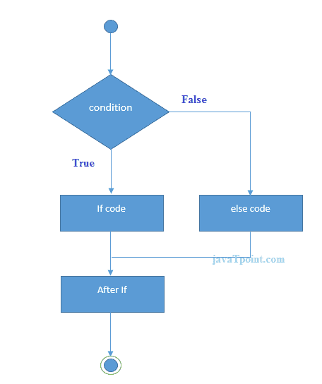
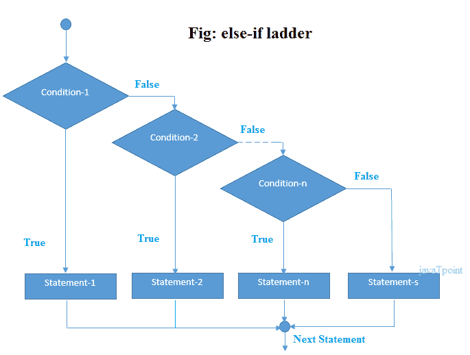

# 如果没有的话

> 原文：<https://www.javatpoint.com/c-if-else>

C 语言中的 if-else 语句用于执行基于特定条件的操作。if 块中指定的操作在且仅在给定条件为真时执行。

C 语言中的 if 语句有以下几种变体。

*   如果语句
*   If-else 语句
*   否则，如果梯子
*   嵌套 if

## 如果语句

if 语句用于检查某个给定的条件，并根据该条件的正确性执行一些操作。它主要用于我们需要针对不同条件执行不同操作的场景。if 语句的语法如下。

```
if(expression){
//code to be executed
}

```

**C**中 if 语句的流程图


让我们看一个简单的 C 语言 if 语句的例子。

```
#include int main(){  
int number=0;  
printf("Enter a number:");  
scanf("%d",&number);  
if(number%2==0){  
printf("%d is even number",number);  
}  
return 0;
} 
```

**输出**

```
Enter a number:4
4 is even number
enter a number:5

```

### 程序找到三者中数量最多的。

```
#include <stdio.h>
int main()
{
    int a, b, c; 
     printf("Enter three numbers?");
    scanf("%d %d %d",&a,&b,&c);
    if(a>b && a>c)
    {
        printf("%d is largest",a);
    }
    if(b>a  && b > c)
    {
        printf("%d is largest",b);
    }
    if(c>a && c>b)
    {
        printf("%d is largest",c);
    }
    if(a == b && a == c) 
    {
    	printf("All are equal"); 
    }
}

```

**输出**

```
Enter three numbers?
12 23 34
34 is largest 

```

## If-else 语句

if-else 语句用于对一个条件执行两个操作。if-else 语句是 if 语句的扩展，使用 if 语句，我们可以执行两种不同的操作，即一种是针对条件的正确性，另一种是针对条件的不正确性。这里，我们必须注意到 if 和 else 块不能同时执行。使用 if-else 语句总是更好，因为它总是用每个 if 条件调用一个否则的情况。if-else 语句的语法如下。

```
if(expression){
//code to be executed if condition is true
}else{
//code to be executed if condition is false
}

```

**C**中 if-else 语句的流程图



让我们看一个简单的例子，用 C 语言中的 if-else 语句检查一个数字是偶数还是奇数。

```
#include int main(){  
int number=0;  
printf("enter a number:");  
scanf("%d",&number);   
if(number%2==0){  
printf("%d is even number",number);  
}  
else{  
printf("%d is odd number",number);  
}   
return 0;
} 
```

**输出**

```
enter a number:4
4 is even number
enter a number:5
5 is odd number

```

### 检查一个人是否有资格投票的程序。

```
#include <stdio.h>
int main()
{
	int age; 
	printf("Enter your age?"); 
	scanf("%d",&age);
	if(age>=18)
	{
		printf("You are eligible to vote..."); 
	}
	else 
	{
		printf("Sorry ... you can't vote"); 
	}
}

```

**输出**

```
Enter your age?18
You are eligible to vote...
Enter your age?13
Sorry ... you can't vote

```

## 如果其他-如果阶梯声明

if-else-if 梯形语句是 if-else 语句的扩展。它用于针对不同条件执行多种情况的场景。在 if-else-if 梯形语句中，如果条件为真，则执行 if 块中定义的语句，否则，如果其他条件为真，则执行 else-if 块中定义的语句，最后，如果条件都不为真，则执行 else 块中定义的语句。如果可能的话，还有多个其他模块。它类似于 switch case 语句，如果没有匹配的案例，则执行默认值而不是 else block。

```
if(condition1){
//code to be executed if condition1 is true
}else if(condition2){
//code to be executed if condition2 is true
}
else if(condition3){
//code to be executed if condition3 is true
}
...
else{
//code to be executed if all the conditions are false
}

```

**C**中 else-if 梯形语句的流程图



下面给出了一个 C 语言的 if-else-if 语句的例子。

```
#include int main(){  
int number=0;  
printf("enter a number:");  
scanf("%d",&number);   
if(number==10){  
printf("number is equals to 10");  
}  
else if(number==50){  
printf("number is equal to 50");  
}  
else if(number==100){  
printf("number is equal to 100");  
}  
else{  
printf("number is not equal to 10, 50 or 100");  
}  
return 0;
} 
```

**输出**

 **```
enter a number:4
number is not equal to 10, 50 or 100
enter a number:50
number is equal to 50

```**  **### 程序根据指定分数计算学生成绩。

```
#include <stdio.h>
int main()
{
	int marks; 
	printf("Enter your marks?");
	scanf("%d",&marks); 
	if(marks > 85 && marks <= 100)
	{
		printf("Congrats ! you scored grade A ..."); 
	}
	else if (marks > 60 && marks <= 85) 
	{
		printf("You scored grade B + ...");
	}
	else if (marks > 40 && marks <= 60) 
	{
		printf("You scored grade B ...");
	}
	else if (marks > 30 && marks <= 40) 
	{
		printf("You scored grade C ..."); 
	}
	else 
	{
		printf("Sorry you are fail ..."); 
	}
}

```

**输出**

```
Enter your marks?10
Sorry you are fail ...
Enter your marks?40
You scored grade C ...
Enter your marks?90
Congrats ! you scored grade A ...

```

* * ***