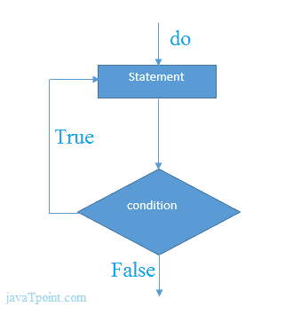

# 在 C 中循环时做

> 原文：<https://www.javatpoint.com/do-while-loop-in-c>

do while 循环是一个经过测试的循环。使用 do-while 循环，我们可以重复执行语句的几个部分。do-while 循环主要用于我们需要至少执行一次循环的情况。do-while 循环主要用于菜单驱动程序，其中终止条件取决于最终用户。

#### do while 循环语法

C 语言边做边循环的语法如下:

```
do{
//code to be executed
}while(condition);

```

#### 例 1

```
#include<stdio.h>
#include<stdlib.h>
void main ()
{
	char c;
	int choice,dummy;  
	do{
	printf("\n1\. Print Hello\n2\. Print Javatpoint\n3\. Exit\n");
	scanf("%d",&choice);
	switch(choice)
	{
		case 1 : 
		printf("Hello"); 
		break;
		case 2:  
		printf("Javatpoint");
		break;
		case 3:
		exit(0); 
		break;
		default: 
		printf("please enter valid choice"); 	
	}
	printf("do you want to enter more?"); 
	scanf("%d",&dummy);
	scanf("%c",&c);
	}while(c=='y');
}

```

#### 输出

```
1\. Print Hello
2\. Print Javatpoint
3\. Exit
1
Hello
do you want to enter more?
y

1\. Print Hello
2\. Print Javatpoint
3\. Exit
2
Javatpoint
do you want to enter more?
n

```

#### do while 循环的流程图



* * *

#### 边做边举例

这里给出了一个简单的 c 语言程序 do while 循环，在这里我们打印 1 的表格。

```
#include int main(){  
int i=1;    
do{  
printf("%d \n",i);  
i++;  
}while(i<=10); 
return 0;
} 
```

#### 输出

```
1
2
3
4
5
6
7
8
9
10

```

#### 使用 do while 循环打印给定数字的表格的程序

```
#include int main(){  
int i=1,number=0;  
printf("Enter a number: ");  
scanf("%d",&number);  
do{  
printf("%d \n",(number*i));  
i++;  
}while(i<=10);  
return 0;
} 
```

#### 输出

```
Enter a number: 5
5
10
15
20
25
30
35
40
45
50

```

```
Enter a number: 10
10
20
30
40
50
60
70
80
90
100

```

* * *

#### 循环时做

如果我们将任何非零值作为条件表达式传递，do-while 循环将运行无限次。

```
do{
//statement
}while(1);

```