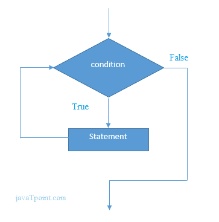

# 当在 C 中循环时

> 原文：<https://www.javatpoint.com/while-loop-in-c>

而循环也称为预测试循环。一般来说，while 循环允许部分代码根据给定的布尔条件执行多次。它可以被看作是一个重复的 if 语句。while 循环主要用于迭代次数事先未知的情况。

#### C 语言 while 循环的语法

c 语言中 while 循环的语法如下:

```
while(condition){
//code to be executed
}

```

#### C 中 while 循环的流程图



* * *

## C 语言中 while 循环的示例

让我们看看打印表 1 的 while 循环的简单程序。

```
#include int main(){  
int i=1;    
while(i<=10){    
printf("%d \n",i);    
i++;    
}
return 0;
} 
```

#### 输出

```
1
2
3
4
5
6
7
8
9
10

```

## 使用 C 语言中的 while 循环打印给定数字的表格的程序

```
#include int main(){  
int i=1,number=0,b=9;  
printf("Enter a number: ");  
scanf("%d",&number);  
while(i<=10){  
printf("%d \n",(number*i));  
i++;  
}  
return 0;
} 
```

#### 输出

```
Enter a number: 50
50
100
150
200
250
300
350
400
450
500

```

```
Enter a number: 100
100
200
300
400
500
600
700
800
900
1000

```

* * *

## while 循环的属性

*   条件表达式用于检查条件。while 循环中定义的语句将重复执行，直到给定条件失败。
*   如果返回 0，则条件为真。如果返回任何非零数字，条件将为假。
*   在 while 循环中，条件表达式是强制的。
*   在没有身体的情况下跑一圈是可能的。
*   while 循环中可以有多个条件表达式。
*   如果循环体只包含一条语句，那么大括号是可选的。

#### 例 1

```
#include<stdio.h>
void main ()
{
	int j = 1;
	while(j+=2,j<=10)
	{
		printf("%d ",j); 
	}
	printf("%d",j);
}

```

#### 输出

```
3 5 7 9 11

```

#### 例 2

```
#include<stdio.h>
void main ()
{
	while()
	{
		printf("hello Javatpoint"); 
	}
}

```

#### 输出

```
compile time error: while loop can't be empty	

```

#### 例 3

```
#include<stdio.h>
void main ()
{
	int x = 10, y = 2;
	while(x+y-1)
	{
		printf("%d %d",x--,y--);
	}
}

```

#### 输出

```
infinite loop 

```

## C 中循环时的不定式

如果 while 循环中传入的表达式导致任何非零值，则循环将运行无限次。

```
while(1){
//statement
}

```