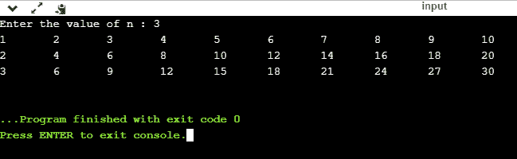
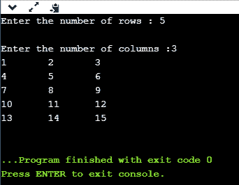
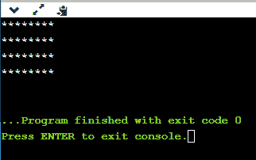

# C 语言中的嵌套循环

> 原文：<https://www.javatpoint.com/nested-loops-in-c>

C 支持 C 中循环的嵌套，循环的嵌套是 C 中允许语句在另一个循环中循环的特性。让我们观察一个 c 语言中嵌套循环的例子。

可以在另一个循环中定义任意数量的循环，即，对于定义任意数量的循环没有限制。嵌套级别可以定义 n 次。您可以在另一个循环中定义任何类型的循环；例如，您可以将“**”定义为“**”循环，而将“**定义为“**”循环。

**嵌套循环的语法**

```

Outer_loop
{
    Inner_loop
   {
         // inner loop statements.
   }
       // outer loop statements.
}

```

**外循环**和**内循环**是有效的循环，可以是“for”循环、“while”循环或“do-while”循环。

**嵌套循环**

嵌套 for 循环是指在“for”循环中定义的任何类型的循环。

```

for (initialization; condition; update) 
{
    for(initialization; condition; update)
    {
           // inner loop statements.
    }
    // outer loop statements.
}

```

**循环嵌套示例**

```

#include <stdio.h>
int main()
{
   int n;// variable declaration
   printf("Enter the value of n :");
   // Displaying the n tables.
   for(int i=1;i<=n;i++)  // outer loop
   {
       for(int j=1;j<=10;j++)  // inner loop
       {
           printf("%d\t",(i*j)); // printing the value.
       }
       printf("\n");
   }

```

**以上代码的解释**

*   首先，将“I”变量初始化为 1，然后程序控制传递给 i<=n。
*   程序控制检查条件“i<=n”是否为真。
*   如果条件为真，则程序控制转到内部循环。
*   内部循环将被执行，直到条件为真。
*   在执行内部循环之后，控制返回到外部循环的更新，即 i++。
*   递增循环计数器的值后，再次检查条件，即 i<=n。
*   如果条件为真，那么将再次执行内部循环。
*   这个过程将持续到外环的条件为真。

**输出:**



**嵌套循环**

嵌套的 while 循环意味着在“while”循环中定义的任何类型的循环。

 **```

while(condition)
{
    while(condition)
    {
         // inner loop statements.
    }
// outer loop statements.
}

```

**嵌套 while 循环示例**

```

#include <stdio.h>
int main()
{
   int rows;  // variable declaration
   int columns; // variable declaration
   int k=1; // variable initialization
   printf("Enter the number of rows :");  // input the number of rows.
   scanf("%d",&rows);
   printf("\nEnter the number of columns :"); // input the number of columns.
   scanf("%d",&columns);
      int a[rows][columns]; //2d array declaration
      int i=1;
   while(i<=rows) // outer loop
   {
       int j=1;
      while(j<=columns)  // inner loop
       {
           printf("%d\t",k);  // printing the value of k.
           k++;   // increment counter
           j++;
       }
       i++;
       printf("\n");
   }
}

```

**以上代码的解释。**

*   我们已经创建了 2d 数组，即 int a[row][columns]。
*   程序将“I”变量初始化为 1。
*   现在，控制移到 while 循环，这个循环检查条件是否为真，然后程序控制移到内部循环。
*   在执行内部循环之后，控制移动到外部循环的更新，即 i++。
*   递增“I”的值后，检查条件(i < =行)。
*   如果条件为真，控件将再次移动到内部循环。
*   这个过程一直持续到外环的条件为真。

**输出:**



**嵌套 do..边循环**

嵌套 do..而 loop 表示在“do”中定义的任何类型的循环..while' loop。

```

do
{
   do
  { 
      // inner loop statements.
   }while(condition);
// outer loop statements.
}while(condition);

```

**嵌套 do 示例..while 循环。**

```

#include <stdio.h>
int main()
{
  /*printing the pattern
     ********
     ********
     ********
     ******** */
int i=1;
do           // outer loop
{
    int j=1;
    do       // inner loop
   {
      printf("*");
      j++;
   }while(j<=8);
    printf("\n");
    i++;
     }while(i<=4);
}

```

**输出:**



**以上代码的解释。**

*   首先，我们初始化外环计数器变量，即“I”加 1。
*   正如我们所知..while 循环执行一次而不检查条件，因此执行内部循环时不检查外部循环中的条件。
*   在执行内部循环之后，控制转移到 i++ 的更新。
*   当循环计数器值增加时，检查条件。如果外部循环中的条件为真，则执行内部循环。
*   这个过程将持续到外环中的条件为真。

* * ***