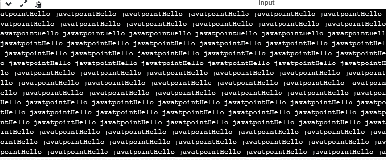
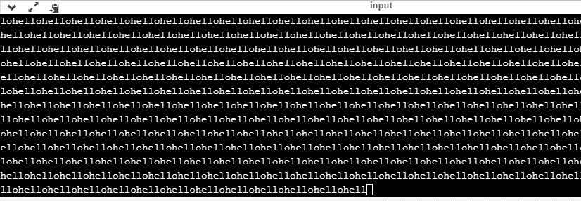

# C 语言中的无限循环

> 原文：<https://www.javatpoint.com/infinite-loop-in-c>

## 什么是无限循环？

无限循环是一种循环构造，它不会终止循环并永远执行循环。它也被称为**无限循环或**无限循环。它要么产生连续输出，要么不产生输出。****

## 何时使用无限循环

无限循环对于那些接受用户输入并持续生成输出直到用户手动退出应用程序的应用程序非常有用。在以下情况下，可以使用这种类型的循环:

*   所有的操作系统都在无限循环中运行，因为它在执行某项任务后并不存在。只有当用户手动关闭系统时，它才会脱离无限循环。
*   当服务器响应所有客户端请求时，所有服务器都在无限循环中运行。只有当管理员手动关闭服务器时，它才会脱离无限循环。
*   所有的游戏也在无限循环中运行。游戏将接受用户请求，直到用户退出游戏。

我们可以通过各种循环结构创建一个无限循环。下面是我们定义无限循环的循环结构:

*   for 循环
*   while 循环
*   边做边循环
*   转到语句
*   宏

### For 循环

让我们看看循环的**无限。以下是循环的**无限**的定义:**

```

for(; ;)
{
    // body of the for loop.
}

```

我们知道**‘for’循环**的所有部分都是可选的，在上面的 for 循环中，我们没有提到任何条件；所以，这个循环将执行无限次。

**我们通过一个例子来了解一下。**

```

#include <stdio.h>
int main()
{
   for(;;)
   {
     printf("Hello javatpoint");
   }
return 0;
}

```

在上面的代码中，我们无限次运行‘for’循环，所以**“Hello javatpoint”**将无限显示。

**输出**



### while 循环

现在，我们将看到如何使用 while 循环创建一个无限循环。以下是无限 while 循环的定义:

```

while(1)
{
   // body of the loop..
}

```

在上面的 while 循环中，我们将“1”放在循环条件中。正如我们所知，任何非零整数代表真实条件，而“0”代表虚假条件。

**我们来看一个简单的例子。**

```

#include <stdio.h>
int main()
{
  int i=0;
  while(1)
  {
      i++; 
      printf("i is :%d",i);
  }
return 0;
}

```

在上面的代码中，我们定义了一个 while 循环，它运行无限次，因为它不包含任何条件。“I”的值将被更新无数次。

**输出**


**做..边循环**

**做什么..而**循环也可以用来创建无限循环。以下是**做无限创造的语法..而**循环。

```

do
{
    // body of the loop..
}while(1);

```

上面做的..而循环表示无限条件，因为我们在循环条件中提供了“1”值。因为我们已经知道非零整数代表真实情况，所以这个循环将运行无限次。

**转到语句**

我们也可以使用 goto 语句来定义无限循环。

```

infinite_loop;
// body statements.
goto infinite_loop;

```

在上面的代码中，goto 语句将控制转移到无限循环。

**宏**

我们也可以借助一个宏常数来创建无限循环。让我们通过一个例子来理解。

```

#include <stdio.h>
#define infinite for(;;)
int main()
{

  infinite
  {
      printf("hello");
  }

    return 0;
}

```

在上面的代码中，我们定义了一个名为‘无限’的宏，它的值是‘for(；；)'.每当“无限”这个词出现在一个程序中，它就会被“for(；；)'.

**输出**



到目前为止，我们已经看到了定义无限循环的各种方法。然而，我们需要一些方法来走出无限循环。为了走出无限循环，我们可以使用 break 语句。

**我们通过一个例子来了解一下。**

```

#include <stdio.h>
int main()
{
 char ch;
 while(1)
 {
     ch=getchar();
     if(ch=='n')
     {
         break;
     }
     printf("hello");
 }
 return 0;
}

```

在上面的代码中，我们定义了 while 循环，它将执行无限多次，直到我们按下“n”键。我们在 while 循环中添加了“if”语句。“if”语句包含 break 关键字，break 关键字将控制带出循环。

**无意的无限循环**

有时，由于代码中的错误，会出现无意的无限循环。如果我们是初学者，那么追踪他们就变得非常困难。以下是一些追踪无意无限循环的方法:

*   我们应该仔细检查分号。有时候我们把分号放错了地方，导致了无限循环。

```

#include <stdio.h>
int main()
{
int i=1;
while(i<=10);
{
printf("%d", i);
i++;
}
return 0;
}

```

在上面的代码中，我们将分号放在 while 循环的条件之后，这将导致无限循环。由于这个分号，while 循环的内部主体将不执行。

*   我们应该仔细检查逻辑条件。有时，我们会错误地将赋值运算符(=)而不是关系运算符(= =)。

```

#include <stdio.h>
int main()
{
char ch='n';
while(ch='y')
{
 printf("hello");
}
return 0;
}

```

在上面的代码中，我们使用赋值操作符(ch='y ')，这导致循环执行无限次。

*   我们使用了错误的循环条件，导致循环无限期执行。

```

#include <stdio.h>
int main()
{
  for(int i=1;i>=1;i++)
  {
      printf("hello");
  }
return 0;
}

```

上面的代码将无限次地执行“for 循环”。正如我们所说的条件(i>=1)，它对每个条件都是真的，这意味着“你好”将被无限打印。

*   当我们在嵌套循环中使用 **break** 关键字时，我们应该小心，因为它将终止最近循环的执行，而不是整个循环。

```

#include <stdio.h>
int main()
{
  while(1)
  {
      for(int i=1;i<=10;i++)
      {
          if(i%2==0)
          {
              break;
          }
      }
  }
    return 0;
}

```

在上面的代码中，当我们在内部循环中使用 break 关键字时，while 循环将被执行无限多次。这个 break 关键字将把控件带出内部循环，而不是外部循环。

*   当我们在循环中使用浮点值时，我们应该非常小心，因为我们不能低估浮点错误。

```

#include <stdio.h>
int main()
{
  float x = 3.0;
while (x != 4.0) {
  printf("x = %f\n", x);
  x += 0.1;
}
    return 0;
}

```

在上面的代码中，循环将运行无限次，因为计算机将浮点值表示为实值。计算机将 4.0 的值表示为 3.999999 或 4.000001，因此条件(x！=4.0)永远不会是假的。这个问题的解决方案是将条件写成(k<=4.0)。

* * *