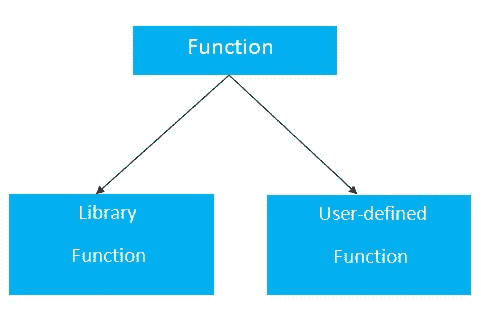

# 功能

> 原文：<https://www.javatpoint.com/functions-in-c>

在 c 语言中，我们可以将一个大程序分成称为函数的基本构件。该函数包含由{}括起来的一组编程语句。一个函数可以被多次调用，为 C 程序提供可重用性和模块化。换句话说，我们可以说函数的集合创建了一个程序。该函数在其他编程语言中也被称为*程序*或*子程序*。

## C 语言中函数的优势

C 函数有以下优点。

*   通过使用函数，我们可以避免在程序中一次又一次地重写相同的逻辑/代码。
*   在一个程序中，我们可以从程序的任何地方调用 C 函数任何次数。
*   当一个大的 C 程序被分成多个函数时，我们可以很容易地跟踪它。
*   可重用性是 C 语言功能的主要成就。
*   然而，在 C 程序中，函数调用总是一个开销。

## 功能方面

C 函数有三个方面。

*   **函数声明**一个函数必须在 c 程序中全局声明，才能告诉编译器函数名、函数参数和返回类型。

*   **函数调用**函数可以从程序中的任何地方调用。参数列表在函数调用和函数声明方面不能不同。我们必须传递与函数声明中声明的相同数量的函数。

*   **功能定义**包含要执行的实际语句。这是调用函数时控件所涉及的最重要的方面。这里，我们必须注意到只能从函数中返回一个值。

| 塞内加尔 | 功能方面 | 句法 |
| one | 函数声明 | return _ type function _ name(参数列表)； |
| Two | 函数调用 | 函数名(参数列表) |
| three | 函数定义 | return_type function_name(参数列表){函数体；} |

用 c 语言创建函数的语法如下:

```
return_type function_name(data_type parameter...){
//code to be executed
}

```

## 函数的类型

C 编程中有两种类型的函数:

1.  **库函数**:是在 C 头文件中声明的函数，如 scanf()、printf()、get()、put()、ceil()、floor()等。
2.  **自定义函数**:是 C 程序员创建的函数，可以多次使用。它降低了大程序的复杂性，优化了代码。



## 返回值

C 函数可以从函数中返回值，也可以不返回值。如果不必从函数中返回任何值，请使用 void 作为返回类型。

让我们看一个 C 函数的简单例子，它不从函数中返回值。

**无返回值示例:**

```
void hello(){
printf("hello c");
}

```

如果您想从函数中返回任何值，您需要使用任何数据类型，如 int、long、char 等。返回类型取决于从函数返回的值。

让我们看一个简单的 C 函数例子，它从函数中返回 int 值。

**返回值示例:**

```
int get(){
return 10;
}

```

在上面的例子中，我们必须返回 10 作为一个值，所以返回类型是 int。如果要返回浮点值(如 10.2、3.1、54.5 等)，则需要使用 float 作为方法的返回类型。

```
float get(){
return 10.2;
}

```

现在，您需要调用该函数，以获取该函数的值。

## 函数调用的不同方面

函数可以接受也可以不接受任何参数。它可能会也可能不会返回值。基于这些事实，函数调用有四个不同的方面。

*   没有参数和返回值的函数
*   不带参数且带有返回值的函数
*   带参数且无返回值的函数
*   带有参数和返回值的函数

### 不带参数和返回值的函数示例

**例 1**

```
#include<stdio.h>
void printName();
void main ()
{
    printf("Hello ");
    printName();
}
void printName()
{
    printf("Javatpoint");
}

```

**输出**

```
Hello Javatpoint

```

**例 2**

```
#include<stdio.h>
void sum();
void main()
{
    printf("\nGoing to calculate the sum of two numbers:");
    sum();
}
void sum()
{
    int a,b; 
    printf("\nEnter two numbers");
    scanf("%d %d",&a,&b); 
    printf("The sum is %d",a+b);
}

```

**输出**

```
Going to calculate the sum of two numbers:

Enter two numbers 10 
24 

The sum is 34

```

### 不带参数且带有返回值的函数示例

**例 1**

```
#include<stdio.h>
int sum();
void main()
{
    int result; 
    printf("\nGoing to calculate the sum of two numbers:");
    result = sum();
    printf("%d",result);
}
int sum()
{
    int a,b; 
    printf("\nEnter two numbers");
    scanf("%d %d",&a,&b);
    return a+b; 
}

```

**输出**

```
Going to calculate the sum of two numbers:

Enter two numbers 10 
24 

The sum is 34

```

**例 2:计算正方形面积的程序**

```
#include<stdio.h>
int sum();
void main()
{
    printf("Going to calculate the area of the square\n");
    float area = square();
    printf("The area of the square: %f\n",area);
}
int square()
{
    float side;
    printf("Enter the length of the side in meters: ");
    scanf("%f",&side);
    return side * side;
}

```

**输出**

```
Going to calculate the area of the square 
Enter the length of the side in meters: 10 
The area of the square: 100.000000

```

### 带参数和不带返回值的函数示例

**例 1**

```
#include<stdio.h>
void sum(int, int);
void main()
{
    int a,b,result; 
    printf("\nGoing to calculate the sum of two numbers:");
    printf("\nEnter two numbers:");
    scanf("%d %d",&a,&b);
    sum(a,b);
}
void sum(int a, int b)
{
	printf("\nThe sum is %d",a+b);    
}

```

**输出**

```
Going to calculate the sum of two numbers:

Enter two numbers 10 
24 

The sum is 34

```

**例 2:计算五个数平均值的程序。**

```
#include<stdio.h>
void average(int, int, int, int, int);
void main()
{
    int a,b,c,d,e; 
    printf("\nGoing to calculate the average of five numbers:");
    printf("\nEnter five numbers:");
    scanf("%d %d %d %d %d",&a,&b,&c,&d,&e);
    average(a,b,c,d,e);
}
void average(int a, int b, int c, int d, int e)
{
	float avg; 
	avg = (a+b+c+d+e)/5; 
	printf("The average of given five numbers : %f",avg);
}

```

**输出**

```
Going to calculate the average of five numbers:
Enter five numbers:10 
20
30
40
50
The average of given five numbers : 30.000000

```

### 带参数和返回值的函数示例

**例 1**

```
#include<stdio.h>
int sum(int, int);
void main()
{
    int a,b,result; 
    printf("\nGoing to calculate the sum of two numbers:");
    printf("\nEnter two numbers:");
    scanf("%d %d",&a,&b);
    result = sum(a,b);
    printf("\nThe sum is : %d",result);
}
int sum(int a, int b)
{
	return a+b;
}

```

**输出**

```
Going to calculate the sum of two numbers:
Enter two numbers:10
20 
The sum is : 30   

```

**例 2:检查数字是偶数还是奇数的程序**

```
#include<stdio.h>
int even_odd(int);
void main()
{
 int n,flag=0;
 printf("\nGoing to check whether a number is even or odd");
 printf("\nEnter the number: ");
 scanf("%d",&n);
 flag = even_odd(n);
 if(flag == 0)
 {
 	printf("\nThe number is odd");
 }
 else 
 {
 	printf("\nThe number is even");
 }
}
int even_odd(int n)
{
	if(n%2 == 0)
	{
		return 1;
	}
	else 
	{
		return 0;
	}
}

```

**输出**

```
Going to check whether a number is even or odd
Enter the number: 100
The number is even

```

## 库函数

库函数是 C 语言中的内置函数，它们被分组并放置在一个称为库的公共位置。这些功能用于执行一些特定的操作。例如，printf 是一个用于在控制台上打印的库函数。库函数是由编译器的设计者创建的。所有的 C 标准库函数都是在扩展名为**的不同头文件中定义的。h** 。我们需要在程序中包含这些头文件，以利用这些头文件中定义的库函数。例如，要使用诸如 printf/scanf 之类的库函数，我们需要在程序中包含 stdio.h，它是一个头文件，包含所有关于标准输入/输出的库函数。

下表列出了最常用的头文件。

| 塞内加尔 | 头文件 | 描述 |
| one | stdio.h | 这是一个标准的输入/输出头文件。它包含关于标准输入/输出的所有库函数。 |
| Two | 科尼厄斯 | 这是一个控制台输入/输出头文件。 |
| three | 字符串. h | 它包含所有与字符串相关的库函数，如 get()，put()，等等。 |
| four | stdlib.h .标准版 | 这个头文件包含了所有通用的库函数，比如 malloc()，calloc()，exit()，等等。 |
| five | 数学 h | 这个头文件包含所有与数学运算相关的函数，比如 sqrt()，pow()，等等。 |
| six | time.h | 这个头文件包含所有与时间相关的函数。 |
| seven | 类型 h . h | 这个头文件包含所有字符处理功能。 |
| eight | 标准 arg.h | 变量参数函数是在这个头文件中定义的。 |
| nine | 信号. h | 所有信号处理功能都在这个头文件中定义。 |
| Ten | setjmp.h | 这个文件包含所有的跳转函数。 |
| Eleven | 本地. h | 该文件包含区域设置函数。 |
| Twelve | errno.h | 该文件包含错误处理功能。 |
| Thirteen | assert.h | 该文件包含诊断功能。 |

* * *