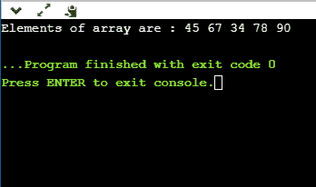
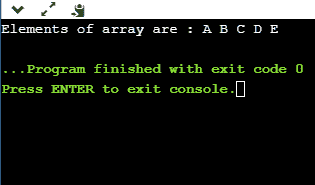
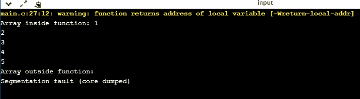
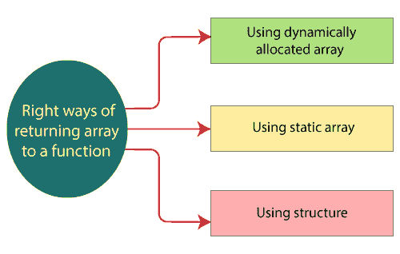
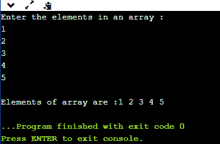
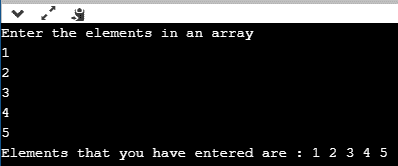
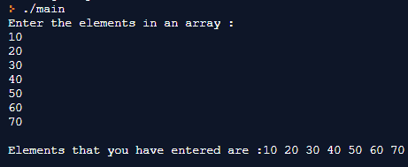
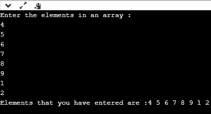

# 用 C 语言返回一个数组

> 原文：<https://www.javatpoint.com/return-an-array-in-c>

## 什么是阵列？

数组是一种存储固定大小的同类数据集合的数据结构。简而言之，我们可以说数组是同一类型变量的集合。

例如，如果我们想要声明 n 个变量，n1，n2...如果我们单独创建所有这些变量，那么这将成为一项非常繁琐的任务。在这种情况下，我们创建一个具有相同类型的变量数组。数组的每个元素都可以使用元素的索引来访问。

我们先来看看如何将一维数组传递给函数。

Passing array to a function

```

#include <stdio.h>
void getarray(int arr[])
{
    printf("Elements of array are : ");
    for(int i=0;i<5;i++)
    {
        printf("%d ", arr[i]);
    }
}
int main()
{
   int arr[5]={45,67,34,78,90};
   getarray(arr);
   return 0;
}

```

在上面的程序中，我们首先创建了数组 **arr[]** ，然后将这个数组传递给函数 getarray()。 **getarray()** 函数打印数组 arr[]的所有元素。

**输出**



**将数组作为指针传递给函数**

现在，我们将看到如何将数组作为指针传递给函数。

```

#include <stdio.h>
void printarray(char *arr)
{
    printf("Elements of array are : ");
    for(int i=0;i<5;i++)
    {
        printf("%c ", arr[i]);
    }
}
int main()
{
  char arr[5]={'A','B','C','D','E'};
  printarray(arr);
  return 0;
}

```

在上面的代码中，我们将数组作为指针传递给了函数。函数 **printarray()** 打印数组的元素。

**输出**



#### 注意:从上面的例子中，我们观察到数组作为引用被传递给了一个函数，这意味着数组也存在于函数之外。

**如何从函数中返回数组**

**返回指向数组的指针**

```

#include <stdio.h>
int *getarray()
{
    int arr[5];
    printf("Enter the elements in an array : ");
    for(int i=0;i<5;i++)
    {
        scanf("%d", &arr[i]);
    }
    return arr;
}
int main()
{
  int *n;
  n=getarray();
  printf("\nElements of array are :");
  for(int i=0;i<5;i++)
    {
        printf("%d", n[i]);
    }
    return 0;
}

```

在上面的程序中， **getarray()** 函数返回一个变量‘arr’。它返回一个局部变量，但它是一个要返回的非法内存位置，是在堆栈中的一个函数内分配的。由于程序控制返回到 **main()** 函数，堆栈中的所有变量都被释放。因此，我们可以说这个程序正在返回内存位置，这个位置已经被取消分配了，所以程序的输出是一个**分段错误**。

**输出**



**将数组返回给函数有三种正确的方法:**

*   **使用动态分配的数组**
*   **使用静态数组**
*   **使用结构**



**通过向函数传递一个要作为参数返回的数组来返回数组。**

```

#include <stdio.h>
int *getarray(int *a)
{

    printf("Enter the elements in an array : ");
    for(int i=0;i<5;i++)
    {
        scanf("%d", &a[i]);
    }
    return a;
}
int main()
{
  int *n;
  int a[5];
  n=getarray(a);
  printf("\nElements of array are :");
  for(int i=0;i<5;i++)
    {
        printf("%d", n[i]);
    }
    return 0;
}

```

**输出**



**使用 malloc()函数返回数组。**

```

#include <stdio.h>
#include<malloc.h>
int *getarray()
{
    int size;
    printf("Enter the size of the array : ");
    scanf("%d",&size);
    int *p= malloc(sizeof(size));
    printf("\nEnter the elements in an array");
    for(int i=0;i<size;i++)
    {
        scanf("%d",&p[i]);
    }
    return p;
}
int main()
{
   int *ptr;
   ptr=getarray();
   int length=sizeof(*ptr);
   printf("Elements that you have entered are : ");
   for(int i=0;ptr[i]!='\0';i++)
    {
      printf("%d ", ptr[i]);
    }
  return 0;
}

```

**输出**



**使用静态变量**

```

#include <stdio.h>
int *getarray()
{
  static int arr[7];
  printf("Enter the elements in an array : ");
  for(int i=0;i<7;i++)
  {
      scanf("%d",&arr[i]);
  }
  return arr;

}
int main()
{
  int *ptr;
  ptr=getarray();
  printf("\nElements that you have entered are :");
  for(int i=0;i<7;i++)
  {
      printf("%d ", ptr[i]);
  }
}

```

在上面的代码中，我们在 **getarray()** 函数中将变量 **arr[]** 创建为静态的，该函数在整个程序中都是可用的。因此，函数 getarray()返回变量“ **arr** ”的实际内存位置。

**输出**



**使用结构**

The structure is a user-defined data type that can contain a collection of items of different types. Now, we will create a program that returns an array by using structure.

```

#include <stdio.h>
#include<malloc.h>
struct array
{
    int arr[8];
};
struct array getarray()
{
    struct array y;
    printf("Enter the elements in an array : ");
    for(int i=0;i<8;i++)
    {
        scanf("%d",&y.arr[i]);
    }
    return y;
}
int main()
{
  struct array x=getarray();
  printf("Elements that you have entered are :");
  for(int i=0;x.arr[i]!='\0';i++)
  {
      printf("%d ", x.arr[i]);
  }
    return 0;
}

```

**输出**



* * *