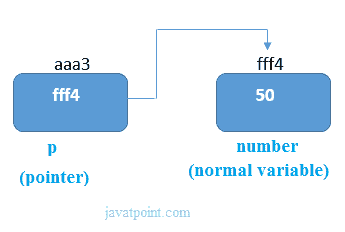
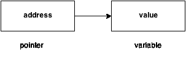

# 指针

> 原文：<https://www.javatpoint.com/c-pointers>

C 语言中的指针是一个存储另一个变量地址的变量。该变量可以是 int、char、数组、函数或任何其他指针类型。指针的大小取决于体系结构。然而，在 32 位体系结构中，指针的大小是 2 字节。

考虑下面的例子来定义一个存储整数地址的指针。

```
int n = 10; 
int* p = &n; // Variable p of type pointer is pointing to the address of the variable n of type integer. 

```

## 声明指针

c 语言中的指针可以用*(星号)来声明。它也称为间接指针，用于取消引用指针。

```
int *a;//pointer to int
char *c;//pointer to char

```

### 指针示例

下面给出了一个使用指针打印地址和值的例子。



从上图可以看出，指针变量存储的是 number 变量的地址，即 fff4。数字变量的值是 50。但是指针变量 p 的地址是 aaa3。

借助*(T0)间接运算符，我们可以打印指针变量 p 的值。

让我们看看上图中解释的指针示例。

```
#include int main(){
int number=50;  
int *p;    
p=&number;//stores the address of number variable  
printf("Address of p variable is %x \n",p); // p contains the address of the number therefore printing p gives the address of number.   
printf("Value of p variable is %d \n",*p); // As we know that * is used to dereference a pointer therefore if we print *p, we will get the value stored at the address contained by p.  
return 0;
} 
```

**输出**

```
Address of number variable is fff4
Address of p variable is fff4
Value of p variable is 50

```

### 指向数组的指针

```
int arr[10];
int *p[10]=&arr; // Variable p of type pointer is pointing to the address of an integer array arr.

```

### 指向函数的指针

```
void show (int);
void(*p)(int) = &display; // Pointer p is pointing to the address of a function

```

### 指向结构的指针

```
struct st {
	int i;
	float f;
}ref;
struct st *p = &ref;

```



## 指针的优势

1)指针**减少代码****提高性能**，用于检索字符串、树等。和函数一起使用。

2)我们可以使用指针**从函数**中返回多个值。

3)它使您能够**访问计算机内存中的任何内存位置**。

## 指针的使用

指针在 c 语言中有很多应用。

**1)动态内存分配**

在 c 语言中，我们可以在使用指针的地方使用 malloc()和 calloc()函数动态分配内存。

**2)阵列、功能和结构**

c 语言中的指针广泛用于数组、函数和结构中。它减少了代码并提高了性能。

## (&)操作员的地址

运算符“&”的地址返回变量的地址。但是，我们需要使用%u 来显示变量的地址。

```
#include int main(){
int number=50; 
printf("value of number is %d, address of number is %u",number,&number);  
return 0;
} 
```

**输出**

```
value of number is 50, address of number is fff4

```

## 空指针

没有分配任何值但为空的指针称为空指针。如果在声明时指针中没有任何要指定的地址，可以赋空值。它将提供一个更好的方法。

```
int *p=NULL;

```

在大多数库中，指针的值是 0(零)。

## 指针程序，不使用第三个变量交换两个数字。

```
#include int main(){
int a=10,b=20,*p1=&a,*p2=&b;

printf("Before swap: *p1=%d *p2=%d",*p1,*p2);
*p1=*p1+*p2;
*p2=*p1-*p2;
*p1=*p1-*p2;
printf("\nAfter swap: *p1=%d *p2=%d",*p1,*p2);

return 0;
} 
```

**输出**

```
Before swap: *p1=10 *p2=20
After swap: *p1=20 *p2=10

```

## 读取复杂指针

在阅读 c 语言中的复杂指针时，有几件事必须考虑。让我们看看指针所使用的运算符的优先级和结合性。

| 操作员 | 优先 | 结合性 |
| (), [] | one | 从左到右 |
| *，标识符 | Two | 从右向左 |
| 数据类型 | three | - |

在这里，我们必须注意到，

*   ():该运算符是用于声明和定义函数的括号运算符。
*   []:该运算符是数组下标运算符
*   *:此运算符是指针运算符。
*   标识符:它是指针的名称。优先级将始终分配给此。
*   数据类型:数据类型是指针要指向的变量的类型。它还包括修饰符，如带符号的 int、long 等)。

**如何读取指针:int (*p)[10]。**

要读取指针，我们必须看到()和[]具有相同的优先级。因此，这里必须考虑它们的关联性。关联性是从左到右的，因此优先级为()。

在方括号()内，指针运算符*和指针名称(标识符)p 具有相同的优先级。因此，这里必须考虑它们的关联性，即从右到左，因此优先级为 p，第二优先级为*。

将第三优先级分配给[]，因为数据类型具有最后的优先级。因此指针看起来如下。

*   char -> 4
*   * -> 2
*   p -> 1
*   [10] -> 3

指针将被读取，因为 p 是指向大小为 10 的整数数组的指针。

**例**

如何读取下面的指针？

```
int (*p)(int (*)[2], int (*)void))

```

### 说明

这个指针将被读取，因为 p 是这样一个函数的指针，该函数接受第一个参数作为大小为 2 的一维整数数组的指针，接受第二个参数作为函数的指针，该函数的参数为 void，返回类型为整数。

* * *