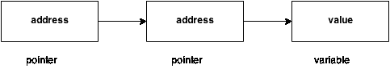

# 双指针(指针对指针)

> 原文：<https://www.javatpoint.com/c-pointer-to-pointer>

我们知道，c 语言中使用指针来存储变量的地址，指针减少了变量的访问时间。然而，在 C 语言中，我们也可以定义一个指针来存储另一个指针的地址。这种指针被称为双指针(指针对指针)。第一个指针用于存储变量的地址，而第二个指针用于存储第一个指针的地址。让我们通过下面给出的图表来理解它。



声明双指针的语法如下。

```
int **p; // pointer to a pointer which is pointing to an integer. 

```

考虑下面的例子。

```
#include<stdio.h>
void main ()
{
	int a = 10;
	int *p;
	int **pp; 
	p = &a; // pointer p is pointing to the address of a
	pp = &p; // pointer pp is a double pointer pointing to the address of pointer p
	printf("address of a: %x\n",p); // Address of a will be printed 
	printf("address of p: %x\n",pp); // Address of p will be printed
	printf("value stored at p: %d\n",*p); // value stoted at the address contained by p i.e. 10 will be printed
	printf("value stored at pp: %d\n",**pp); // value stored at the address contained by the pointer stoyred at pp
}

```

#### 输出

```
address of a: d26a8734
address of p: d26a8738
value stored at p: 10
value stored at pp: 10

```

## 双指针示例

让我们看一个例子，其中一个指针指向另一个指针的地址。


如上图所示，p2 包含 p (fff2)的地址，p 包含数字变量(fff4)的地址。

```
#include int main(){
int number=50;    
int *p;//pointer to int  
int **p2;//pointer to pointer      
p=&number;//stores the address of number variable    
p2=&p;  
printf("Address of number variable is %x \n",&number);    
printf("Address of p variable is %x \n",p);    
printf("Value of *p variable is %d \n",*p);    
printf("Address of p2 variable is %x \n",p2);    
printf("Value of **p2 variable is %d \n",*p);    
return 0;
} 
```

#### 输出

```
Address of number variable is fff4
Address of p variable is fff4
Value of *p variable is 50
Address of p2 variable is fff2
Value of **p variable is 50

```

* * *

## 问:以下程序的输出是什么？

```
#include<stdio.h>
void main ()
{
	int a[10] = {100, 206, 300, 409, 509, 601}; //Line 1
	int *p[] = {a, a+1, a+2, a+3, a+4, a+5}; //Line 2
	int **pp = p; //Line 3
	pp++; // Line 4
	printf("%d %d %d\n",pp-p,*pp - a,**pp); // Line 5
	*pp++; // Line 6
	printf("%d %d %d\n",pp-p,*pp - a,**pp); // Line 7
	++*pp; // Line 8
	printf("%d %d %d\n",pp-p,*pp - a,**pp); // Line 9
	++**pp; // Line 10 
	printf("%d %d %d\n",pp-p,*pp - a,**pp); // Line 11
}

```

#### 说明


在上面的问题中，指针算法与双指针一起使用。定义了由指针 p 的数组指向的 6 个元素的数组。指针数组 p 由双指针 pp 指向。然而， 上图为您提供了一个关于内存如何分配给数组 a 和指针数组 p 的简单想法。p 的元素是指向数组 a 的每个元素的指针。由于我们知道数组名包含数组的基址，因此它将作为指针工作，并且可以通过使用*(a)、*(a+1)等来遍历值。 如图所示，可以通过以下方式访问[0]。

*   a[0]:这是访问数组第一个元素的最简单方法
*   *(a):由于一个存储数组第一个元素的地址，我们可以通过在它上面使用间接指针来访问它的值。
*   *p[0]:如果一个[0]要通过使用指向它的指针 p 来访问，那么我们可以在指针数组 p 的第一个元素上使用间接运算符(*)，即*p[0]。
*   **(pp):由于 pp 存储指针数组的基址，*pp 将给出指针数组第一个元素的值，即整数数组第一个元素的地址。**p 将给出整数数组第一个元素的实际值。

来到程序中，第 1 行和第 2 行相对声明整数和指针数组。第 3 行将双指针初始化为指针数组 p。如图所示，如果数组的地址从 200 开始，并且整数的大小为 2，则指针数组将包含值 200、202、204、206、208、210。让我们考虑指针数组的基址是 300；双指针 pp 包含指针数组的地址，即 300。第 4 行将 pp 的值增加 1，即 pp 现在将指向地址 302。

第 5 行包含一个输出三个值的表达式，即 pp - p，*pp - a，**pp。让我们分别计算它们。

*   pp = 302，p = 300 = > PP-p =(302-300)/2 = > PP-p = 1，即 1 将被打印。
*   pp = 302，*pp = 202，a = 200 => *pp - a = 202 - 200 = 2/2 = 1，即会打印 1。
*   pp = 302，*pp = 202，*(*pp) = 206，即会打印 206。

因此，作为第 5 行的结果，输出 1，1，206 将打印在控制台上。在第 6 行，*pp++被写。这里，我们必须注意到两个一元运算符*和++具有相同的优先级。因此，根据结合律，它将从右向左求值。因此表达式*pp++可以重写为(*(pp++))。因为，pp = 302 现在将变成，304。*pp 将给出 204。

在第 7 行，再次写下表达式，它打印三个值，即 pp-p、*pp-a、*pp。让我们计算它们中的每一个。

*   pp = 304，p = 300 = > PP-p =(304-300)/2 = > PP-p = 2，即 2 将被打印。
*   pp = 304，*pp = 204，a = 200 => *pp-a = (204 - 200)/2 = 2，即会打印 2。
*   pp = 304，*pp = 204，*(*pp) = 300，即会打印 300。

因此，作为第 7 行的结果，输出 2，2，300 将打印在控制台上。在第 8 行，写了++*pp。根据结合律，这可以重写为，(+++(*(PP))。因为，pp = 304，*pp = 204，所以*pp = *(p[2]) = 206 的值现在将指向 a[3]。

在第 9 行，再次写下表达式，它打印三个值，即 pp-p、*pp-a、*pp。让我们计算它们中的每一个。

*   pp = 304，p = 300 = > PP-p =(304-300)/2 = > PP-p = 2，即 2 将被打印。
*   pp = 304，*pp = 206，a = 200 => *pp-a = (206 - 200)/2 = 3，即会打印 3。
*   pp = 304，*pp = 206，*(*pp) = 409，即会打印 409。

因此，作为第 9 行的结果，输出 2、3、409 将被打印在控制台上。在第 10 行，++**pp 被写下。根据结合律，这可以改写为，(+++(*(*(PP)))。pp = 304，*pp = 206，**pp = 409，++**pp => *pp = *pp + 1 = 410。换句话说，a[3] = 410。

在第 11 行，再次写下表达式，它打印三个值，即 pp-p，*pp-a，*pp。让我们计算它们中的每一个。

*   pp = 304，p = 300 = > PP-p =(304-300)/2 = > PP-p = 2，即 2 将被打印。
*   pp = 304，*pp = 206，a = 200 => *pp-a = (206 - 200)/2 = 3，即会打印 3。
*   第 8 行，**pp = 410。

因此，作为第 9 行的结果，输出 2、3、410 将被打印在控制台上。

最后，整个程序的输出将给出如下:

**输出**

```
1 1 206
2 2 300
2 3 409
2 3 410 

```