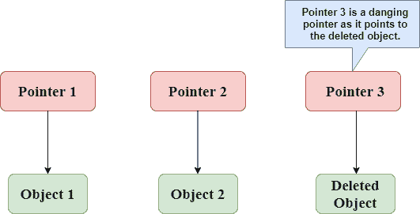
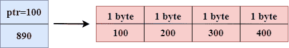
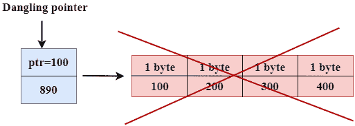
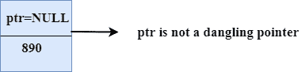
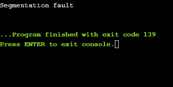
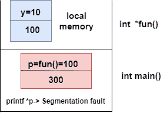
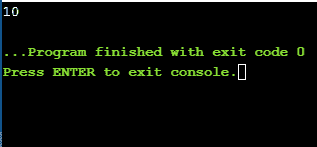
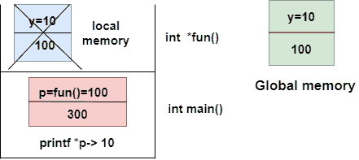

# C 语言中的悬空指针

> 原文：<https://www.javatpoint.com/dangling-pointers-in-c>

与指针和内存管理相关的最常见错误是悬空/野生指针。有时程序员无法用有效的地址初始化指针，那么这种类型的初始化指针在 c 语言中被称为悬空指针。

当对象在不修改指针值的情况下从内存中删除或取消分配时，悬空指针会在对象销毁时出现。在这种情况下，指针指向被取消分配的内存。悬空指针可以指向包含程序代码或操作系统代码的内存。如果我们给这个指针赋值，那么它会覆盖程序代码或操作系统指令的值；在这种情况下，程序将显示不良结果，甚至可能崩溃。如果内存被重新分配给其他进程，那么我们取消引用悬空指针将导致分段错误。

**我们来观察下面的例子。**



在上图中，我们可以观察到**指针 3** 是一个悬空指针。**指针 1** 和**指针 2** 分别指向分配的对象，即对象 1 和对象 2。**指针 3** 是一个悬空指针，因为它指向取消分配的对象。

**我们通过一些 C 程序来了解悬空指针。**

**使用 free()函数解除内存分配。**

```

#include <stdio.h>
int main()
{
   int *ptr=(int *)malloc(sizeof(int));
   int a=560;
   ptr=&a;
   free(ptr);
   return 0;
}

```

在上面的代码中，我们创建了两个变量，即*ptr 和 a，其中‘ptr’是指针，‘a’是整数变量。*ptr 是一个指针变量，是在 **malloc()** 函数的帮助下创建的。我们知道 malloc()函数返回 void，所以我们使用 int *将 void 指针转换为 int 指针。

语句**int * ptr =(int *)malloc(sizeof(int))；**将分配如下图所示的 4 字节内存:



语句 **free(ptr)** 解除分配内存，如下图带叉号所示，“ptr”指针指向解除分配的内存时变得悬空。



如果我们将空值赋给“ptr”，那么“ptr”将不会指向被删除的内存。因此，我们可以说 ptr 不是悬空指针，如下图所示:



**变量超出范围**

当变量超出范围时，指向该变量的指针变成**悬空指针。**

```

#include<stdio.h>
int main()
{
    char *str;
    {
        char a = ?A?;
        str = &a;
    }
    // a falls out of scope 
    // str is now a dangling pointer 
    printf("%s", *str);
}

```

**在上面的代码中，我们执行了以下步骤:**

*   首先，我们声明名为“str”的指针变量。
*   在内部范围内，我们声明了一个字符变量。字符串指针包含变量“a”的地址。
*   当控件超出内部范围时，“a”变量将不再可用，因此 str 指向取消分配的内存。这意味着字符串指针变成了悬空指针。

**功能调用**

现在，我们将看到当我们调用函数时指针是如何变得悬空的。

**我们通过一个例子来了解一下。**

```

   #include <stdio.h>
    int *fun(){
    int y=10;
    return &y;
  }
int main()
{
int *p=fun();
printf("%d", *p);
return 0;
}

```

**在上面的代码中，我们执行了以下步骤:**

*   首先，我们创建 **main()** 函数，其中我们已经声明了**‘p’**指针，该指针包含 **fun()** 的返回值。
*   当调用 **fun()** 时，控件移动到 **int *fun()的上下文中，**的 **fun()** 返回“y”变量的地址。
*   当控制返回到 **main()** 函数的上下文时，意味着变量**‘y’**不再可用。因此，我们可以说**‘p’**指针是一个悬空指针，因为它指向未分配的内存。

**输出**



**让我们用图解法表示上述代码的工作。**



**让我们考虑另一个悬空指针的例子。**

```

#include <stdio.h>
int *fun()
{
    static int y=10;
    return &y;
}
int main()
{
   int *p=fun();
   printf("%d", *p);
    return 0;
}

```

上面的代码与前面的代码相似，但唯一的区别是变量“y”是静态的。我们知道静态变量存储在全局内存中。

**输出**



现在，我们用图解法表示上述代码的工作。



上图显示了堆栈内存。首先，调用 fun() 函数，然后控件移动到 **int *fun()的上下文中。**由于‘y’是静态变量，所以存储在全局内存中；它的范围在整个计划中都是可用的。当返回地址值时，控制返回到 **main()的上下文。**指针‘p’包含‘y’的地址，即 100。当我们打印值“*p”时，它会打印值“y”，即 10。因此，我们可以说指针“p”不是悬空指针，因为它包含存储在全局内存中的变量的地址。

**避免悬空指针错误**

将指针初始化为**空值**可以避免悬空指针错误。如果我们将**空值**分配给指针，那么指针将不会指向取消分配的内存。将**空值**赋值给指针意味着指针没有指向任何内存位置。

* * *