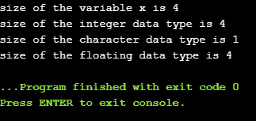

# C 中的 sizeof()运算符

> 原文：<https://www.javatpoint.com/size-of-operator-in-c>

c 语言中常用 **sizeof()** 运算符，它决定表达式的大小或字符大小的存储单元数中指定的数据类型。 **sizeof()** 运算符包含一个操作数，该操作数可以是表达式或数据类型转换，其中转换是括在括号内的数据类型。数据类型不仅可以是基本数据类型，如整数或浮点数据类型，还可以是指针数据类型和复合数据类型，如联合和结构。

### 需要 sizeof()运算符

主要是，程序知道原始数据类型的存储大小。虽然数据类型的存储大小是不变的，但是在不同的平台上实现时，它是不同的。例如，我们使用 **sizeof()** 运算符动态分配数组空间:

```

int *ptr=malloc(10*sizeof(int));

```

在上面的示例中，我们使用了 sizeof()运算符，该运算符应用于 int 类型的转换。我们使用 **malloc()** 函数来分配内存，并返回指向该分配内存的指针。内存空间等于 int 数据类型占用的字节数乘以 10。

#### 注意:
不同机器上的输出可以不同，比如 32 位操作系统会显示不同的输出，64 位操作系统会显示相同数据类型的不同输出。

**sizeof()** 运算符根据操作数的类型有不同的行为。

*   **操作数是数据类型**
*   **操作数是表达式**

### 当操作数是数据类型时。

```

#include <stdio.h>
int main()
{
    int x=89;    // variable declaration.
    printf("size of the variable x is %d", sizeof(x));  // Displaying the size of ?x? variable.
    printf("\nsize of the integer data type is %d",sizeof(int)); //Displaying the size of integer data type.
    printf("\nsize of the character data type is %d",sizeof(char)); //Displaying the size of character data type.

    printf("\nsize of the floating data type is %d",sizeof(float)); //Displaying the size of floating data type.
return 0;
}

```

在上面的代码中，我们借助 **sizeof()** 运算符打印了 int、char、float 等不同数据类型的大小。

**输出**



### 当操作数是表达式时

```

#include <stdio.h>
int main()
{
  double i=78.0; //variable initialization.
  float j=6.78; //variable initialization.
  printf("size of (i+j) expression is : %d",sizeof(i+j)); //Displaying the size of the expression (i+j).
  return 0;
}

```

在上面的代码中，我们分别创建了 double 和 float 类型的两个变量‘I’和‘j’，然后使用 **sizeof(i+j)** 运算符打印表达式的大小。

**输出**

```
size of (i+j) expression is : 8

```

* * *