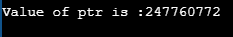

# C 语言中的常量指针

> 原文：<https://www.javatpoint.com/const-pointer-in-c>

### 常数指针

C 中的常量指针不能改变它所指向的变量的地址，即地址将保持不变。因此，我们可以说，如果一个常量指针指向某个变量，那么它就不能指向任何其他变量。

### 常数指针的语法

```

<type of pointer> *const <name of pointer>;

```

**常数指针的声明如下:**

```

int *const ptr;

```

**我们通过一个例子来理解常量指针。**

```

#include <stdio.h>
int main()
{
    int a=1;
    int b=2;
    int *const ptr;
    ptr=&a;
    ptr=&b;
    printf("Value of ptr is :%d",*ptr);
    return 0;
}

```

**在上面的代码中:**

*   我们声明了两个变量，即分别具有值 1 和值 2 的 a 和 b。
*   我们声明一个常量指针。
*   首先，我们将变量“a”的地址分配给指针“ptr”。
*   然后，我们将变量“b”的地址分配给指针“ptr”。
*   最后，我们尝试打印由“ptr”指向的变量值。

**输出**


在上面的输出中，我们可以观察到上面的代码产生了错误“只读变量‘ptr’的赋值”。这意味着“ptr”持有的变量“ptr”的值不能更改。在上面的代码中，我们将“ptr”的值从&a 更改为&b，这对于常量指针是不可能的。因此，我们可以说指向某个变量的常量指针不能指向另一个变量。

### 指向常数的指针

指向常量的指针是一个指针，指针所指向的变量的值不能通过它改变。这些指针的地址可以改变，但是指针指向的变量的值不能改变。

### 指向常数的指针的语法

```

const <type of pointer>* <name of pointer>

```

**指针指向常量的声明如下:**

```

const int* ptr;

```

**我们通过一个例子来了解一下。**

*   **首先，我们编写代码来改变指针的值**

```

#include <stdio.h>
int main()
{
    int a=100;
    int b=200;
    const int* ptr;
    ptr=&a;
    ptr=&b;
    printf("Value of ptr is :%u",ptr);
    return 0;
}

```

**在上面的代码中:**

*   我们声明了两个变量，即 a 和 b，它们的值分别为 100 和 200。
*   我们声明一个指向常量的指针。
*   首先，我们将变量“a”的地址分配给指针“ptr”。
*   然后，我们将变量“b”的地址分配给指针“ptr”。
*   最后，我们尝试打印“ptr”的值。

**输出**



上面的代码运行成功，它在输出中显示了“ptr”的值。

*   现在，我们编写代码，改变指针指向的变量的值。

```

#include <stdio.h>
int main()
{
    int a=100;
    int b=200;
    const int* ptr;
    ptr=&b;
    *ptr=300;
    printf("Value of ptr is :%d",*ptr);
    return 0;
}

```

**在上面的代码中:**

*   我们声明了两个变量，即‘a’和‘b’，它们的值分别为 100 和 200。
*   我们声明一个指向常量的指针。
*   我们将变量“b”的地址分配给指针“ptr”。
*   然后，我们尝试通过指针“ptr”修改变量“b”的值。
*   最后，我们尝试打印指针“ptr”所指向的变量值。

**输出**


上面的代码显示了错误“分配只读位置' *ptr '”。这个错误意味着我们不能改变指针所指向的变量的值。

### 指向常数的常数指针

指向常量的常量指针是指针，它是以上两个指针的组合。它既不能改变它所指向的变量的地址，也不能改变放在这个地址的值。

### 句法

```

const <type of pointer>* const <name of the pointer>;

```

**常数指针到常数的声明如下:**

```

const int* const ptr;

```

**我们通过一个例子来了解一下。**

```

#include <stdio.h>
int main()
{
    int a=10;
    int b=90;
    const int* const ptr=&a;
   *ptr=12;
    ptr=&b;
    printf("Value of ptr is :%d",*ptr);
    return 0;
} 

```

**在上面的代码中:**

*   我们声明了两个变量，即‘a’和‘b’，它们的值分别为 10 和 90。
*   我们声明一个指向常量的常量指针，然后分配“a”的地址。
*   我们试图通过指针“ptr”来改变变量“a”的值。
*   然后我们尝试将变量“b”的地址分配给指针“ptr”。
*   最后，我们打印由指针“ptr”指向的变量值。

**输出**


上面的代码显示了错误“分配只读位置' *ptr '”和“分配只读变量' ptr '”。因此，我们得出结论，指向常数的常数指针既不能改变地址，也不能改变由该指针指向的值。

* * *