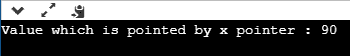

# C 语言中的空指针

> 原文：<https://www.javatpoint.com/void-pointer-in-c>

到目前为止，我们已经研究了分配给指针的地址应该与指针声明中指定的类型相同。例如，如果我们声明了 int 指针，那么这个 int 指针不能指向 float 变量或其他类型的变量，也就是说，它只能指向 int 类型的变量。为了克服这个问题，我们使用指针来作废。指向 void 的指针意味着可以指向任何数据类型的通用指针。我们可以将任何数据类型的地址分配给 void 指针，而 void 指针可以分配给任何类型的指针，而无需执行任何显式的类型转换。

### void 指针的语法

```

void *pointer name;

```

**作废指针声明如下:**

```

void *ptr;

```

在上面的声明中，void 是指针的类型，“ptr”是指针的名称。

**我们来考虑一些例子:**

int I = 9；//整数变量初始化。

int * p；//整数指针声明。

float * fp//浮点指针声明。

void * ptr// void 指针声明。

p = fp//不正确。

fp= &i; //不正确

ptr = p；//正确

ptr = fp//正确

ptr= &i; //正确

### C 语言中空指针的大小

C 中空指针的大小与字符类型指针的大小相同。根据 C 感知，指向 void 的指针的表示与字符类型的指针相同。指针的大小会因您使用的平台而异。

**我们来看看下面的例子:**

```

#include <stdio.h>
int main()
{
    void *ptr = NULL; //void pointer
    int *p  = NULL;// integer pointer
    char *cp = NULL;//character pointer
    float *fp = NULL;//float pointer
    //size of void pointer
    printf("size of void pointer = %d\n\n",sizeof(ptr));
    //size of integer pointer
    printf("size of integer pointer = %d\n\n",sizeof(p));
    //size of character pointer
    printf("size of character pointer = %d\n\n",sizeof(cp));
    //size of float pointer
    printf("size of float pointer = %d\n\n",sizeof(fp));
    return 0;
}

```

**输出**


### void 指针的优点

**以下是空指针的优点:**

*   malloc()和 calloc()函数返回 void 指针，因此这些函数可以用来分配任何数据类型的内存。

```

#include <stdio.h>
#include<malloc.h>
int main()
{
   int a=90;

   int *x = (int*)malloc(sizeof(int)) ;
   x=&a;
   printf("Value which is pointed by x pointer : %d",*x);
    return 0;
}

```

**输出**



*   C 中的 void 指针也可以用来实现 C 中的泛型函数。

**与空指针相关的一些要点有:**

*   **取消引用 C 中的空指针**

C 中的 void 指针不能直接取消引用。让我们看看下面的例子。

```

#include <stdio.h>
int main()
{
   int a=90;
   void *ptr;
   ptr=&a;
   printf("Value which is pointed by ptr pointer : %d",*ptr);
   return 0;
}

```

在上面的代码中，*ptr 是一个指向整数变量“a”的 void 指针。因为我们已经知道 void 指针不能被取消引用，所以上面的代码会给出编译时错误，因为我们正在直接打印指针“ptr”指向的变量的值。

**输出**


现在，我们重写上面的代码来消除错误。

```

#include <stdio.h>
int main()
{
   int a=90;
   void *ptr;
   ptr=&a;
   printf("Value which is pointed by ptr pointer : %d",*(int*)ptr);
    return 0;
}

```

在上面的代码中，我们使用下面给出的语句将 void 指针类型转换为整数指针:

**(int *)ptr；**

然后，我们使用下面给出的语句打印由 void 指针“ptr”指向的变量值:

***(int *)ptr；**

**输出**


*   **对无效指针的算术运算**

我们不能直接对 C 语言中的空指针进行算术运算。我们需要应用正确的类型转换，以便能够对空指针执行算术运算。

**我们来看看下面的例子:**

```

#include<stdio.h> 
int main() 
{ 
   float a[4]={6.1,2.3,7.8,9.0};
   void *ptr;
   ptr=a;
   for(int i=0;i<4;i++)
  {
      printf("%f,",*ptr);
      ptr=ptr+1;         // Incorrect.

}}

```

上面的代码显示了编译时错误“**无效使用 void 表达式**”，因为我们不能直接对 void 指针应用算术运算，即 ptr=ptr+1。

**让我们重写上面的代码来消除错误。**

```

#include<stdio.h> 
int main() 
{ 
   float a[4]={6.1,2.3,7.8,9.0};
   void *ptr;
   ptr=a;
   for(int i=0;i<4;i++)
  {
      printf("%f,",*((float*)ptr+i));
   }}

```

上面的代码运行成功，因为我们对 void 指针应用了正确的强制转换，即(float*)ptr，然后我们应用了算术运算，即*((float*)ptr+i)。

**输出**


### 为什么我们使用空指针？

我们使用 void 指针是因为它的可重用性。Void 指针可以存储任何类型的对象，我们可以通过使用具有适当类型转换的间接操作符来检索任何类型的对象。

**我们通过一个例子来了解一下。**

```

#include<stdio.h> 
int main() 
{ 
  int a=56; // initialization of a integer variable 'a'.
  float b=4.5; // initialization of a float variable 'b'.
  char c='k'; // initialization of a char variable 'c'.
   void *ptr; // declaration of void pointer.
   // assigning the address of variable 'a'.
   ptr=&a;
   printf("value of 'a' is : %d",*((int*)ptr));
   // assigning the address of variable 'b'.
   ptr=&b;
   printf("\nvalue of 'b' is : %f",*((float*)ptr));
   // assigning the address of variable 'c'.
   ptr=&c;
    printf("\nvalue of 'c' is : %c",*((char*)ptr));
    return 0;
}

```

**输出**


* * *