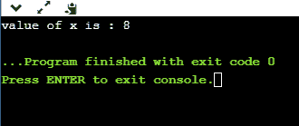
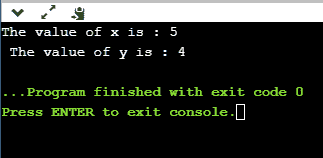

# 取消引用指针

> 原文：<https://www.javatpoint.com/c-dereference-pointer>

我们已经知道**“什么是指针”**，指针是存储另一个变量地址的变量。取消引用运算符也称为间接运算符，用(*)表示。当间接操作符(*)与指针变量一起使用时，则称为**取消指针引用。**当我们取消引用一个指针时，这个指针指向的变量的值将被返回。

## 为什么我们使用解引用指针？

**由于以下原因取消引用指针:**

*   它可以用来访问或操作存储在内存位置的数据，内存位置由指针指向。
*   应用于取消引用指针的任何操作都将直接影响它所指向的变量的值。

**让我们观察以下取消引用指针的步骤。**

*   首先，我们声明指针指向的整数变量。

```

int x =9; 

```

*   现在，我们声明整数指针变量。

```

int *ptr; 

```

*   在声明一个整数指针变量后，我们将“x”变量的地址存储到指针变量“ptr”中。

```

ptr=&x;

```

*   我们可以通过取消指针“ptr”的引用来更改“x”变量的值，如下所示:

```

*ptr =8;

```

上一行将“x”变量的值从 9 更改为 8，因为“ptr”指向“x”位置，取消对“ptr”的引用，即*ptr=8 将更新 x 的值。

**让我们结合以上所有步骤:**

```

#include <stdio.h>
int main()
{
    int x=9;
    int *ptr;
    ptr=&x;
    *ptr=8;
    printf("value of x is : %d", x);
    return 0;}

```

**输出**



**我们再来考虑一个例子。**

```

#include <stdio.h>
int main()
{
    int x=4;
    int y;
    int *ptr;
    ptr=&x; 
    y=*ptr;
    *ptr=5;
    printf("The value of x is : %d",x);
    printf("\n The value of y is : %d",y);
    return 0;
}

```

**在上面的代码中:**

*   我们声明了两个变量“x”和“y ”,其中“x”代表“4”值。
*   我们声明一个指针变量“ptr”。
*   在指针变量声明之后，我们将“x”变量的地址分配给指针“ptr”。
*   因为我们知道‘ptr’包含‘x’变量的地址，所以‘* ptr’与‘x’相同。
*   我们借助‘ptr’变量将‘x’的值赋给‘y’，即 y=* **ptr** 而不是使用‘x’变量。

#### 注意:根据我们的说法，如果我们改变“x”的值，那么“y”的值也会改变，因为指针“ptr”保存了“x”变量的地址。但是这种情况不会发生，因为“y”正在存储值“5”的本地副本。

**输出**



**我们来考虑另一个场景。**

```

#include <stdio.h>
int main()
{
   int a=90;
   int *ptr1,*ptr2;
   ptr1=&a;
   ptr2=&a;
   *ptr1=7;
   *ptr2=6;
    printf("The value of a is : %d",a);
    return 0;
}

```

**在上面的代码中:**

*   首先，我们声明一个“a”变量。
*   然后我们声明两个指针，即 ptr1 和 ptr2。
*   两个指针都包含“a”变量的地址。
*   我们给*ptr1 赋值“7 ”,给*ptr2 赋值“6”。“a”的最终值将是“6”。

#### 注意:如果我们有多个指针指向同一个位置，那么一个指针所做的更改将与另一个指针相同。

**输出**


* * *