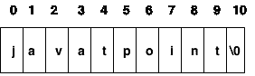
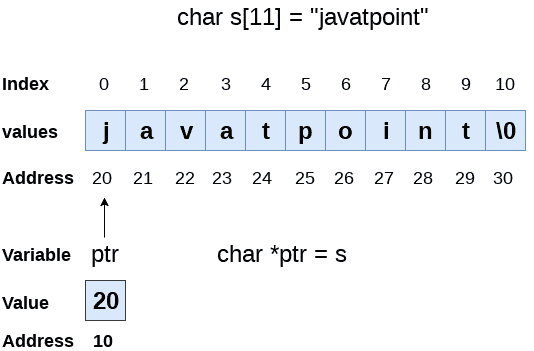

# c 字符串

> 原文：<https://www.javatpoint.com/c-strings>

该字符串可以定义为以 null(“\ 0”)结尾的一维字符数组。字符数组或字符串用于操作文本，如单词或句子。数组中的每个字符占用一个字节的内存，最后一个字符必须始终为 0。终止字符(“\0”)在字符串中很重要，因为它是识别字符串结束位置的唯一方法。当我们将一个字符串定义为 char s[10]时，字符 s[10]在内存中用 null 隐式初始化。

用 c 语言声明字符串有两种方法。

1.  按字符排列
2.  按字符串文字

让我们看看用 C 语言通过 char 数组声明**字符串的例子。**

```
char ch[10]={'j', 'a', 'v', 'a', 't', 'p', 'o', 'i', 'n', 't', '\0'};

```

我们知道，数组索引从 0 开始，所以它将表示为下图所示。



声明字符串时，大小不是必需的。因此，我们可以编写如下所示的上述代码:

```
char ch[]={'j', 'a', 'v', 'a', 't', 'p', 'o', 'i', 'n', 't', '\0'};

```

我们也可以用 C 语言中的字符串文字来定义**字符串。例如:**

```
char ch[]="javatpoint";

```

在这种情况下，编译器将在字符串的末尾追加“\0”。

### 字符数组和字符串文字之间的区别

字符数组和文字有两个主要区别。

*   我们需要自己在数组末尾添加空字符' \0 '，而在字符数组的情况下，它是由编译器在内部追加的。
*   字符串不能被重新分配给另一组字符，而我们可以重新分配数组的字符。

## C 语言中的字符串示例

让我们看一个简单的例子，其中一个字符串被声明并被打印。“%s”在 c 语言中用作字符串的格式说明符。

```
#include #include <string.h>int main(){  
  char ch[11]={'j', 'a', 'v', 'a', 't', 'p', 'o', 'i', 'n', 't', '\0'};  
   char ch2[11]="javatpoint";  

   printf("Char Array Value is: %s\n", ch);  
   printf("String Literal Value is: %s\n", ch2);  
 return 0;  
}</string.h> 
```

**输出**

```
Char Array Value is: javatpoint
String Literal Value is: javatpoint

```

## 遍历字符串

遍历字符串是任何编程语言中最重要的方面之一。我们可能需要处理一个非常大的文本，这可以通过遍历文本来完成。遍历字符串与遍历整数数组有些不同。我们需要知道数组的长度来遍历整数数组，而在字符串的情况下，我们可以使用空字符来标识字符串的结尾并终止循环。

因此，有两种方法可以遍历字符串。

*   通过使用字符串的长度
*   通过使用空字符。

让我们讨论每一个。

### 使用字符串的长度

让我们看一个计算字符串中元音数量的例子。

```
#include<stdio.h>
void main ()
{
	char s[11] = "javatpoint";
	int i = 0; 
	int count = 0;
	while(i<11)
	{
		if(s[i]=='a' || s[i] == 'e' || s[i] == 'i' || s[i] == 'u' || s[i] == 'o')
		{
			count ++;
		}
		i++;
	}
	printf("The number of vowels %d",count);
}

```

**输出**

```
The number of vowels 4 

```

### 使用空字符

让我们看看使用空字符计算元音数量的同一个例子。

```
#include<stdio.h>
void main ()
{
	char s[11] = "javatpoint";
	int i = 0; 
	int count = 0;
	while(s[i] != NULL)
	{
		if(s[i]=='a' || s[i] == 'e' || s[i] == 'i' || s[i] == 'u' || s[i] == 'o')
		{
			count ++;
		}
		i++;
	}
	printf("The number of vowels %d",count);
}

```

**输出**

```
The number of vowels 4 

```

## 接受字符串作为输入

到目前为止，我们使用 scanf 来接受用户的输入。然而，它也可以用于字符串的情况，但是有不同的场景。考虑下面的代码，它在遇到空格时存储字符串。

```
#include<stdio.h>
void main ()
{
	char s[20];
	printf("Enter the string?");
	scanf("%s",s);
	printf("You entered %s",s);
}

```

**输出**

```
Enter the string?javatpoint is the best                                                                 
You entered javatpoint

```

从输出中可以清楚地看出，上面的代码不适用于空格分隔的字符串。为了使这段代码适用于空格分隔的字符串，scanf 函数中需要进行较小的更改，也就是说，我们必须编写:scanf("%[^\n]s",s)来指示编译器在遇到新行时存储字符串。让我们考虑以下示例来存储空格分隔的字符串。

```
#include void main ()
{
	char s[20];
	printf("Enter the string?");
	scanf("%[^\n]s",s);
	printf("You entered %s",s);
} 
```

**输出**

```
Enter the string?javatpoint is the best
You entered javatpoint is the best

```

这里我们还必须注意到，我们不需要在 scanf 中使用 address of (&)运算符来存储字符串，因为字符串 s 是一个字符数组，而数组的名称，即 s 表示字符串(字符数组)的基址，因此我们不需要使用& with。

### 一些要点

但是，在使用 scanf 输入字符串时，必须注意以下几点。

*   编译器不会对字符数组执行边界检查。因此，可能会出现字符串的长度超过字符数组的维数的情况，这可能总是会覆盖一些重要的数据。
*   我们可以使用 get()代替 scanf，get()是头文件字符串中定义的内置函数。

## 带字符串的指针

到目前为止，我们已经在数组、函数和原始数据类型中使用了指针。但是，指针可以用来指向字符串。使用指针指向字符串有各种好处。让我们考虑下面的例子，通过指针访问字符串。

```
#include<stdio.h>
void main ()
{
	char s[11] = "javatpoint";
	char *p = s; // pointer p is pointing to string s. 
	printf("%s",p); // the string javatpoint is printed if we print p.
}

```

**输出**

```
javatpoint

```



我们知道字符串是一个字符数组，指针可以像数组一样使用。在上面的例子中，P 被声明为指向字符数组 s 的指针。P 的作用类似于 s，因为 s 是字符串的基址，在内部被视为指针。但是，我们不能更改 s 的内容，也不能直接将 s 的内容复制到另一个字符串中。为此，我们需要使用指针来存储字符串。在下面的示例中，我们展示了如何使用指针将字符串的内容复制到另一个字符串中。

```
#include<stdio.h>
void main ()
{
	char *p = "hello javatpoint";
	printf("String p: %s\n",p);
	char *q;
	printf("copying the content of p into q...\n");
	q = p;
	printf("String q: %s\n",q);
}

```

**输出**

```
String p: hello javatpoint 
copying the content of p into q... 
String q: hello javatpoint 

```

一旦定义了字符串，就不能将其重新分配给另一组字符。但是，使用指针，我们可以将字符集分配给字符串。考虑下面的例子。

```
#include<stdio.h>
void main ()
{
	char *p = "hello javatpoint";
	printf("Before assigning: %s\n",p);
	p = "hello";
	printf("After assigning: %s\n",p);
}

```

**输出**

```
Before assigning: hello javatpoint  
After assigning: hello

```

* * *