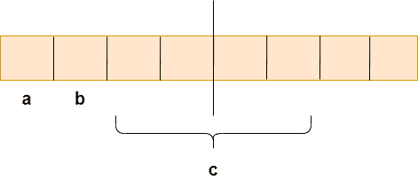
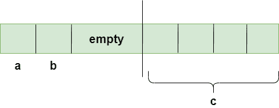
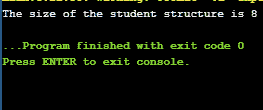
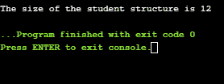
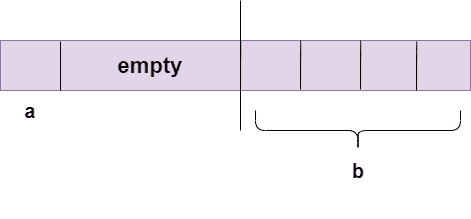
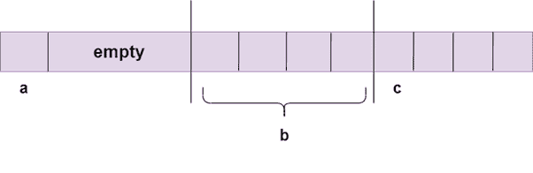
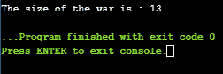

# C 语言中的结构填充

> 原文：<https://www.javatpoint.com/structure-padding-in-c>

结构填充是 C 语言中的一个概念，它在内存地址之间添加一个或多个空字节，以对齐内存中的数据。

**我们先通过一个简单的场景来理解 [C](https://www.javatpoint.com/c-programming-language-tutorial) 中的结构填充，如下所示:**

假设我们创建一个用户定义的结构。当我们创建这个结构的对象时，连续的内存将被分配给结构成员。

```

struct student
{
   char a;
   char b;
   int c;
} stud1;

```

在上面的例子中，我们创建了一个类型为**学生**的结构。我们已经宣布该结构的对象名为“**学生 1** ”。创建对象后，一个连续的内存块被分配给它的结构成员。首先将内存分配给“ **a** 变量，然后是“ **b** 变量，然后是**c**变量。

### 这个学生有多大？

现在，我们计算**结构学生**的大小。我们假设 int 的大小是 4 字节，char 的大小是 1 字节。

```

struct student
{
  char a; // 1 byte
  char b; // 1 byte
  int c; // 4 bytes 
}

```

在上面的例子中，当我们计算**结构学生**的大小时，大小是 6 字节。但是这个答案是错误的。现在，我们就明白为什么这个答案是错的了？我们需要理解结构填充的概念。

### 结构填充

处理器不会一次读取 1 个字节。它一次读一个单词。

**1 字是什么意思？**

如果我们有一个 32 位处理器，那么处理器一次读取 4 个字节，这意味着 1 个字等于 4 个字节。

```

1 word = 4 bytes

```

如果我们有一个 64 位处理器，那么处理器一次读取 8 个字节，这意味着 1 个字等于 8 个字节。

```

1 word = 8 bytes

```

因此，我们可以说 32 位处理器一次能够访问 4 个字节，而 64 位处理器一次能够访问 8 个字节。这个词的大小取决于架构。

### 为什么是结构填充？

```

struct student
{
  char a; // 1 byte
  char b; // 1 byte
  int c; // 4 bytes 
}

```

如果我们有一个 32 位处理器(一次 4 字节)，那么上述结构的内存的图形表示将是:



正如我们所知，结构占用了上图所示的连续内存块，即 char a 为 1 字节，char b 为 1 字节，int c 为 4 字节，那么在这种情况下我们面临什么问题呢？

### 有什么问题？

在我们考虑 32 位架构时，可以一次访问 4 个字节。问题是在一个 CPU 周期内，可以访问一个字节的 **char a** 、一个字节的 **char b** 、两个字节的 **int c** 。我们在访问 **char a** 和 **char b** 时不会遇到任何问题，因为这两个变量都可以在一个 [CPU](https://www.javatpoint.com/cpu-full-form) 周期内访问，但是我们在访问 **int c** 变量时会遇到问题，因为需要 2 个 CPU 周期来访问‘c’变量的值。在第一个 CPU 周期中，访问前两个字节，在第二个周期中，访问另外两个字节。

假设我们不想访问‘a’和‘b’变量，我们只想访问变量‘c’，这需要两个周期。变量“c”有 4 个字节，因此也可以在一个周期内访问，但在这种情况下，它使用了 2 个周期。这是对 CPU 周期的不必要浪费。由于这个原因，引入了结构填充概念来节省 CPU 周期数。结构填充由编译器自动完成。现在，我们将看到结构填充是如何完成的。

### 结构填充是怎么做的？



为了实现结构填充，在左边创建一个空行，如上图所示，左边的“c”变量占用的两个字节被移到右边。所以，c 变量的所有四个字节都在右边。现在，可以在一个 CPU 周期内访问“c”变量。结构填充后，结构占用的总内存为 8 字节(1 字节+1 字节+2 字节+4 字节)，大于前一个。虽然在这种情况下会浪费内存，但是可以在一个周期内访问该变量。

**让我们创建一个简单的结构程序。**

```

#include <stdio.h>
struct student
{
   char a;
   char b;
   int c;
};
int main()
{
   struct student stud1; // variable declaration of the student type..
   // Displaying the size of the structure student.
   printf("The size of the student structure is %d", sizeof(stud1));
   return 0;
}

```

在上面的代码中，我们创建了一个名为“ **student** 的结构。在 **main()** 方法中，我们声明了一个学生类型的变量，即**stude 1**，然后使用 **sizeof()** 运算符计算学生的大小。由于结构填充的概念，输出将是 **8 字节**，我们已经在上面讨论过了。

**输出**



### 改变变量的顺序

现在，我们将看到当我们改变变量的顺序时会发生什么，它会影响程序的输出吗？让我们考虑同样的程序。

```

#include <stdio.h>
struct student
{
   char a;
   int b;
  char c;
};
int main()
{
   struct student stud1; // variable declaration of the student type..
   // Displaying the size of the structure student.
   printf("The size of the student structure is %d", sizeof(stud1));
   return 0;
}

```

上面的代码与前面的代码类似；我们唯一改变的是**结构学生**内部变量的顺序。由于顺序的改变，两种情况下的输出会不同。在前面的例子中，输出是 8 字节，但是在这个例子中，输出是 12 字节，正如我们在下面的截图中可以观察到的。

**输出**



现在，我们需要理解“**为什么在这种情况下输出不同**”。

*   首先，内存分配给**字符一个**变量，即 1 字节。
    T3】
*   现在，内存将被分配给 **int b** ，因为 **int** 变量占用了 4 个字节，但是在左边，只有 3 个字节可用。空行将在这 3 个字节上创建，而 int 变量将占用其他 4 个字节，这样就可以在单个 CPU 周期内访问整数变量。
    
*   现在，内存将被赋予 **char c** 一次，CPU 可以访问 1 个字，等于 4 个字节，所以 CPU 将使用 4 个字节来访问一个‘c’变量。因此，需要的总内存为 12 字节(4 字节+4 字节+4 字节)，即访问 **char a** 变量需要 4 字节，访问 **int b** 变量需要 4 字节，访问‘**c**变量单个字符需要其他 4 字节。
    

### 如何避免 C 语言中的结构填充？

结构填充是由编译器自动完成的内置过程。有时需要避免 C 中的结构填充，因为它使结构的尺寸大于结构构件的尺寸。

我们可以通过两种方式避免 C 语言中的结构填充:

*   **使用#pragma 包(1)指令**
*   **使用属性**

**使用#pragma 包(1)指令**

```

#include <stdio.h>
#pragma pack(1)
struct base
{
    int a;
    char b;
    double c;
};
int main()
{
  struct base var; // variable declaration of type base
  // Displaying the size of the structure base
  printf("The size of the var is : %d", sizeof(var));
return 0;
}

```

在上面的代码中，我们使用了 **#pragma pack(1)** 指令来避免结构填充。如果我们不使用这个指令，那么上述程序的输出将是 16 字节。但是结构成员的实际大小是 13 个字节，所以浪费了 3 个字节。为了避免浪费内存，我们使用 **#pragma pack(1)** 指令来提供 1 字节封装。

**输出**



*   **使用属性**

```

#include <stdio.h>

struct base
{
    int a;
    char b;
    double c;
}__attribute__((packed));  ;
int main()
{
  struct base var; // variable declaration of type base
  // Displaying the size of the structure base
  printf("The size of the var is : %d", sizeof(var));

    return 0;
}

```

**输出**


* * *