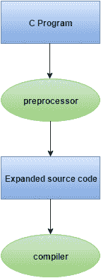

# 预处理器指令

> 原文：<https://www.javatpoint.com/c-preprocessor>

C 预处理器是一个微处理器，编译器使用它在编译前转换您的代码。它被称为微预处理器，因为它允许我们添加宏。

#### 注意:编译前执行处理器指令。

所有预处理器指令都以 hash #符号开头。

让我们看看预处理器指令的列表。

*   #包括
*   #定义
*   # undef
*   #ifdef
*   #ifndef
*   #如果
*   #否则
*   艾列弗
*   #endif
*   #错误
*   #pragma

## 什么是宏

请访问[下页](c-macros)。

* * *