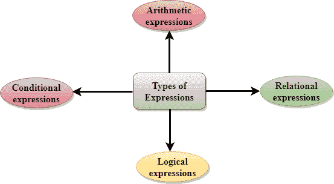
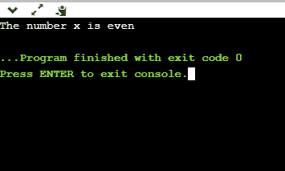
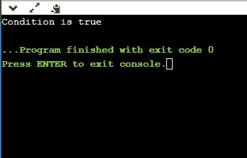
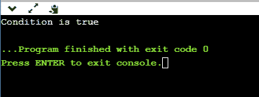
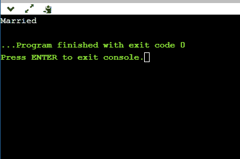

# 表达式

> 原文：<https://www.javatpoint.com/c-expressions>

表达式是一种公式，其中操作数通过使用运算符来计算值而相互链接。操作数可以是函数引用、变量、数组元素或常数。

**我们来看一个例子:**

```

a-b;

```

在上面的表达式中，减号(-)是一个运算符，a 和 b 是两个操作数。

**C 中存在四种类型的表达式:**

*   算术表达式
*   关系表达式
*   逻辑表达式
*   条件表达式

每种类型的表达式都采用特定类型的操作数，并使用一组特定的运算符。对特定表达式的求值产生特定的值。

**例如:**

```

x = 9/2 + a-b;

```

上面这一行是一个语句，不是一个表达式。等号后面的部分是表达式。



## 算术表达式

算术表达式是由操作数和算术运算符组成的表达式。算术表达式计算 int、float 或 double 类型的值。

当一个表达式只包含整数操作数时，则称为纯整数表达式，当它只包含实数操作数时，则称为纯实数表达式，当它同时包含整数和实数操作数时，则称为混合模式表达式。

**算术表达式的评估**

通过一次执行一个操作来计算表达式。运算符的优先级和结合性决定了单个运算的求值顺序。

**进行个别操作时，会发生以下情况:**

*   当两个操作数都是整数类型时，将执行算术运算，运算结果将是一个整数值。例如，3/2 将产生 1，而不是 1.5，因为小数部分被忽略。
*   当两个操作数都是 float 类型时，将执行算术运算，运算结果将是一个实值。例如，2.0/2.0 将产生 1.0，而不是 1。
*   如果一个操作数是整数类型，另一个操作数是实数类型，那么将执行混合运算。在这种情况下，第一个操作数被转换为实操作数，然后执行算术运算以产生实值。例如，6/2.0 将产生 3.0，因为第一个值 6 被转换为 6.0，然后执行算术运算以产生 3.0。

让我们通过一个例子来理解。

6*2/ (2+1 * 2/3 + 6) + 8 * (8/4)

| 表达评价 | 每个操作的描述 |
| 6*2/( 2+1 * 2/3 +6) +8 * (8/4) | 给出了一个表达式。 |
| 6*2/(2+2/3 + 6) + 8 * (8/4) | 2 乘以 1，得出值 2。 |
| 6*2/(2+0+6) + 8 * (8/4) | 2 除以 3，得出值 0。 |
| 6*2/ 8+ 8 * (8/4) | 2 与 6 相加，得到值 8。 |
| 6*2/8 + 8 * 2 | 8 除以 4，得出值 2。 |
| 12/8 +8 * 2 | 6 乘以 2，得到值 12。 |
| 1 + 8 * 2 | 12 除以 8，得出值 1。 |
| 1 + 16 | 8 乘以 2，得到值 16。 |
| Seventeen | 1 与 16 相加，得到值 17。 |

## 关系表达式

*   关系表达式是用于比较两个操作数的表达式。
*   这是一个用来决定是否应该采取行动的条件。
*   在关系表达式中，数值不能与字符串值进行比较。
*   关系表达式的结果可以是零或非零值。这里，零值相当于假，非零值相当于真。

| 关系式 | 描述 |
| x%2 = = 0 | 这个条件用来检查 x 是否为偶数。如果 x 是偶数，则关系表达式得出值 1，否则得出值 0。 |
| a！=b | 它用于检查 a 是否不等于 b。如果 a 不等于 b，则此关系表达式的结果为 1，否则为 0。 |
| a+b = = x+y | 用于检查表达式“a+b”是否等于表达式“x+y”。 |
| a>=9 | 它用于检查的值是否大于或等于 9。 |

**我们来看一个简单的例子:**

```

#include <stdio.h>
 int main()
{

    int x=4;
    if(x%2==0)
    {
        printf("The number x is even");
    }
    else
    printf("The number x is not even");
    return 0;
}

```

**输出**



## 逻辑表达式

*   逻辑表达式是计算零值或非零值的表达式。
*   做决定是一个复杂的测试条件。

**我们来看一些逻辑表达式的例子。**

| 逻辑表达式 | 描述 |
| (x > 4 ) && ( x < 6) | 检查 x 是否大于 4，x 是否小于 6 是一个测试条件。只有当两个条件都为真时，条件的结果才为真。 |
| x > 10 &#124;&#124; y <11 | 这是一个测试条件，用于检查 x 是否大于 10 或 y 是否小于 11。如果其中一个条件为真值，则测试条件的结果为真。 |
| ！(x > 10 ) && ( y = = 2) | 这是一个测试条件，用于检查 x 是否不大于 10，y 是否等于 2。如果两个条件都为真，则条件的结果为真。 |

**我们来看一个简单的“& &”操作符的程序。**

```

#include <stdio.h>
int main()
{
    int x = 4;
    int y = 10;
    if ( (x <10) && (y>5))
    {
        printf("Condition is true");
    }
    else
    printf("Condition is false");
    return 0;
}

```

**输出**



**我们来看一个简单的“| |”运算符的例子**

```

#include <stdio.h>
int main()
{
    int x = 4;
    int y = 9;
    if ( (x <6) || (y>10))
    {
        printf("Condition is true");
    }
    else
    printf("Condition is false");
    return 0;
}

```

**输出**



## 条件表达式

*   条件表达式是如果条件为真则返回 1 的表达式，否则返回 0。
*   条件运算符也称为三元运算符。

**条件运算符的语法**

**假设 exp1、exp2、exp3 是三个表达式。**

exp1？exp2 : exp3

上述表达式是基于 exp1 表达式的值计算的条件表达式。如果表达式 exp1 的条件成立，则最终的条件表达式由 exp2 表示，否则由 exp3 表示。

**我们通过一个简单的例子来理解。**

```

#include<stdio.h>
#include<string.h>
int main()
{
    int age = 25;
    char status;
    status = (age>22) ? 'M': 'U';
    if(status == 'M')
    printf("Married");
    else
    printf("Unmarried");
    return 0;
}

```

**输出**



* * *