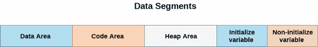

# 数据段

> 原文：<https://www.javatpoint.com/c-data-segments>

为了理解我们的 C 程序的工作方式，我们需要理解分配给我们程序的内存的安排。

所有的变量、函数和数据结构都被分配到一个称为数据段的特殊内存段中。数据段主要分为四个不同的部分，具体分配给我们的 C 程序中定义的不同类型的数据。

数据段的组成部分是:

## 1.数据区

它是永久记忆区。所有静态和外部变量都存储在数据区。存储在数据区的变量一直存在，直到程序退出。

## 2.代码区

它是只能由函数指针访问的内存区域。代码区域的大小是固定的。

## 3.堆区域

众所周知，C 语言支持动态内存分配。c 提供像 malloc()和 calloc()这样的函数，用于动态分配内存。因此，堆区域用于存储使用动态内存分配创建的数据结构。堆区域的大小是可变的，取决于内存中的可用空间。

## 4.堆栈区

栈区分为两部分，即初始化和非初始化。初始化变量优先于非初始化变量。

1.  所有自动变量都将内存放入堆栈区域。
2.  c 语言中的常量存储在堆栈区域。
3.  默认存储类的所有局部变量都存储在堆栈区域。
4.  函数参数和返回值存储在堆栈区域。
5.  堆栈区域是临时内存区域，因为只要程序超出范围，存储在堆栈区域中的变量就会被删除。