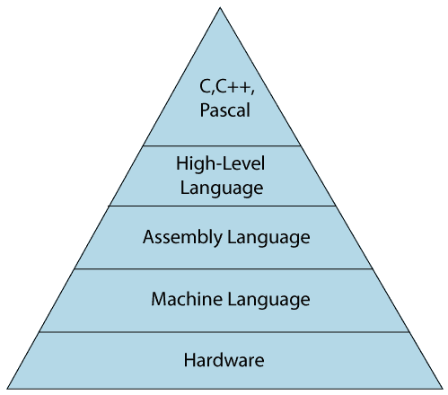

# 什么是编程语言？

> 原文：<https://www.javatpoint.com/classification-of-programming-languages>

编程语言定义了一组由中央处理器(中央处理器)编译在一起执行特定任务的指令。编程语言主要指 C、C++、Pascal、Ada、COBOL 等高级语言。

每种编程语言都包含一组独特的关键字和语法，用于创建一组指令。到目前为止，已经开发了成千上万种编程语言，但每种语言都有其特定的用途。这些语言在它们提供的硬件抽象级别上有所不同。一些编程语言提供较少或没有抽象，而一些提供较高的抽象。根据抽象层次，它们可以分为两类:

*   低级语言
*   高级语言

下图描述了硬件的抽象层次。从下图中我们可以观察到，机器语言不提供抽象，汇编语言提供的抽象较少，而高级语言提供的抽象水平较高。

## 低级语言

低级语言是一种不提供硬件抽象的编程语言，它以 0 或 1 的形式表示，即机器指令。属于这一类别的语言是机器级语言和汇编语言。

### 机器级语言

机器级语言是由一组二进制形式为 0 或 1 的指令组成的语言。我们知道计算机只能理解机器指令，机器指令是二进制数字，即 0 和 1，所以给计算机的指令只能是二进制代码。用机器语言创建程序是一项非常困难的任务，因为程序员用机器指令编写程序并不容易。由于不容易理解，容易出错，维护成本也很高。机器级语言是不可移植的，因为每台计算机都有自己的机器指令，所以如果我们在一台计算机上编写程序，在另一台计算机上将不再有效。

不同的处理器架构使用不同的机器码，例如，一个 PowerPC 处理器包含 RISC 架构，这需要不同于英特尔 x86 处理器的代码，英特尔 x86 处理器具有 CISC 架构。

### 汇编语言

汇编语言包含一些人类可读的命令，如 mov、add、sub 等。通过使用被称为汇编语言的机器级语言的扩展形式，我们在机器级语言中所面临的问题在某种程度上得以减少。由于汇编语言指令是用 mov、add、sub 等英文单词编写的，所以更容易编写和理解。

因为我们知道计算机只能理解机器级指令，所以我们需要一个翻译器把汇编代码转换成机器代码。用于翻译代码的翻译器被称为汇编器。

汇编语言代码是不可移植的，因为数据存储在计算机寄存器中，计算机必须知道不同的寄存器组。

汇编代码并不比机器代码快，因为汇编语言在层次结构中位于机器语言之上，所以这意味着汇编语言从硬件中有一些抽象，而机器语言没有抽象。

### 机器级语言和汇编语言的区别

以下是机器级语言和汇编语言之间的区别:

| 机器级语言 | 汇编语言 |
| 机器级语言位于层次结构的最底层，因此它对硬件的抽象程度为零。 | 汇编语言高于机器语言意味着它对硬件的抽象程度较低。 |
| 它不容易被人类理解。 | 它易于阅读、书写和维护。 |
| 机器级语言是用二进制数字编写的，即 0 和 1。 | 汇编语言是用简单的英语编写的，所以用户很容易理解。 |
| 它不需要任何翻译器，因为机器代码是由计算机直接执行的。 | 在汇编语言中，汇编程序用于将汇编代码转换成机器码。 |
| 它是第一代编程语言。 | 它是第二代编程语言。 |

## 高级语言

高级语言是一种编程语言，允许程序员编写独立于特定类型计算机的程序。高级语言被认为是高级的，因为它们比机器语言更接近人类语言。

当用高级语言编写程序时，那么整个注意力都需要放在问题的逻辑上。

需要编译器将高级语言翻译成低级语言。

**高级语言的优势**

*   高级语言易于阅读、书写和维护，因为它像单词一样用英语书写。
*   高级语言旨在克服低级语言的局限性，即可移植性。高级语言是可移植的；即这些语言是独立于机器的。

## 低级语言和高级语言的区别

**以下是低级语言和高级语言的区别:**

| 低级语言 | 高级语言 |
| 它是一种机器友好的语言，即计算机理解机器语言，用 0 或 1 表示。 | 这是一种用户友好的语言，因为这种语言是用简单的英语单词编写的，人类很容易理解。 |
| 低级语言需要更多的时间来执行。 | 它的执行速度更快。 |
| 它要求汇编程序将汇编代码转换成机器码。 | 它要求编译器将高级语言指令转换成机器码。 |
| 机器代码不能在所有机器上运行，所以它不是一种可移植的语言。 | 高级代码可以运行所有的平台，所以它是一种可移植的语言。 |
| 它是内存高效的。 | 它的内存效率较低。 |
| 在低级语言中，调试和维护并不容易。 | 在高级语言中，调试和维护更容易。 |

* * *