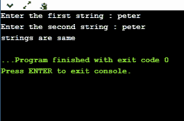
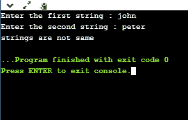
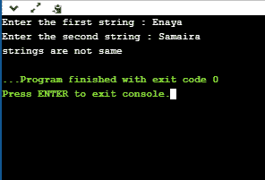
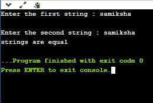

# c 程序来比较这两个字符串

> 原文：<https://www.javatpoint.com/c-program-to-compare-the-two-strings>

可以使用字符串函数或不使用字符串函数来比较字符串。首先，我们将看看如何借助字符串函数来比较字符串，即 **strcmp()，**，它是在 **string.h** 头文件中定义的。

### 使用字符串函数进行字符串比较

在**字符串. h** 头文件中预定义的字符串函数是 **strcmp()** 函数。strcmp()函数将两个字符串视为一个参数，该函数返回一个整数值，其中整数值可以是**零**、**正**或**负**。

### strcmp()函数的语法如下:

```

int strcmp (const char* str1, const char* str2);

```

在上面的语法中，两个参数作为字符串传递，即 **str1** 和 **str2** ，返回类型为 **int** 表示 strcmp()返回一个整数值。

函数的作用是:比较两个字符串的字符。如果两个字符串的第一个字符相同，则该比较过程将继续，直到所有字符都被比较或者指针指向空字符' \0 '。

**strcmp()函数的可能返回值**

| 返回值 | 描述 |
| Zero | 当两个字符串相等时。 |
| <0 | 如果第一个字符串的字符的 ASCII 值小于第二个字符串的字符的 ASCII 值，则该函数将返回负值。 |
| >0 | 如果第一个字符串的字符的 ASCII 值大于第二个字符串的字符的 ASCII 值，那么函数将返回正值。 |

**我们通过一个例子来了解一下。**

```

#include <stdio.h>
#include<string.h>
int main()
{
   char str1[20];  // declaration of char array
   char str2[20];  // declaration of char array
   int value; // declaration of integer variable
   printf("Enter the first string : ");
   scanf("%s",str1);
   printf("Enter the second string : ");
   scanf("%s",str2);
   // comparing both the strings using strcmp() function
   value=strcmp(str1,str2);
   if(value==0)
   printf("strings are same");
   else
   printf("strings are not same");
   return 0;
}

```

### 对上述程序的分析

*   我们已经声明了两个 char 类型的数组，即 str1 和 str2。我们将用户输入视为字符串。
*   我们使用 **strcmp()** 函数比较字符串，即 **strcmp(str1，str2)。**该功能将比较字符串 str1 和 str2。如果函数返回 0 值意味着两个字符串相同，否则字符串不相等。

**输出:**




### 不使用 strcmp()函数的字符串比较

```

#include <stdio.h>
int compare(char[],char[]);
int main()
{
   char str1[20]; // declaration of char array
   char str2[20]; // declaration of char array
   printf("Enter the first string : ");
   scanf("%s",str1);
   printf("Enter the second string : ");
   scanf("%s",str2);
   int c= compare(str1,str2); // calling compare() function
   if(c==0)
   printf("strings are same");
   else
   printf("strings are not same");

    return 0;
}

// Comparing both the strings.
int compare(char a[],char b[])
{
    int flag=0,i=0;  // integer variables declaration
    while(a[i]!='\0' &&b[i]!='\0')  // while loop
    {
       if(a[i]!=b[i])
       {
           flag=1;
           break;
       }
       i++;
    }
    if(flag==0)
    return 0;
    else
    return 1;
}

```

### 对上述程序的分析

*   在上面，我们已经声明了两个 char 类型的数组，并将用户输入作为字符串。
*   我们定义了一个 compare()函数，该函数将用户输入字符串作为参数，并比较两个字符串。如果函数返回 0，这意味着两个字符串相等，否则两个字符串不相等**。**

**输出:**



### 使用指针进行字符串比较

```

#include <stdio.h>
int stringcompare(char*,char*);
int main()
{
  char str1[20]; // declaration of char array
  char str2[20]; // declaration of char array
  printf("Enter the first string : ");
  scanf("%s",str1);
  printf("\nEnter the second string : ");
  scanf("%s",str2);
  int compare=stringcompare(str1,str2); // calling stringcompare() function.
  if(compare==0)
  printf("strings are equal");
 else
 printf("strings are not equal");
return 0;
}
// Comparing both the strings using pointers
int stringcompare(char *a,char *b)
{
   int flag=0;
    while(*a!='\0' && *b!='\0')  // while loop
    {
        if(*a!=*b)
        {
            flag=1;
        }
        a++;
        b++;
    }

    if(flag==0)
    return 0;
    else
    return 1;
}

```

### 对上述程序的分析

*   我们已经创建了两个 str1 和 str2 类型的 char 数组。我们将用户输入视为字符串。
*   我们已经定义了一个 stringcompare()函数，它将使用两个 char 类型的指针作为参数。“a”指针保存 str1 的地址，“b”指针保存 str2 的地址。在函数内部，我们创建了一个 while 循环，它将一直执行，直到指针 a 或 b 没有到达空字符。

**输出:**



* * *