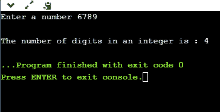
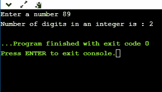
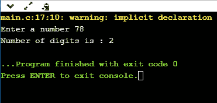
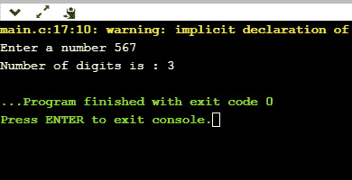

# 计算 C 中的位数

> 原文：<https://www.javatpoint.com/count-the-number-of-digits-in-c>

现在，我们来看看如何计算一个整数的位数。这个整数只不过是用户输入的数字。

**首先，我们将使用 for 或 while 循环计算计数位数。**

**接近**

*   首先，号码将由用户输入。假设我们声明变量“n”，并将整数值存储在“n”变量中。
*   我们将创建一个 while 循环，该循环迭代直到“n”的值不等于零。
*   假设“n”的值是 123。
*   当第一次迭代执行时,“n”的值将是 123，count 的值将增加到 1。
*   当第二次迭代执行时,“n”的值将是 12，count 的值将增加到 2。
*   当第三次迭代执行时,“n”的值将为 1，count 的值将增加到 3。
*   第三次迭代完成后,' n '的值变为 0，循环终止，因为它不满足条件(n！=0).

**让我们创建一个程序来实现上述方法。**

```

#include <stdio.h>
int main()
{
   int n;  // variable declaration
   int count=0;   // variable declaration
   printf("Enter a number");
   scanf("%d",&n);
   while(n!=0)
   {
       n=n/10;
       count++;
   }

   printf("\nThe number of digits in an integer is : %d",count);
    return 0;
}

```

**输出**



**现在，我们将看到如何在不使用循环的情况下计算位数。**

我们还可以借助对数函数来计算位数。位数可以用 log10(num)+1 来计算，其中 log10()是 **math.h** 头文件中的预定义函数。

**我们来看一个简单的例子。**

```

#include <stdio.h>
#include<math.h>
int main()
{
    int num;  // variable declaration
    int count=0;  // variable declaration
    printf("Enter a number");
    scanf("%d",&num);
   count=(num==0)?1:log10(num)+1;
   printf("Number of digits in an integer is : %d",count);
   return 0;
}

```

**输出**



**我们将创建一个 C 程序，使用函数计算位数。**

```

#include <stdio.h>
int main()
{
    int num;  // variable declaration
    int count=0;  // variable declaration
    printf("Enter a number");
    scanf("%d",&num);
   count=func(num);
   printf("Number of digits is : %d", count);

    return 0;
}
int func(int n)
{
    int counter=0; // variable declaration
    while(n!=0)
    {
        n=n/10;
        counter++;
    }
    return counter;
}

```

**输出**



**现在，我们将看到如何使用递归计算位数。**

```

#include <stdio.h>
int main()
{
    int num;  // variable declaration
    int count=0;  // variable declaration
    printf("Enter a number");
    scanf("%d",&num);
   count=func(num);
   printf("Number of digits is : %d", count);
   return 0;
}
int func(int n)
{
    static int counter=0; // variable declaration
  if(n>0)
  {
      counter=counter+1;
      return func(n/10);
  }
    else
    return counter;
}

```

在上面的程序中，我们正在计算一个整数的位数。func()函数被调用。在 func()中，我们声明了一个静态变量，即计数器，它将只被初始化一次。函数(n/10)将被递归调用，直到条件(n>0)为真。当条件为假时，则返回计数器的值。

**输出**



* * *