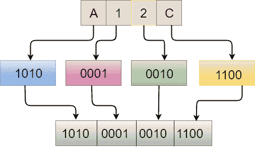

# C 语言中的十六进制到二进制

> 原文：<https://www.javatpoint.com/hexadecimal-to-binary-in-c>

## 十六进制是什么？

十六进制是一种位置系统，通过使用 16 作为基数，用十六个不同的符号表示数字。这些不同的符号，即“ **0-9** ”代表从零到九的值，而“ **A-F** ”代表从十到十五的值。

## 什么是二进制？

二进制是用基数为 2 的数字系统表示的数字，它使用两个符号，即 0 和 1。

**示例**

假设十六进制数是 A12C。现在我们计算十六进制数的二进制值。

十六进制数=A12C

相当于 A 的二进制值是 1010

相当于 1 的二进制值是 0001

相当于 2 的二进制值是 0010

相当于 C 的二进制值是 1100

因此，相当于 A12C 的二进制值是 1010000100101100。



#### 注意:要将十六进制转换为二进制数，需要对十六进制数的每个数字的二进制值进行求值和组合，得到给定十六进制数的二进制数。

**我们通过一个例子来了解一下。**

```

#include<stdio.h>
void hextobin(char b[]);
void main()
{
    char hex[]="A12C";
    hextobin(hex);
}
void hextobin(char hex[])
{
   int i=0; 
   while(hex[i])
   {
       switch(hex[i])
       {
           case '0':
           printf("0000");
           break;
           case '1':
           printf("0001");
           break;
           case '2':
           printf("0010");
           break;
           case '3':
           printf("0011");
           break;
           case '4':
           printf("0100");
           break;
           case '5':
           printf("0101");
           break;
           case '6':
           printf("0110");
           break;
           case '7':
           printf("0111");
           break;
           case '8':
           printf("1000");
           break;
           case '9':
           printf("1000");
           break;
           case 'A':
           printf("1010");
           break;
           case 'a':
           printf("1010");
           break;
           case 'B':
           printf("1011");
           break;
           case 'b':
           printf("1011");
           break;
           case 'C':
           printf("1100");
           break;
           case 'c':
           printf("1100");
           break;
           case 'D':
           printf("1101");
           break;
           case 'd':
           printf("1101");
           break;
           case 'E':
           printf("1110");
           break;
           case 'e':
           printf("1110");
           break;
           case 'F':
           printf("1111");
           break;
           case 'f':
           printf("1111");
           break;
       }
       i++;
   }}

```

在上面的代码中，我们要计算“ **A12C** 的二进制值。我们首先将该值存储在名为 **hex[]** 的字符数组中，然后将该数组传递给 hextobin()函数。hextobin()将计算数字的二进制值，它通过 while 循环迭代数组的每个元素，并通过 switch 语句找到每个对应元素的二进制值。

**输出**

```
1010000100101100  

```

* * *