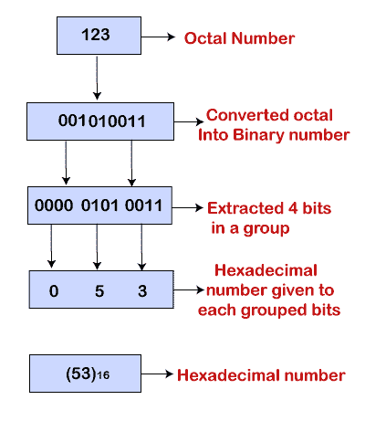
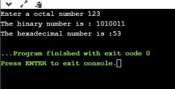

# 八进制到十六进制

> 原文：<https://www.javatpoint.com/octal-to-hexadecimal-in-c>

### 什么是八进制数字系统？

八进制数字系统是以-8 为基数的数字系统，其中-8 代表从 0 到 7 的八位数字。

### 什么是十六进制数字系统？

十六进制数字系统是具有基数-16 的数字系统，其中基数-16 代表十六位数字，即 0，1，2，3，4，5，6，7，8，9，A，B，C，D，E，f

### 如何将八进制数转换成十六进制数

我们不能直接把八进制转换成十六进制。首先，我们需要将八进制数转换成二进制数系统，然后这个二进制数系统将转换成十六进制数系统。

**我们来看看进场。**

*   输入八进制数。
*   八进制数字系统被转换成二进制数字系统。
*   从右侧提取一组中的 4 位。
*   为提取的 4 位提供十六进制数。

**比如八进制数是 123。**



**让我们创建一个简单的程序，将八进制数转换成十六进制数。**

```

#include <stdio.h>
#include<string.h>
int main()
{
  int octaltobinary[]={0,1,10,11,100,101,110,111};
  char hexadecimal[10];
   char hex[10];
  long int binary=0;
  int octal;
  int rem=0;
  int position=1;
  int len=0;
   int k=0;
  printf("Enter a octal number");
  scanf("%d",&octal);
// Converting octal number into a binary number.  
while(octal!=0)
  {
      rem=octal%10;
      binary=octaltobinary[rem]*position+binary;
      octal=octal/10;
      position=position*1000;
  }
  printf("The binary number is : %ld",binary);

  // Converting binary number into a hexadecimal number.
  while(binary > 0)
    {
        rem = binary % 10000;
        switch(rem)
        {
            case 0:
                strcat(hexadecimal, "0");
                break;
            case 1:
                strcat(hexadecimal, "1");
                break;
            case 10:
                strcat(hexadecimal, "2");
                break;
            case 11:
                strcat(hexadecimal, "3");
                break;
            case 100:
                strcat(hexadecimal, "4");
                break;
            case 101:
                strcat(hexadecimal, "5");
                break;
            case 110:
                strcat(hexadecimal, "6");
                break;
            case 111:
                strcat(hexadecimal, "7");
                break;
            case 1000:
                strcat(hexadecimal, "8");
                break;
            case 1001:
                strcat(hexadecimal, "9");
                break;
            case 1010:
                strcat(hexadecimal, "A");
                break;
            case 1011:
                strcat(hexadecimal, "B");
                break;
            case 1100:
                strcat(hexadecimal, "C");
                break;
            case 1101:
                strcat(hexadecimal, "D");
                break;
            case 1110:
                strcat(hexadecimal, "E");
                break;
            case 1111:
                strcat(hexadecimal, "F");
            break;
        }
len=len+1;
        binary /= 10000;
    }
  for(int i=len-1;i>=0;i--)
{
    hex[k]=hexadecimal[i];
    k++;
}
hex[len]='\0';
printf("\nThe hexadecimal number is :");
for(int i=0; hex[i]!='\0';i++)
{
    printf("%c",hex[i]);
}

    return 0;
}

```

**输出**



**以上程序分析**

*   首先，我们接受用户输入，这将是一个八进制数，并将其存储在一个“**八进制**变量中。
*   输入用户输入后，我们将八进制数转换为二进制数。我们遍历 **while(八进制！=0)** 循环，执行到八进制值不等于零。二进制数的最终值将存储在一个“二进制”变量中。
*   在计算二进制数之后，我们将计算十六进制数。我们将使用**迭代二进制数的元素，而(二进制> 0)** 在每次迭代中，从二进制数右侧提取四个数字，并用它们对应的十六进制数替换。
*   **十六进制[]** 变量包含实际十六进制数的反数值。为了得到一个八进制数的实际十六进制数，我们定义了一个新的变量，即**十六进制[]** 。我们将从最后一个开始迭代**十六进制[]** 变量的元素，并将每个元素存储在**十六进制[]** 中。

* * *