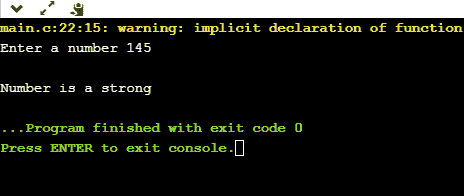
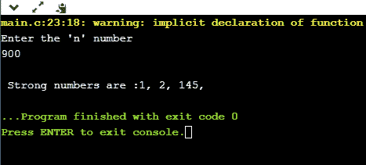
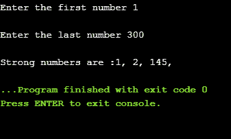

# C 中的强数

> 原文：<https://www.javatpoint.com/strong-number-in-c>

当单个数字的阶乘之和等于一个数时，这个数可以说是一个强数。

例如，145 是一个强数字。

**我们通过一个例子来了解一下。**

*   **程序检查号码是否强。**

```

#include <stdio.h>
int main()
{
    int n;
    int sum=0;
    printf("Enter a number");
    scanf("%d",&n);
    int k=n;
    int r;
    while(k!=0)
    {
        r=k%10;
        int f=fact(r);
        k=k/10;
        sum=sum+f;
    }
    if(sum==n)
    {
        printf("\nNumber is a strong");
    }
    else
    {
        printf("\nNumber is not a strong");
    }
    return 0;
}
int fact(int r)
{
    int mul=1;
    for(int i=1;i<=r;i++)
    {
        mul=mul*i;
    }
    return mul;

}

```

在上面的代码中，从用户那里检索输入数据，然后检查输入数据是否是强号。

**输出**



*   **程序打印从 1 到 n 的强数字**

```

#include<stdio.h>
int main()
{
    int fact=1,sum=0;
    int n,r;
    printf("Enter the 'n' number");
    scanf("%d",&n);
    printf("\n Strong numbers are :");
    for(int i=1;i<=n;i++)
    {
        int k=i;
        while(k!=0)
        {
            r=k%10;
            fact=factorial(r);

            k=k/10;
            sum=sum+fact;
        }
        if(sum==i){
        printf("%d, ",i);

           }
           sum=0;
    }

    return 0;
}

 int factorial(int f)
    {
        int mul=1;
        for(int i=1; i<=f;i++)
        {
            mul=mul*i;
        }
        return mul;
    }

```

**输出**



*   **在给定范围内寻找强数的程序。**

```

#include<stdio.h>
int main()
{
    int fact=1,sum=0;
    int n1,n2,r;
    printf("Enter the first number");
    scanf("%d",&n1);
    printf("\nEnter the last number");
    scanf("%d",&n2);
    printf("\nStrong numbers are :");
    for(int i=n1;i<=n2;i++)
    {
        int k=i;
        while(k!=0)
        {
            r=k%10;
            fact=factorial(r);
            k=k/10;
            sum=sum+fact;
        }
        if(sum==i){
        printf("%d, ",i);
        }
           sum=0;
    }
   return 0;
}
int factorial(int f)
 {
        int mul=1;
        for(int i=1; i<=f;i++)
        {
            mul=mul*i;
        }
        return mul;
    }

```

**输出:**



* * *