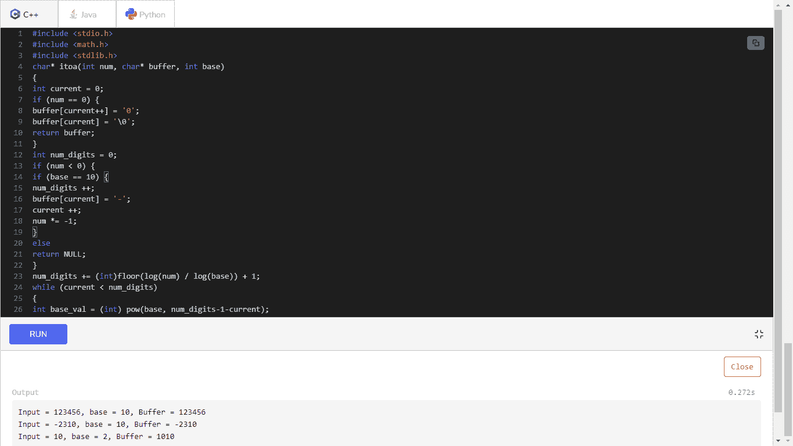

# C 语言中的 itoa 函数

> 原文：<https://www.javatpoint.com/itoa-function-in-c>

itoa()函数用于在 C 语言中将 int 数据类型转换为 string 数据类型。

### 语法-

```

char * itoa ( int value, char * str, int base );

```

我们在缓冲传递中放置的字符串必须足够大以容纳输出。因为基数值可以是 OCTAL(0 - 7)、DECIMAL(0 - 9)或 HEX(0 - 9，a - f)。当基数为 DECIMAL 时，itoa()产生-

(void) sprintf(缓冲区，“%d”，n)；

这里，缓冲区返回字符串。

当基数为 OCTAL 时，itoa()将整数“n”格式化为无符号的八进制常数。

当基数为 HEX 时，itoa()将整数' n '格式化为无符号的十六进制常数。

十六进制值将包括小写字母。

### 返回值-

将返回字符串指针。当我们传递一个无效的基数参数时，函数将返回空值。

符合标准的替代方案-

*   sprintf(字符串，“%d”，值)-用于转换为十进制基数。
*   sprintf(字符串，“%x”，值)-用于转换为十六进制基数。
*   sprintf(str，“%o”，值)-用于转换为八进制基数。

**算法:**

```

Step 1: Take a number as argument
Step 2: Create an empty string buffer to store result
Step 3: Use sprintf() to convert number to string
Step 4: End

```

**代码-**

```

#include <stdio.h>
#include <math.h>
#include <stdlib.h>
char* itoa(int num, char* buffer, int base) 
{
int current = 0;
if (num == 0) {
buffer[current++] = '0';
buffer[current] = '\0';
return buffer;
}
int num_digits = 0;
if (num < 0) {
if (base == 10) {
num_digits ++;
buffer[current] = '-';
current ++;
num *= -1;
}
else
return NULL;
}
num_digits += (int)floor(log(num) / log(base)) + 1;
while (current < num_digits) 
{
int base_val = (int) pow(base, num_digits-1-current);
int num_val = num / base_val;
 char value = num_val + '0';
buffer[current] = value;
current ++;
num -= base_val * num_val;
}
buffer[current] = '\0';
return buffer;
}
int main() 
{
int a = 123456;
char buffer[256];
if (itoa(a, buffer, 10) != NULL) {
printf("Input = %d, base = %d, Buffer = %s\n", a, 10, buffer);
}
int b = -2310;
if (itoa(b, buffer, 10) != NULL) {
printf("Input = %d, base = %d, Buffer = %s\n", b, 10, buffer);
}
int c = 10;
if (itoa(c, buffer, 2) != NULL) {
printf("Input = %d, base = %d, Buffer = %s\n", c, 2, buffer);
}
return 0;
}

```

**输出**

```
Input = 123456, base = 10, Buffer = 123456
Input = -2310, base = 10, Buffer = -2310 
Input = 10, base = 2, Buffer = 1010

```



#### 注意:但是我们必须记住，当我们用 gcc 编译时，我们必须使用“-lm”标志来包含数学库。

**gcc -o 测试. out 测试. c -lm**

* * *