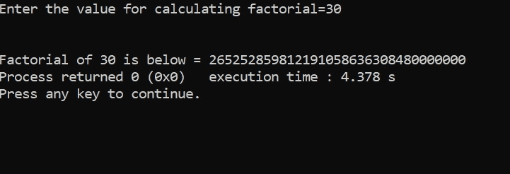

# C 中的超长阶乘

> 原文：<https://www.javatpoint.com/extra-long-factorials-in-c>

**问题表述:**整数 n 的*阶乘*，写 n！，定义为:

n！= n x (n-1) x (n-2) x (n-3) x ……x 3 x 2 x 1

计算并打印给定整数的阶乘。

例如，如果 n = 30，我们计算 30 x 29 x 28 x ……..x 3 x 2 x 1 然后得到。

2 6 5 2 5 2 8 5 9 8 1 2 1 9 1 0 5 8 6 3 0 8 4 8 0 0 0 0 0 0 总共 33 位数。

#### 注意:n > 20 的阶乘甚至不能存储在 64 位长的变量中。这种计算必须使用大整数。像 Java、Python、Ruby 等语言。可以处理大整数，但是我们需要用 C/C++ 编写额外的代码来处理巨大的值。

**程序说明:**下面的程序可以计算任意数的阶乘，即 20 以上数的阶乘，这对于 64 位计算机来说是不可行的。

我们从变量开始

```

#include<stdio.h>
int main()
{
    int n;
    printf("Enter the value for calculating factorial=");
    scanf("%d", &n);
    int j = 2; // last multiple of factorial of any number goes upto 2 
    int a[1000] = {0};// array of 1000 spaces initialized with 0
    a[0] = 1;
    int len = 1;// length starts with one
    int c = 0, num = 0;
    while(j <= n) // till j is less than value for which factorial is required
    {
        c = 0;
        num = 0;
        while(c < len)
        {
            a[c] = a[c] * j;
            a[c] = a[c] + num;
            num = a[c] / 10;
            a[c] = a[c] % 10;
            c++;
        }
        while(num != 0)
        {
            a[len] = num % 10;
            num = num / 10;
            len++;
        }
        j++;
    }
    len--;
    printf("\n\nFactorial of %d is below = ", n);
    while(len >= 0)
    {
        printf("%d", a[len]);
        len--;
    }
return 0;    
}

```

**输出上述代码**



```

Example to show working of above code for n = 5

n = 5, j = 2, a[0] = 1, a[1000] = { 1, 0, 0, ……….0 }
len =1, c = 0, num =0

while( j < = n) → ( 2 < = 5) becomes True
again it initializes c = 0 and num = 0
while ( c < len )   → (0 < 1 )  becomes True for 1st iteration

a[c] = a[c] * j;    → a[0] = 1 * 2 = 2 → a[1000] = { 2, 0, 0, ….., 0}
a[c] = a[c] + num;  → a[0] = 2 + 0 = 2 → a[1000] = { 2, 0, 0, ….., 0}
num = a[c] / 10;    → num = 2 / 10 = 0
a[c] = a[c] % 10;  → a[0] = 2 % 10 = 2 → a[1000] = { 2, 0, 0, ….., 0}
c++; →  c = 1 

while ( c < len )   → (1 < 1 )  becomes False for 2nd iteration
Hence moving next instruction

while(num != 0)  → False as num = 0 ( no entry inside loop)

j++; → j = 3 ( again moving towards first while loop )

while( j < = n) → ( 3 < = 5) becomes True
again it initializes c = 0 and num = 0

while ( c < len )   → (0 < 1 )  becomes True for 1st iteration

a[c] = a[c] * j;    → a[0] = 2 * 3 = 6 → a[1000] = { 6, 0, 0, ….., 0}
a[c] = a[c] + num;  → a[0] = 6 + 0 =6  → a[1000] = { 6, 0, 0, ….., 0}
num = a[c] / 10;    → num = 6 / 10 = 0
a[c] = a[c] % 10;  → a[0] = 6 % 10 = 6 → a[1000] = { 6, 0, 0, ….., 0}
c++; →  c = 1 
while ( c < len )   → (1 < 1 )  becomes False for 2nd iteration
Hence moving next instruction

while(num != 0)  → False as num = 0 ( no entry inside loop)

j++; → j = 4 ( again moving towards first while loop )

while( j < = n) → ( 4 < = 5) becomes True
again it initializes c = 0 and num = 0

while ( c < len ) → (0 < 1 )  becomes True for 1st iteration
a[c] = a[c] * j;  → a[0] = 6 * 4 = 24 → a[1000] = { 24, 0, 0, ….., 0}
a[c] = a[c] + num;→ a[0] = 24 + 0 = 24→ a[1000] = { 24, 0, 0, ….., 0}
num = a[c] / 10;  → num = 24 / 10 = 2
a[c] = a[c] % 10; → a[0] = 24 % 10 = 4 → a[1000] = { 4, 0, 0, ….., 0}
c++; →  c = 1 

while ( c < len )   → (1 < 1 )  becomes False for 2nd iteration
Hence moving next instruction

while(num != 0) → becomes True as num = 2 which is not zero

a[len] = num % 10;  → a[1] = 2 % 10 = 2 → a[1000] = { 4, 2, 0, …, 0}
num = num / 10;     → num = 2 / 10 = 0
len++;              → len = 2 ( clearly len is now 2 )

j++; → j = 5 ( again moving towards first while loop )

while( j < = n) → ( 5 < = 5) becomes True
again it initializes c = 0 and num = 0

while ( c < len ) → (0 < 2 )  becomes True for 1st iteration
a[c] = a[c] * j;  → a[0] = 4 * 5 = 20 → a[1000] = {20, 2, 0, …, 0}
a[c] = a[c] + num;→ a[0] = 20 + 0 = 20→ a[1000] = {20, 2, 0, …, 0}
num = a[c] / 10;  → num = 20 / 10 = 2
a[c] = a[c] % 10; → a[0] = 20 % 10 = 0→ a[1000] ={0, 2, 0, …, 0}
c++; →  c = 1 

while ( c < len ) → (1 < 2 )  becomes True for 2nd iteration
a[c] = a[c] * j;  → a[1] = 2 * 5 = 10 → a[1000] = {0, 10, 0, …, 0}
a[c] = a[c] + num;→ a[1] = 1 + 2 = 12→ a[1000] = {0, 12, 0, …, 0}
num = a[c] / 10;  → num = 12 / 10 = 1
a[c] = a[c] % 10; → a[1] = 12 % 10 = 2→ a[1000] ={0, 2, 0, …, 0}
c++; →  c = 2

while ( c < len )   → (2 < 2 )  becomes False for 3rd iteration
Hence moving next instruction

while(num != 0) → becomes True as num = 1 which is not zero

a[len] = num % 10;  → a[2] = 1 % 10 = 1 → a[1000] = { 0, 2, 1, …, 0}
num = num / 10;     → num = 1 / 10 = 0
len++;              → len = 3 ( clearly len is now 3 )

j++; → j = 6 ( again moving towards first while loop )

while( j < = n) → ( 6 < = 5) becomes False, as this is the top most loop, on failure of condition we move out of while body.

Moving next instruction
len--;  len = 2( as in array { 0, 2, 1, …, 0 } we have value at index 0, 1 and 2 which is 120( factorial of 5)

while(len >= 0)       → ( 2 >= 0) → True 
printf("%d", a[len]); → print(a[2]) → 1
len--;                → len = 1

while(len >= 0)       → ( 1 >= 0) → True 
printf("%d", a[len]); → print(a[1]) → 2
len--;                → len = 0

while(len >= 0)       → ( 0 >= 0) → True 
printf("%d", a[len]); → print(a[0]) → 0
len--;                → len = -1

while(len >= 0)       → ( -1 >= 0) → False, and we exit from final while loop,

so the final value is 120 ( factorial of 5)

As we took array size 1000, i.e. a[1000] we can find out factorial of any number whose resultant values are less than or equal to a[1000], as we have seen that factorial of 30! = 2 6 5 2 5 2 8 5 9 8 1 2 1 9 1 0 5 8 6 3 6 3 0 8 4 8 0 0 0 0 0 0 0 in total 33 digits which became possible only because of array size.

```

* * *