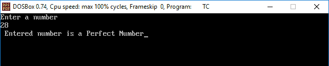
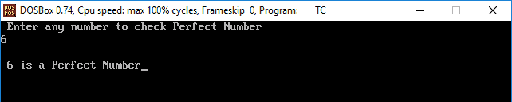
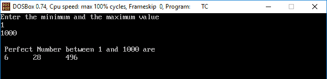

# C 语言中的完全数程序

> 原文：<https://www.javatpoint.com/perfect-number-program-in-c>

## 完美数字

在数学中，一个完全数是一个正整数，它等于它的正整数除数之和，不包括数本身。

例如，6 是一个可以被 1、2 和 3 完全整除的正数。我们知道这个数也可以被它自己整除，但是我们将把它包括在除数的加法中。当我们把这些约数 **(1 + 2 + 3 = 6)相加时，**就产生了 6，等于我们已经考虑过的数。所以，我们可以说 6 是一个完全数。

有两种方法可以找到完美的数字:

*   用于循环
*   使用 while 循环

## 用于循环

编写一个 C 程序，接受用户的输入，并检查给定的数字是否完美。

```

/*C program to check whether the given number is the Perfect number*/
#include<stdio.h>
#include<conio.h>
void main()
{
// declare and initialize the variables
int num, rem, sum = 0, i;
// take an input from the user.
printf("Enter a number\n");
scanf("%d", &num);    
// find all divisors and add them
for(i = 1; i < num; i++)
                     {
                              rem = num % i;
                             if (rem == 0)
                                        {
                                               sum = sum + i;
                                         }
                        }
if (sum == num)
                      printf(" %d is a Perfect Number");
           else
                      printf("\n %d is not a Perfect Number");
getch();
}

```

**输出**



在上面的输出中，循环条件在每次迭代时被验证，计数器 **i** 增加 1。在循环中，执行各种操作，例如:

**第一步:** i = 1，rem = num % i，= > 28 % 1 = 0。这里 rem = 0。

**步骤 2:** rem == 0，条件真。

**第三步:** sum = 0 + i，sum = 0 + 1 = > 1

// i 递增 1

**第四步:** i = 2，rem = num % i，= > 28 % 2 = 0。给你雷姆。= 0，条件为真；

总和= 1+1 = > 1+2 = 3

**第五步:** i = 3，rem = num % i，= > 28 % 3 = 1。这里 rem = 0，条件为假；

**第 6 步:** i = 4，rem = num % i，= > 28 % 4 = 0。这里 rem == 0，条件为真；

总和= 1+1 = > 3+4 = 7

同样，检查所有条件；

**第 7 步:** Sum == num，28 == 28，打印信息“输入的数字是一个完美的数字”

## 使用 while 循环

**示例 2:让我们创建一个 C 程序，使用 while 循环来查找完全数。**

```

/*Create a C Program to find the perfect number using while loop*/
#include<stdio.h>
#include<conio.h>
void main()
{
int i = 1, num, Sum = 0;
printf(" Enter any number to check Perfect Number \n");
scanf("%d", &num);

while(i < num )
                     {
                               if(num % i == 0)
                               Sum = Sum + i;
                               i++;
                     }
           if(Sum == num)
                  printf("\n %d is Perfect Number", num);
           else
           printf("\n %d is not a Perfect Number", num);
getch();
} 

```

**输出**



**例 3:通过 C 程序求两个数之间的完全数。**

```

#include<stdio.h>
#include<conio.h>
void main()
{
int num, Sum = 0, i, Max, Min;
// Take two number from the user: min and max
printf("Enter the minimum and the maximum value\n");
scanf("%d %d", &Min, &Max);

printf("\n Perfect Number between %d and %d are\n ", Min, Max);
for(num = Min; num <= Max; num++)
                     {
                             for(i = 1, Sum = 0; i < num; i++)
                                     {
                                            if(num %i == 0)
                                            Sum = Sum + i;
                                      }
                              if(Sum == num)
                             printf("%d \t", num);
                      }
  getch();
}

```

**输出**



* * *