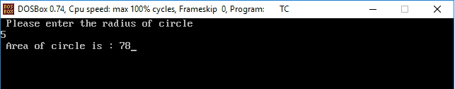
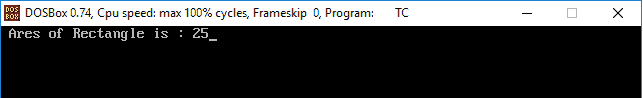

# 变量和常数的区别

> 原文：<https://www.javatpoint.com/variables-vs-constants-in-c>

## 什么是变量？

变量就像一个容器，包含有助于执行程序的特定数据类型的值或数据。变量值可以根据**条件**或程序运行时给出的信息而变化。一个变量可以用两种方式定义，像**大写**和**小写**字母、**数字**和**下划线**。变量可以存储不同数据类型的值，如整数、浮点、字符、枚举。

[C 编程语言](https://www.javatpoint.com/c-programming-language-tutorial)中定义变量名的规则:

1.  变量区分大小写。
2.  变量名必须以字母或下划线开头。
3.  它包括字母、数字和下划线。
4.  变量名中不应有空格。
5.  变量的名称不应该是任何保留的关键字，如 int、float、str、char 等。

### 变量声明

在 [C 程序](https://www.javatpoint.com/c-programs)中声明变量很简单。

```

// declare the variable in C.
Datatype variable_name;
Datatype variable_name1, variable_name2, vriable_name3;
int a, b, d;
int _c;
char letter;
float z ;
har str[] = "welcome";

```

### 变量的初始化

它是 C 程序中变量的简单初始化:

```

Datatype variable_name;  // declaration of variable
Variable_name = 10;      // define value;

Declaration and initialization of variable:
Datatype variable_name = value;  
int a = 10;
float x = 5.5;
char letter = 'A';
int z = 1, a = 5, c = 2;

```

## 常数

常量是一个固定值，其值在程序执行期间或一旦定义该值就不能更改。它也被称为字面意思。比如 5、20、‘a’、‘半径’、5.2、“欢迎回来”等。常量有两种定义方式，如**#定义**预处理器和**常量**关键字。常量可以是不同的数据类型，例如整数常量、浮点常量、字符常量、字符串常量和枚举常量。让我们简单了解一下它们:

1.  **整数常数**
    整数常数是一个整数，可以很大，不包含任何小数点。例如 0、1、2、123、5767、05、0X23、0xFFF 等。
2.  **浮点常数**
    浮点常数是整数常数中包含小数点、小数和指数形式的部分。
    这里有一些浮点常量的例子:
    0.5，35.05，2.3e6，3.52f 或 3.52F，PI = 3.14 等。
3.  **字符常量**
    它是一个用单引号括起来的单个字符常量(如‘A’、‘A’)，称为字符常量。有一些有效的常量，如:“g”、“D”、“I”、“I #”。
4.  **字符串常量**
    它是用双引号括起来的字符串常量的字符集。字符可以是字母、数字、特殊符号和一些空格。此外，字符串常量包含零个、一个或多个双引号中的连续字符。例如“你好朋友”、“电脑”、“5987”、“A”。

#### 注意:“A”和“A”是不同的；第一个是由字符 A 和\0 组成的字符串常量。而第二个“A”代表的是一个整数值为 65 的字符常量。

**示例 1:** 让我们创建一个程序，使用**#在 C 常量中定义**预处理器。

```

/* create a program to display the use of #define processor in C.
#include<stdio.h>
#include<conio.h>
#define PI 3.14
void main()
{
int radius, area;
printf(" Please enter the radius of circle\n");
scanf("%d", &radius);
area = PI * radius * radius;
printf(" Area of circle is : %d", area);
getch();
}

```

**输出:**



**示例 2:** 编写创建一个程序来显示 c 语言中 const 关键字的使用

```

/* create a program to display the use of const keyword in C. */
#include<stdio.h>
#include<conio.h>
void main()
{
const int Len = 5;
const int Width = 5;
int area;
area = Len * Width;
printf(" Ares of Rectangle is : %d", area);
 getch();
}

```

**输出:**



### C 程序中变量与常数的区别

| 变量 | 常数 |
| 它是一个在程序中存储数据类型值的变量。 | 它类似于一个变量，在程序执行过程中不能改变。 |
| 它是一个变量，可以在程序中定义变量后进行更改 | 它是一个固定变量，在程序中定义该变量后不能更改。 |
| 变量值可以根据条件而变化。 | 在常量中，该值不能更改。 |
| 通常，它使用 int、float、char、string、double 等。程序中的数据类型。 | 可以用两种方式表达:# define pre-processor 和 const 关键字。 |
| **例:**int a = 5；浮子半径= 5.2；字符“A”； | **例:**const int Len = 5；
#定义 PI 3.14 |

* * *