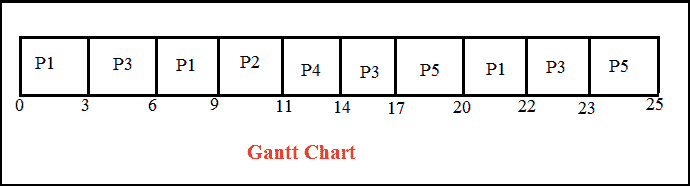
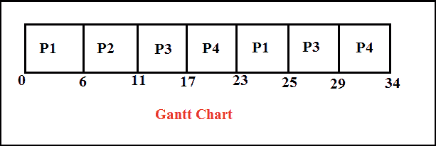
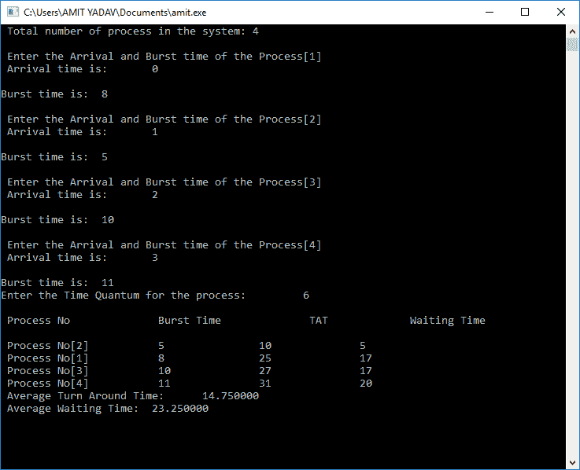

# 带输出的 C 语言循环程序

> 原文：<https://www.javatpoint.com/round-robin-program-in-c>

循环调度是一种中央处理器调度算法，它以循环顺序向每个进程共享相等的资源，并在没有优先级的情况下处理所有进程。在循环中，每个进程获得一个固定的时间片间隔来利用资源或执行其任务，称为时间**量子或时间片**。如果在给定的时隙内执行，一些循环进程被抢先，而其余的进程返回就绪队列，等待在预定的时隙内以循环顺序运行，直到它们完成任务。通过对[中央处理器](https://www.javatpoint.com/central-processing-unit)进行适当的分区，消除了每个进程的饥饿，实现了[中央处理器](https://www.javatpoint.com/cpu-full-form)的调度。

### 循环调度算法

**第一步:**根据所有流程在就绪队列中的到达时间组织所有流程。就绪队列的队列结构基于先进先出结构来执行所有的中央处理器进程。

**步骤 2:** 现在，我们从就绪队列中推送第一个进程，以在固定时间内执行其任务，该时间由到达队列的每个进程分配。

**步骤 3:** 如果进程由于到达下一个进程的到达时间而被另一个进程停止，该进程无法在定义的时间间隔或时隙内完成其任务，该进程将从就绪队列中推送以执行其任务。因此，CPU 保存了进程的前一个状态，这有助于从中断点恢复。(如果剩余进程的突发时间，将进程推到就绪队列的末尾)。

**步骤 4:** 类似地，调度器从就绪队列中选择另一个进程来执行其任务。当一个进程在时隙内完成其任务时，该进程将不会继续执行，因为该进程的突发时间已经结束。

**第五步:**同样，我们重复所有步骤执行流程，直到工作完成。

### 循环赛的特点

1.  这是一种先发制人的算法。
2.  它在所有进程之间共享相等的时间间隔来完成它们的任务。
3.  它是一种无饥饿的 CPU 调度算法。因此，它被称为最公平和简单的算法。

### 优势

1.  它没有面临任何饥饿问题或车队效应。
2.  每个进程都获得与公平分配 CPU 同等的优先级。
3.  很容易实现中央处理器调度算法。
4.  当到达下一个进程的到达时间时，每个新进程都被添加到就绪队列的末尾。
5.  每个进程以循环顺序执行，共享一个固定的时隙或时间段。
6.  在循环调度算法中，每个进程都有机会在给定的时间段后重新调度。

### 不足之处

1.  如果时间量较低，则需要更多时间在进程之间进行上下文切换。
2.  它没有为执行最重要的过程提供任何特殊的优先级。
3.  由于时隙短，大型进程的等待时间更长。
4.  算法的性能取决于时间量。
5.  由于对时间量的大切片，该过程的响应时间更长。
6.  对于循环算法中的所有进程来说，获得一个正确的时隙或数量是相当困难的。

### 循环调度 CPU 调度示例:

让我们用一个例子来理解循环赛的概念。假设我们有五个进程 P1、P2、P3、P4 和五常。每个进程的到达和爆发时间如下表所示。时间量子是三个单位。

| 过程 | 到达时间 | 突发时间 |
| 第一亲代 | Zero | eight |
| P2 | five | Two |
| P3 | one | seven |
| P4 | six | three |
| 孕烯醇酮 | eight | five |

现在我们必须为循环调度器创建**就绪队列**和**甘特图**。

就绪队列:P1、P3、P1、P2、P4、P3、五常、P1、P3、五常

下面是甘特图:



**步骤 1:** 在时间 0，进程 p 1 进入就绪队列，并在定义的时隙 3 开始执行。在时间片的 3 个单位中，另一个进程 P3 到达就绪队列，因为它的到达时间是 1。

**步骤 2:** 现在，进程 P3 以 3 个单位的时隙开始执行，而进程 P1 必须等待。在进程 P3 执行之后，进程 P1 再次恢复其时隙 3 的执行。

**步骤 3:** 在进程 P1 的执行过程中，又有两个进程 P2 和 P4 到达就绪队列，开始执行。由于 P2 进程排在第一位，因此它将在 P4 进程执行后执行 2 个时间单位。

**第四步:**这里，p 4 已经执行了时隙 3 个单位，由于 BT (Burst Time)为 2，其任务完成。因此，它不会进入就绪队列。

**步骤 5:** 之后，进程 P3 从时隙 3 的就绪队列中执行，然后进程 p 5 到达时隙 3。

**步骤 6:** 同时执行进程 P5，进程 P1 和 P3 要在就绪队列中等待。

**步骤 7:** 现在进程 P1 从就绪队列中取出，并开始执行时隙 2，因为它只需要 2 BT 来完成它的任务。因此，它不会进入就绪队列进行进一步执行。

**步骤 8:** 现在，进程 P3 在时隙 1 执行，因为它只需要 1 个 BT 来完成它的任务。

**第 9 步:**最后一个进程 P5 针对时隙 2 执行，因为它只需要 2 BT 就可以完成任务。

以下是查找完成时间、[周转时间(TAT)](https://www.javatpoint.com/tat-full-form) 、响应时间(RT)和等待时间(WT)的重要术语。

1.  **完成时间**:定义流程完成执行的时间。
2.  **周转时间**:定义完成时间(CT)和到达时间(AT)的时间差。
    周转时间=完成时间-到达时间
3.  **等待时间**:定义请求动作到获取资源之间的总时间。
    等待时间=周转时间-突发时间
4.  **响应时间**:定义**系统**响应某个流程的时间。

| 过程 | 到达时间 | 突发时间 | 完成时间 | 解题时间 | 等待时间 | 响应时间 |
| 第一亲代 | Zero | eight | Twenty-two | Twenty-two | Fourteen | Zero |
| P2 | five | Two | Eleven | six | four | four |
| P3 | one | seven | Twenty-three | Twenty-two | Fifteen | Two |
| P4 | six | three | Fourteen | eight | five | five |
| 孕烯醇酮 | eight | five | Twenty-five | Seventeen | Twelve | nine |

流程完成时间 P1 = 22，P2 = 11，P3 = 23，P4 = 14，P5 = 25。

P1 周转时间=完成时间(CT) -到达时间(AT)
22-0 = 22
P2 周转时间= 11-5 = 6
P3 周转时间= 23-1 = 22
P4 周转时间= 14-6 = 8
P5 周转时间= 25 - 8 = 17

P1 等待时间=周转时间(TAT) -突发时间(BT)
22-8 = 14
P2 等待时间= 6-2 = 4
P3 等待时间= 22-7 = 15
P4 等待时间= 8-3 = 5
P5 等待时间= 17 - 5 = 12

平均等待时间= (14 + 4 + 15 + 5 + 12)/5 = 50/5 = 10

平均周转时间= (22+6+22+8+17)/5= 75/5 = 15

### 顺序到达时间的循环 CPU 调度示例

让我们理解另一个具有顺序到达时间的循环的例子。这里我们有四个流程 P1、P2、P3 和 P4。每个进程的到达和爆发时间如下表所示。时间量为 **6** 单位。

| 过程 | 到达时间 | 突发时间 |
| 第一亲代 | Zero | eight |
| P2 | one | five |
| P3 | Two | Ten |
| P4 | three | Eleven |

下面是甘特图:



**步骤 1:** 在时间 0，进程 p 1 到达就绪队列，并执行其时间量为 6 个单位的任务。在时间片的 6 个单位中，另一个进程 P2、P3 和 P4 到达就绪队列。之后，进程 P1 将返回到就绪队列的末尾，等待它们的执行。

**步骤 2:** 现在，进程 p 2 开始执行时隙 5 单元，因为突发时间(BT)为 5，并且它不进入就绪队列以进一步执行。

**第三步:**该过程结束后，p 3 开始执行，有 10 个 Burst 时间，但时间量是 6 个单位。因此，它在定义的时间限制内执行任务，并被添加到就绪队列的末尾。

**第四步:**之后，进程 p 4 开始执行，其爆发时间为 11，但时间量为 6 个单位。它只执行 6 秒钟的任务，然后添加到就绪队列的末尾。

**第五步:**P4 执行完毕后，现在 P1 将再次开始执行 2 个单位或秒，过程 P1 终止或结束。类似地，进程 P1 的完全执行，然后是 P3，开始其剩余的突发时间 4 的执行，并且该进程完成。

**第六步:**进程 P3 执行完毕后，现在进程 P4 执行剩余时隙 5，进程结束。

| 过程 | 到达时间 | 突发时间 | 完成时间 | 解题时间 | 等待时间 |
| 第一亲代 | Zero | eight | Twenty-five | Twenty-five | Seventeen |
| P2 | one | five | Eleven | Ten | five |
| P3 | Two | Ten | Twenty-nine | Twenty-seven | Seventeen |
| P4 | three | Eleven | Thirty-four | Thirty-one | Twenty |

现在我们找到**完成，掉头时间，等待时间**和平均 **TAT** 和等待时间。

P1 完成时间为:25
P2 完成时间为:11
P3 完成时间为:29
P4 完成时间为:34

**周转时间:完成时间(CT) -到达时间(AT)**
流程 P1: 25 - 0 = 25
流程 P2: 11 -1 = 10
流程 P3: 29 - 2 = 27
流程 P4: 34 - 3 = 31
平均周转时间为:(25+10+27+31)/4 = 23.25

**流程等待时间:**

P1 = 25-8 = 17
P2 = 10-5 = 5
P3 = 27-10 = 17
P4 = 31-11 = 20
**平均等待时间为:** (17+5+17+20)/4 = 59/4 = 14.75

### 用 C 语言编写一个循环调度 CPU 的程序。

```

#include<stdio.h>
#include<conio.h>

void main()
{
	// initlialize the variable name
	int i, NOP, sum=0,count=0, y, quant, wt=0, tat=0, at[10], bt[10], temp[10];
	float avg_wt, avg_tat;
	printf(" Total number of process in the system: ");
	scanf("%d", &NOP);
	y = NOP; // Assign the number of process to variable y

// Use for loop to enter the details of the process like Arrival time and the Burst Time
for(i=0; i<NOP; i++)
{
printf("\n Enter the Arrival and Burst time of the Process[%d]\n", i+1);
printf(" Arrival time is: \t");  // Accept arrival time
scanf("%d", &at[i]);
printf(" \nBurst time is: \t"); // Accept the Burst time
scanf("%d", &bt[i]);
temp[i] = bt[i]; // store the burst time in temp array
}
// Accept the Time qunat
printf("Enter the Time Quantum for the process: \t");
scanf("%d", &quant);
// Display the process No, burst time, Turn Around Time and the waiting time
printf("\n Process No \t\t Burst Time \t\t TAT \t\t Waiting Time ");
for(sum=0, i = 0; y!=0; )
{
if(temp[i] <= quant && temp[i] > 0) // define the conditions 
{
	sum = sum + temp[i];
	temp[i] = 0;
	count=1;
	}	
	else if(temp[i] > 0)
	{
		temp[i] = temp[i] - quant;
		sum = sum + quant;	
	}
	if(temp[i]==0 && count==1)
	{
		y--; //decrement the process no.
		printf("\nProcess No[%d] \t\t %d\t\t\t\t %d\t\t\t %d", i+1, bt[i], sum-at[i], sum-at[i]-bt[i]);
		wt = wt+sum-at[i]-bt[i];
		tat = tat+sum-at[i];
		count =0;	
	}
	if(i==NOP-1)
	{
		i=0;
	}
	else if(at[i+1]<=sum)
	{
		i++;
	}
	else
	{
		i=0;
	}
}
// represents the average waiting time and Turn Around time
avg_wt = wt * 1.0/NOP;
avg_tat = tat * 1.0/NOP;
printf("\n Average Turn Around Time: \t%f", avg_wt);
printf("\n Average Waiting Time: \t%f", avg_tat);
getch();
}

```

**输出:**



* * *