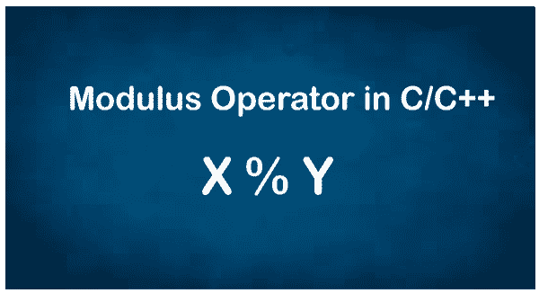

# C/C++中的模运算符

> 原文：<https://www.javatpoint.com/modulus-operator-in-c-or-cpp>

在了解模数**算符**之前，我们需要了解术语**算符**。在编程中，运算符符号告诉编译器根据传递的操作在给定的数字上执行特定的操作。

它用于对数字执行不同的操作(+、-、*、/)。通过在程序中使用各种运算符，有助于增强程序员的逻辑和数学能力。除了这四个基本运算符外，还有一些其他的运算符，如**模数运算符(%)、**范围解析运算符(::)等。

在本节中，我们将重点介绍**模数运算符。**



## C 和 C++中的模运算符是什么？

**模数运算符**是各种编程语言中使用的符号。用百分比符号( **%** )表示。它是算术运算符中使用的模数运算符。它决定了余数。在某些情况下，余数可能是 0，这意味着这个数完全可以被除数整除。

**语法:**

```

rem = a % b

```

在上面的语法中，a 和 b 是两个整数， **%** (Percent)符号是将 a 除以 b 并返回余数的模运算符。

### 模算子的返回可能性

以下是第一个数除以第二个数只返回余数的可能性。

1.  如果变量 a 可以被第二个数字(b)完全整除，它将返回零(0)，或者余数变为 0。
2.  如果变量 a 不能被第二个数字(b)完全整除，它将返回一个范围为[1，a - 1]的数值。或者我们可以说它将余数返回到非零整数值。
3.  如果第一个数字(a)非零，第二个数字为 0，则在编译时会产生错误。

### 模数运算符在 C/C++中是如何工作的？

模数运算符处理终端用户接收的两个操作数。之后，它将第一个数除以第二个数，并确定余数。让我们理解下面的例子，它说明了模数运算符的功能。

**例**:当我们执行 8 和 5 之间的模数运算符时，意味着 8 % 5，它返回余数 3，因为当 8 除以 5 时，它返回 1 作为商，3 作为余数。

类似地，7 % 2 返回 1 作为余数，因为当 7 除以 2 时，它返回 3 作为商，1 作为余数。

**例 1:编写一个程序来实现 C.** 中的模数运算符

**模式 c**

```

#include #include <conio.h>void main()
{
	int a, b;
	int res; // store the resultant of modulus expression

	a = 5;
	b = 2;
	res = a % b; // define modulus expression
	printf(" Modulus returns a remainder: %d", res);

	res = b % a; // define modulus expression
	printf(" \n Modulus returns a remainder: %d", res);

	a = 10;
	b = 5;
	res = a % b; // define modulus expression
	printf(" \n Modulus returns a remainder: %d", res);
	getch();
}</conio.h> 
```

**输出:**

```
Modulus returns a remainder: 1
 Modulus returns a remainder: 2
 Modulus returns a remainder: 0

```

#### 注意:当我们用一个浮点数除以另一个数时，它会将编译后的计时器错误作为无效操作数返回。因此，我们可以说它不适用于浮点数。

**用 C++实现模数运算符的程序。**

**Mode3.cpp**

```

#include using namespace std;
int main(void)
{
	int a, b;
	int res; // store the resultant of modulus expression

	a = 5;
	b = 2;
	res = a % b; // modulus expression
	cout <
```

**输出:**

```
Modulus returns a remainder: 1
 Modulus returns a remainder: 2
 Modulus returns a remainder: 0

```

## C++中的模运算符

**Mode4.cpp**

```

#include using namespace std;
int main(void)
{
	int a, b;
	int res; // store the result of modulus expression

	a = -5;
	b = 2;
	res = a % b; // modulus expression
	cout <
```

**输出:**

```
Modulus returns a remainder: -1
 Modulus returns a remainder: 2
 Modulus returns a remainder: -1

```

### 模数运算符的链接

我们可以使用模数运算符链在一条语句中对两个以上的操作数执行模数除法。下面是模数运算符链接的伪代码，如下所示。

```

res = operand1 % operand2 % operand3 % .... % operand_n

```

让我们考虑模数运算符链的程序，以获取两个以上的操作数。

**Mode5.cpp**

```

#include using namespace std;
int main()
{
  // Use of modulus operator in C++
	int x = 14;
	int y = 6;
	int z = 3;
	int modulo = x % y % z; // x % y returns 2, and 2 % z returns 2
	cout << "Modulus is : "<< modulo;
} 
```

**输出:**

```
Modulus is: 2

```

* * *