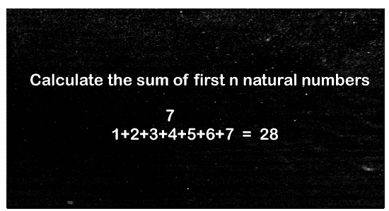

# C 中前 N 个自然数之和

> 原文：<https://www.javatpoint.com/sum-of-first-n-natural-numbers-in-c>

正如我们所知，自然数包含从 1、2、3 到 n 或无穷大的所有正数。例如，假设当我们计算前 25 个数字的总和时。这意味着我们开始把 1 到 25 的数字相加，这个过程叫做**前 N 个自然数**的和。在本主题中，我们将学习如何使用 [C](https://www.javatpoint.com/c-programming-language-tutorial) 程序找到前 n 个数字的和。



### 数学公式

下面是使用数学公式求 n 个自然数之和的表达式:

```

Sum of n natural number = n * (n + 1) / 2

```

其中 n 定义[自然数](https://www.javatpoint.com/natural-numbers)。

假设，我们要计算前 20 个自然数的和，我们需要放入一个数学公式来得到和:

```

Sum = 20 * (20 + 1) / 2 = 20 * 10.50 = 210
Or 
20 * (20 + 1) /2 = 10 * 21 = 210

```

### 伪代码

1.  int i，sum = 0，num
2.  输入正数
3.  i = 0
4.  做
5.  sum = sum + i
6.  i = i + 1
7.  迭代 i < = num 的值
8.  显示第一个自然数的总和。

### 用于循环

让我们创建一个 C 程序，使用[进行循环](https://www.javatpoint.com/for-loop-in-c)来确定 n 个自然数的和。

**相扑比赛编号 1.c**

```

#include #include <conio.h>void main()
{
	int num, i, sum = 0; // declare local variables
	printf(" Enter a positive number: ");
	scanf("%d", &num); // take any positive number
	// executes until the condition remains true.
	for (i = 0; i <= num; i++)
	{
		sum = sum + i; // at each iteration the value of i is added to the sum variable
	}
	// display the sum of natural number
	printf("\n Sum of the first %d number is: %d", num, sum); 
	getch();
}</conio.h> 
```

**输出:**

```
Enter a positive number: 25
Sum of the first 25 number is: 325

```

### 使用 while 循环

让我们创建一个 C 程序，在循环时使用[确定 n 个自然数的和。](https://www.javatpoint.com/while-loop-in-c)

**相扑馆编号 2.c**

```

#include #include <conio.h>void main()
{
	int num, i, sum = 0; // initialize and declare the local variables
	printf("Enter a positive number : ");
	scanf("%d", &num); // take a value up to which find the sum of n natural number
	i = 0;
	while (i <= num) // define the while loop and i should be less than num
	{
		sum = sum + i; // store the sum of natural number
		i++; // increment by 1
	}
	// print the sum of natural number
	printf(" \n Sum of first %d natural number is : %d", num, sum);
	getch();
}</conio.h> 
```

**输出:**

```
Enter a positive number: 20
Sum of the first 20 natural number is: 210

```

在上面的例子中，当我们输入一个正数 20 时，while 循环会连续迭代 i = 0 到 20 之间的计数器值。在每次迭代中，I 的值被加到变量**和**中，I 增加 1。当 **while 条件**变为假时，它退出循环并打印前 20 个自然数的总和。

### 使用边做边循环

让我们考虑下面的例子，使用 [Do while loop](https://www.javatpoint.com/do-while-loop-in-c) 计算自然数的和。

**相扑馆编号 3.c**

```

#include #include <conio.h>void main()
{
	int num, i, sum = 0; // initialize and declare the local variables
	printf("Enter a positive number: ");
	scanf("%d", &num); // take a value up to which find the sum of natural number
	i = 0;
	do
	{
	    sum = sum + i; // store the sum of natural number
		i++; // increment by 1	
	} while (i <= num); // define the while loop and i should be less than num

	// print the sum of natural number
	printf(" \n Sum of first %d natural number is : %d", num, sum);
	getch();
}</conio.h> 
```

**输出:**

```
Enter a positive number: 30
Sum of the first 30 natural number is: 465

```

在上面的例子中，当我们输入一个正数 30 时，do 循环在 i = 0 到 30 之间不断迭代计数器值。在每次迭代中，I 的值被加到变量**和**中，I 增加 1。当 **while 条件**变为假时，它从 while 循环中退出并打印前 30 个自然数的总和。

### 使用数学公式

让我们编写一个程序，用数学公式打印 n 个自然数的和。

**相扑比赛 4.c**

```

#include int main()
{
	int n = 40; // declare & initialize local variable n.
	int sum = (n * (n + 1) ) / 2; /* define the mathematical formula to calculate the sum of given number. */
	printf("Sum of %d natural number is = %d", n, sum); // print the sum of natural number
	return 0;
} 
```

**输出:**

```
Sum of 40 natural number is = 840

```

### 使用函数

让我们考虑下面的例子，用 C 中的[函数计算自然数的和。](https://www.javatpoint.com/functions-in-c)

**相扑馆编号 5.c**

```

#include #include <conio.h>void main()
{
	int num, total; // local variable
	printf("Enter a natural number: ");
	scanf("%d", &num); // take a natural number from the user
	total = natural_no(num);  // call the function
	printf(" Sum of the %d natural number is: %d", num, total);
}
int natural_no(num)
{
	int i, sum = 0;
	// use for loop until the condition becomes false
	for (i = 0; i <= num; i++)
	{
         // adding the counter variable i to the sum value
		sum = sum + i;
	}
	return sum;
}</conio.h> 
```

**输出:**

```
Enter a natural number: 100
Sum of the 100 natural number is: 5050

```

### 给定范围内 n 个自然数的和

计算从任意起始数到指定的最后一个数的 n 个自然数之和。

**相扑比赛编号 6.c**

```

#include #include <conio.h>void main()
{
	int num, i, sum = 0; // define the local variables
	printf("Enter the first number: ");
	scanf("%d", &i); // accept the starting number

	printf(" Up to the last natural number: ");
	scanf("%d", &num); // accept the last number

	// As long as the loop condition is true, it continuously iterates the statement	while(i <= num)
	{
		// adding the counter variable i to the sum variable
		sum = sum + i;
		i++; // increment by 1
	}
	printf("Sum of natural number is = %d", sum);
	getch();
}</conio.h> 
```

**输出:**

```
Enter the first number: 1
Up to the last number natural number: 25
Sum of natural number is = 325

```

### 使用递归

让我们考虑以下使用[递归](https://www.javatpoint.com/recursion-in-c)计算自然数之和的例子。

**相扑比赛编号 7.c**

```

#include #include <conio.h>int sum_natural_no(int num); // declare function outside the main function
int
 main()
{
	int num, sum = 0; // declare local variable
	printf("Enter any positive number to calculate the sum of natural no. ");
	scanf("%d", &num); // take an input from the user

	sum = sum_natural_no(num); // call the function

	printf("Sum of the first %d natural number is: %d", num, sum); // print the sum of natural number
	return 0;
}
int sum_natural_no(int num)
{
	if( num == 0) // define if condition
	{
		return num;	
	}
	else
	{   // return the else condition
		return( num + sum_natural_no( num - 1));
	}
}</conio.h> 
```

**输出:**

```
Enter any positive number to calculate the sum of natural no. 50
Sum of the first 50 natural number is: 1275

```

### 使用数组

**相扑比赛 8.c**

```

#include int main()
{
	// declare & initialize local variable
   int num, sum = 0, i, array[50];
	printf(" Enter a positive number as we want to sum the natural number: ");
   scanf("%d", &num); // take a positive number 
   printf("\n Enter the number one by one: \n");
   for (i = 0; i < num; i++)
   {

      scanf("%d", &array[i]); // read value one by one 
      sum = sum + array[i]; // store number into the sum variable
   }

   printf("Sum of the given number is = %d\n", sum);

   return 0;
} 
```

**输出:**

```
Enter a positive number as we want to sum the natural number: 5
 Enter the number one by one: 
2
4
5
6
7
Sum of the given number is = 24

```

* * *