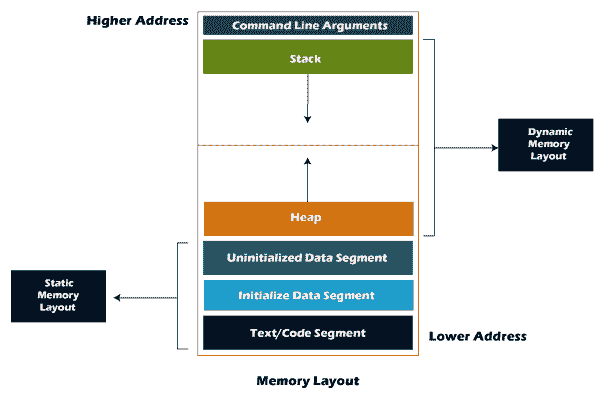

# C 语言中的内存布局

> 原文：<https://www.javatpoint.com/memory-layout-in-c>

当我们创建一个 C 程序并运行该程序时，它的可执行文件以有组织的方式存储在计算机的 ram 中。

C 程序的内存布局如下图所示:



从上图中我们可以看到，C 程序由程序中的以下部分组成:

*   正文段
*   初始化数据段
*   未初始化的数据段
*   堆
*   许多

**让我们一个一个地理解每一节。**

### 1.正文段

文本段也称为代码段。当我们编译任何程序时，它都会创建一个可执行文件，如. out、。exe 等。，存储在内存的文本或代码部分。如果我们将指令存储在硬盘中，那么从硬盘访问指令的速度会变得更慢，因为硬盘在串行通信上工作，所以从硬盘获取数据会更慢，而随机存取存储器直接连接到数据和地址总线，所以从随机存取存储器访问数据会更快。

### 2.数据部分

我们在程序中使用的数据将存储在数据区。因为 main()函数内部声明的变量存储在堆栈中，但是 main()方法外部声明的变量将存储在数据部分中。数据段中声明的变量可以以已初始化、未初始化的形式存储，并且可以是本地的或全局的。因此，数据段分为四类，即初始化、未初始化、全局或本地。

**我们通过一个例子来理解这个场景。**

```

#include int var1;
int var2 = 10;
void function1()
{
    printf("I am function1");
} 
int main()
{
   function1();
   return 0;
} 
```

在上面的代码中，var1 和 var2 变量在 main()函数之外声明，其中 var1 是未初始化的变量，而 var2 是已初始化的变量。这些变量可以在程序中的任何地方访问，因为这些变量不是堆栈中 main()的一部分。

**数据段由两段组成:**

*   未初始化的数据段
*   初始化数据段

**未初始化的数据段**

未初始化的数据段也被称为**。bss** 段，存储所有未初始化的全局、局部和外部变量。如果全局变量、静态变量和外部变量未初始化，则默认情况下，它们的赋值为零。

那个。bss 段代表**区块，以符号**开始。bss 段包含存储所有静态分配变量的目标文件。这里，静态分配的对象是那些没有显式初始化的对象，用零值初始化。在上面的代码中，var1 是一个未初始化的变量，因此它存储在未初始化的数据部分。

**我们来看一些未初始化数据段的例子。**

```

#include char a;    // uninitialized global variable..
int main()
{
    static int a;   // uninitialized static variable..
    return 0; 
} 
```

**初始化数据段**

初始化的数据段也称为数据段。数据段是一个程序的虚拟地址空间，包含所有由程序员显式初始化的全局变量和静态变量。

数据段中的变量值不是只读的，也就是说，它们可以在运行时修改。该数据段可以进一步分为几类:

*   **初始化只读区域:**是变量的值不能修改的区域。
*   **初始化读写区:**这是一个变量的值也可以改变的区域。

例如:全局变量**char str[]=“javatpoint”**、**int a = 45**；将存储在初始化的读写区。如果我们创建像 const char * string =“javatpoint”这样的全局变量；文字“javatpoint”将存储在初始化的读取区域，而 char 指针变量将存储在初始化的写入区域。

```

#include char string[] = "javatpoint";  // global variable stored in initialized data segment in read-write area..
int main()
{
   static int i = 90;   // static variable stored in initialized data segment..
   return 0; 
} 
```

### 3.堆

当我们定义一个函数并调用该函数时，我们使用堆栈框架。函数内部声明的变量存储在堆栈中。函数参数也存储在函数中，因为参数也是函数的一部分。这种类型的内存分配被称为静态内存分配，因为所有变量都是在函数中定义的，变量的大小也是在编译时定义的。堆栈部分在内存中起着非常重要的作用，因为每当调用函数时，都会创建一个新的堆栈框架。

堆栈也用于递归函数。当函数在同一个函数中一次又一次地调用自己时，会导致堆栈溢出情况，并导致程序中的分段错误。

### 4.许多

堆内存用于动态内存分配。堆内存从未初始化数据段的末尾开始，向上增长到更高的地址。malloc()和 calloc()函数用于分配堆中的内存。堆内存可以被所有共享库和动态加载的模块使用。free()函数用于从堆中释放内存。

```

#include int main()
{
    int *ptr = (int*)malloc(sizeof(int)) ; // memory gets allocated in the heap segment.
    return 0;
} 
```

* * *