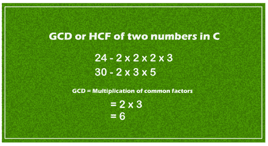

# C 中两个数的 GCD

> 原文：<https://www.javatpoint.com/gcd-of-two-numbers-in-c>

在本主题中，我们将学习 GCD，并找出用 C 编程语言获得两个数字的 GCD 的不同方法。



GCD 是两个或多个数的**最大公约数**的数学术语。它是最大公约数，能完全除两个或两个以上的数而不留余数。因此，它也被称为两个数字中的**最高公因数(HCF)** 。例如，20 和 28 这两个数字的 GCD 是 4，因为 20 和 28 都可以被 1、2、4 完全整除(余数为 0)，而因子 1、2 和 4 中最大的正数是 4。同样，两个数字 24 和 60 的 GCD 是 12。

### 用于循环的两个数的 GCD

让我们考虑一个程序，用循环来得到 C 中两个数的 GCD。

**Gcd_for.c**

```
#include #include <conio.h>int main()
{
	// declare the variables
	int n1, n2, i, GCD_Num;
	printf ( " Enter any two numbers: \n ");
	scanf ( "%d %d", &n1, &n2); 

	// use for loop
	for( i = 1; i <= n1 && i <= n2; ++i)
	{
		if (n1 % i ==0 && n2 % i == 0)
			GCD_Num = i; /* if n1 and n2 is completely divisible by i, the divisible number will be the GCD_Num */
	}
	// print the GCD of two numbers
	printf (" GCD of two numbers %d and %d is %d.", n1, n2, GCD_Num);
	return 0;
}</conio.h> 
```

**输出**

```
Enter any two numbers:
 96
36
 GCD of two numbers 96 and 36 is 12.

```

### 使用 while 循环的两个数字的 GCD

让我们考虑一个程序，用 while 循环得到 C 中两个数的 GCD。

**Gcd_while.c**

```
#include #include <conio.h>int main()
{	
	// initialize the local variables num1 and num2
	int num1 = 50, num2 = 60;

	while (num1 != num2) 
	{
		// if num1 is greater than num2, returns the num1.
		if (num1 > num2)
			{
			num1 = num1 - num2;	
			}
			// otherwise, it returns the num2.
		else
			{
				num2 = num2 - num1;
				}	

	} 
	// print the GCD of the number.
	printf( " GCD of two numbers 50 and 60 is %d.", num2);
}</conio.h> 
```

**输出**

```
GCD of two numbers 50 and 60 is 10.

```

### 从用户那里获得 N 个数字的 GCD

让我们考虑一个程序，通过接收用户的输入来获得 n 个数字的 GCD。

**gcdnum . c .**

```
#include #include <conio.h>void main()
{
	// declaration of the variables
	int n1, n2 = -1;
	printf (" Enter N numbers from the users ( 0 to exists from the loop) \n");
	while ( 1)
	{
		scanf ( "%d", &n1); // A while loop continuously accepts the number 
		if ( n1 < 1) // n1 should be larger than 1 
			break; 

		else if ( n2 == -1) 
			n2 = n1; // assign the value of n1 to n2
		else if(n1 < n2)
			n2 = gcd_Num(n1, n2); // assign the function into the n2
		else
			n2 = gcd_Num( n2, n2); // else it stores the function value into the n2
	}
	printf (" \n GCD of all entered number is: %d", n2);
	getch();
}

// Get the GCD of two numbers
int gcd_Num ( int x, int y)
{
	int i; 
	for( i = x; i >= 1; i --)
	{	// largest number that completely divides both number
		if( x % i == 0 && y % i == 0)
			break; 
	}
	return i;	
}</conio.h> 
```

**输出**

```
GCD of two numbers 50 and 60 is 10.

```

### 从用户那里获得 N 个数字的 GCD

让我们考虑一个程序，通过接收用户的输入来获得 n 个数字的 GCD。

**gcdnum . c .**

```
#include #include <conio.h>void main()
{
	// declaration of the variables
	int n1, n2 = -1;
	printf (" Enter N numbers from the users ( 0 to exists from the loop) \n");
	while ( 1)
	{
		scanf ( "%d", &n1); // A while loop continuously accepts the number 
		if ( n1 < 1) // n1 should be larger than 1 
			break; 

		else if ( n2 == -1) 
			n2 = n1; // assign the value of n1 to n2
		else if(n1 < n2)
			n2 = gcd_Num(n1, n2); // assign the function into the n2
		else
			n2 = gcd_Num( n2, n2); // else it stores the function value into the n2
	}
	printf (" \n GCD of all entered number is: %d", n2);
	getch();
}

// Get the GCD of two numbers
int gcd_Num ( int x, int y)
{
	int i; 
	for( i = x; i >= 1; i --)
	{	// largest number that completely divides both number
		if( x % i == 0 && y % i == 0)
			break; 
	}
	return i;	
}</conio.h> 
```

**输出**

```
Enter the N numbers from the users ( 0 to exists from the loop)
196
224
48
96
36
256
0

 GCD of all entered number is: 4

```

### 使用用户定义的函数获取两个数字的 GCD

让我们考虑一个程序，使用用户定义的函数得到两个数字的 GCD。

漏斗

```
#include #include <conio.h>GetGCD (int x, int y); 
int main()
{
	int x, y, GCD = 0;
	printf ( " Enter the first number \n ");
	scanf ("%d", &x);
	printf ( " Enter the second number \n ");
	scanf ("%d", &y); 
	GCD = GetGCD( x, y); // call the GetGCD() function in main() function

	// display the greatest common difference of two numbers
	printf ( " GCD of the two numbers %d and %d is %d", x, y, GCD); 

	getch();
}

// function definition of the GetGCD
GetGCD ( int x, int y)
{

	// A while loop will continue iterates till y is not equal to 0
	while (y != 0)
	{
		if ( x > y) /* if x is greater than y, the if block is executed. */
		{
			x = x - y;
		}
		else
		{
			y = y - x;
		}
	}
	return x;
}</conio.h> 
```

**输出**

```
Enter the first number
96
 Enter the second number
 132
 GCD of the two numbers 96 and 132 is 12

```

### 使用模运算符的两个数的 GCD

**我们来考虑一个用模算符求两个数 GCD 的程序。**

模块。c

```
#include #include <conio.h>void main()
{
	// declaration of local variable
	int x , y;
	printf ( " Enter the first number: \n ");
	scanf (" %d", &x); 
	printf ( " Enter the second number: \n ");
	scanf (" %d", &y); 
	printf (" GCD of two number %d and %d is %d", x, y, GetGCD( x, y));
	getch();
}

// use a recursive function to return GCD of two numbers x and y
int GetGCD (int x, int y)
{
	if ( y == 0) // if y is equal to 0, it returns x
	{
		return x;
	}
	// use modulo operator to perform the divisibility 
	return GetGCD (y, x % y);
}</conio.h> 
```

**输出**

```
Enter the first number:
 256
 Enter the second number:
 92
 GCD of two number 256 and 92 is 4

```

### 用递归求两个数的 GCD

让我们考虑一个程序，使用递归来寻找 C 语言中两个数字的 GCD。

**递归**

```
#include #include <conio.h>int GCD_Rec(int num1, int num2);
int main()
{
	int num1, num2;
	printf( " Enter any two positive numbers \n");
	scanf("%d %d", &num1, &num2);

	// call and print the GCD of two number using GCD_Rec()
	printf(" GCD of two numbers %d and %d is %d", num1, num2, GCD_Rec(num1, num2));
	return 0;
}

int GCD_Rec(int num1, int num2)
{
	if (num2 != 0)
	{
		return GCD_Rec( num2, num1 % num2);
	}
	else
	{
		return num1;
	}
}</conio.h> 
```

**输出**

```
Enter any two positive numbers:
60
48
GCD of two numbers 60 and 48 is 12

```

在上面的程序中，递归函数 GCD_Rec()不断调用自己，直到 num2 的值等于 0。

### 使用 if_else 和 for 循环的三个数的 GCD

让我们考虑一个程序，使用 if else 语句和 for 循环来获取 C 语言中三个数字的 GCD。

**Gcd_num.c**

```
#include #include <conio.h>void main()
{
	// declare the variable x, y and z.
	int n1, n2, n3;
	printf (" Enter any positive numbers: \n ");
	scanf ( " %d %d %d", &n1, &n2, &n3);
	int GCD;

	// use for loop to define the function and condition
	for ( GCD = GCD_fun( n1, n2, n3); GCD >= 1; GCD--)
	{
		if (n1 % GCD == 0 && n2 % GCD == 0 && n3 % GCD == 0)
		{
			break;
		}
	}
	printf (" GCD of three numbers %d, %d and %d is %d", n1, n2, n3, GCD);
	getch();
}

int GCD_fun ( int x, int y, int z)
{
	if ( x >= y && x >= z)
	{
		return x;
	}

	else if ( y >= x && y >= z)
	{
		return y;
	}

	else if ( z >= x && z >= y)
	{
		return z;
	}
}</conio.h> 
```

**输出**

```
Enter any positive numbers:
 98
49
56
 GCD of three numbers 98, 49 and 56 is 7

```

* * *