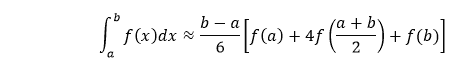

# 辛普森法

> 原文：<https://www.javatpoint.com/simpson-method>

辛普森法是由托马斯·辛普森给出的数值积分法，因此被命名为辛普森法 T2。虽然辛普森有一定的规则，但最基本的是辛普森的两个规则，它们是:

*   **辛普森 1 法则:被称为辛普森 1/3 法则**
*   **辛普森 2 法则:被称为辛普森 3/8 法则**

在本节中，我们将讨论这两个辛普森规则，并将实现这两个规则的示例代码。

### 辛普森 1/3 法则

它也被称为**辛普森规则**其中规则说:



其中 f(x)是被积函数，a 是下限，b 是表达式中积分的上限。

**二次插值**

将被积函数 f(x)替换为二次多项式 P(x)，它是抛物线，取极限 a 和 b 的值与 f(x)相同。它还计算 m = (a + b)/2，如 f(x)所示。因此，在使用拉格朗日多项式插值和代入积分时，我们得到，


然后使用步长 h=(b-a)/2，然后可以写成:


由于它是 h/3，即 1/3 因子，我们称之为辛普森规则，即辛普森 1/3 规则。

辛普森法则可以通过下图推导出来，在下图中，我们用二次插值函数 P(x)来近似积分 f(x)。


**数值示例**

为了求解一个数值，我们需要使用辛普森规则，即


**数值:在极限 4 到 5.2 内评估 logx dx。**

**解决方案:**

**第一步:**选择一个区间将被划分的值，即 n 的值，所以，对于给定的表达式，首先，我们将区间分成六个相等的部分，因为区间的数量应该是偶数。

**第二步:**计算 h = (b - a)/2 的值

**第三步:**评估计算 x <sub>0</sub> 到 x <sub>n</sub> 的值。考虑 y = f(x)，计算 x <sub>0</sub> 到 x <sub>n</sub> 的 y <sub>0</sub> 到 y <sub>n</sub> 的值。在这里，我们得到以下数据:


**第三步:**将数值放入方法中，然后我们可以使用上面的公式计算积分的近似值:

= h/3[( 1.38 + 1.64) + 4 * (1.43 + 1.52 +

1.60 ) +2 *(1.48 + 1.56)]

= 1.84

因此，使用辛普森 1/3 法则，上述积分的近似值为 **1.827** 。

### 辛普森 1/3 法则的程序实现

下面是辛普森 1/3 法则的 C 语言程序代码实现:

```

#include<stdio.h>
#include<conio.h>
#include<math.h>
#define f(x) 1/(1+x*x)
int main()
{
 float lower, upper, intgrl=0.0, stepSize, k;
 int i, subInterval;
 clrscr();
 printf("Enter lower integration limit: ");
 scanf("%f", &lower);
 printf("Enter upper integration limit: ");
 scanf("%f", &upper);
 printf("Enter sub intervals: ");
 scanf("%d", &subInterval);
stepSize = (upper - lower)/subInterval;
 intgrl = f(lower) + f(upper);
 for(i=1; i<= subInterval-1; i++)
 {
  k = lower + i*stepSize;
  if(i%2==0)
  {
   intgrl = intgrl + 2 * f(k);
  }
  else
  {
   intgrl= intgrl + 4 * f(k);
  }
 }
 intgrl = intgrl * stepSize/3;
 printf("The integration is: %.3f", intgrl);
 getch();
 return 0;
}

```

上述代码的输出如下所示:


## 辛普森 3/8 规则

这是辛普森的第二条规则，也类似于辛普森 1/3 规则，但有所不同。1/3 和 3/8 规则的区别在于，在辛普森 3/8 规则中，插值是三次多项式。辛普森 3/8 法则说:


其中 f(x)是被积函数，h 是区间的大小，计算公式为 h = (b - a)/n，这里 n 是区间极限。

现在，让我们看看程序实现，以了解辛普森 3/8 规则背后的逻辑。

### 实施辛普森 3/8 规则的程序

**下面是 C++中的程序代码实现:**

```

#include<stdio.h>
#include<conio.h>
#include<math.h>
#define f(x) 1/(1+x*x)
int main()
{
 float lower, upper, intgrl=0.0, stepSize, k;
 int i, subInterval;
 clrscr();
 printf("Enter lower limit integration limit: ");
 scanf("%f", &lower);
 printf("Enter upper integration limit: ");
 scanf("%f", &upper);
 printf("Enter sub intervals: ");
 scanf("%d", &subInterval);
stepSize = (upper - lower)/subInterval;
intgrl = f(lower) + f(upper);
 for(i=1; i<= subInterval-1; i++)
 {
  k = lower + i*stepSize;
  if(i%3 == 0)
  {
   intgrl = intgrl + 2 * f(k);
  }
  else
  {
   intgrl= intgrl + 3 * f(k);
  }
 }
 intgrl = intgrl * stepSize*3/8;
 printf("The integration is: %.3f", intgrl);
 getch();
 return 0;
}

```

**上述代码的输出如下所示:**


除了上面讨论的辛普森的两个规则之外，还有第三个规则的存在，用于海军结构和舰船稳定性估计。然而，在一般方法中，它并不重要。

* * *