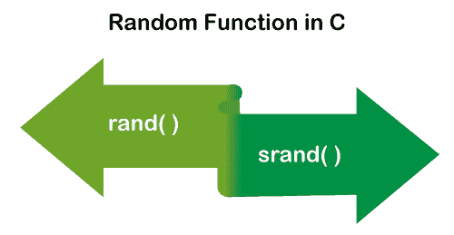

# C 语言中的随机函数

> 原文：<https://www.javatpoint.com/random-function-in-c>

在本主题中，我们将学习随机函数以及如何用 C 编程语言生成随机数。我们知道，随机函数是用来求任意两个定义数之间的随机数的。在 C 编程语言中，随机函数有两个内置函数:rand()和 srand()函数。让我们用 C 语言来理解这些函数。



## rand()函数

在 [C 编程语言](https://www.javatpoint.com/c-programming-language-tutorial)中，rand()函数是一个库函数，生成范围为[0，RAND_MAX]的随机数。当我们在程序中使用 rand()函数时，我们需要实现 **stdlib.h** 头文件，因为 rand()函数是在 stdlib 头文件中定义的。它不包含任何种子号。因此，当我们一次又一次地执行同一个程序时，它会返回相同的值。

#### 注意:如果随机数是用 rand()函数生成的，而没有调用 srand()函数，那么每次执行程序时，它都会返回相同的数字序列。

### 句法

```

int rand (void)

```

函数的作用是:返回随机整数，范围从 0 到 RAND_MAX。RAND_MAX 是一个符号常量，在 stdlib.h 头文件中定义，其值大于但小于 32767，具体取决于 C 库。

### 使用 rand()函数生成随机数

让我们编写一个程序，使用 rand()函数获取随机数。

**编号 c**

```

#include <stdio.h>	
#include <conio.h>
#include <stdlib.h>
void main()
{	
	// use rand() function to generate the number
	printf (" The random number is: %d", rand());
	printf ("\n The random number is: %d", rand());

	printf (" \n The random number is: %d", rand());
	printf ("\n The random number is: %d", rand());
	getch();
}

```

**输出**

```
The random number is: 41
 The random number is: 18467
 The random number is: 6334
 The random number is: 26500

```

### 使用 rand()函数生成 5 个随机数

让我们考虑一个用 C 语言中的 rand()函数生成 5 个随机数的程序。

**random.c**

```

#include <stdio.h>
#include <stdlib.h>

int main()
{
	int i;	
	/* It returns the same sequence of random number 
	on every execution of the program. */
	printf(" Random Numbers are: \n"); 
	for (i = 0; i <5; i++)
	{
		printf(" %d", rand());
	 } 
	 return 0;
}

```

**输出**

```
Random Numbers are:
 41 18467 6334 26500 19169

```

**程序的第二次执行:**

```
Random Numbers are:	
 41 18467 6334 26500 19169

```

**程序的第三次执行**

```
Random Numbers are:
 41 18467 6334 26500 19169

```

正如我们在上面的输出中看到的，它在每次执行编程代码时都会返回相同的随机数序列。

### 使用 rand()函数生成 10 个从 1 到 100 的随机数

让我们考虑一个使用 rand()函数在 C 中查找随机数的程序。

rand _ num . c .

```

#include <stdio.h>
#include <conio.h>
#include <stdlib.h>	
int main()
{
	// declare the local variables
	int i, num;
	printf (" Program to get the random number from 1 to 100 \n");
	for (i = 1; i <= 10; i++)
	{
		num = rand() % 100 + 1; // use rand() function to get the random number
		printf (" %d ", num);
		getch();
}
	}

```

**输出**

```
Program to get the random number from 1 to 100
 42  68  35  1  70  25  79  59  63  65

```

## srand()函数

srand()函数是一个 C 库函数，它确定了产生不同系列伪随机数的起始点。如果不使用 rand()函数，就不能使用 srand()函数。在调用 rand()函数之前，需要 srand()函数在程序中只设置一次种子的值，以生成随机整数的不同结果。

### 句法

```

int srand (unsigned int seed)

```

**种子**:是一个整数值，包含一个新的伪随机数序列的种子。

### 使用 srand()函数生成随机数

让我们编写一个程序，用 c 语言中的 srand()函数得到随机数。

**开玩笑。c**

```

#include <stdio.h>
#include <stdlib.h>
#include <time.h> // use time.h header file to use time

int main()
{
	int num, i;
	time_t t1; // declare time variable

	printf(" Enter a number to set the limit for a random number \n");
	scanf (" %d", &num);

	/* define the random number generator */
	srand ( (unsigned) time (&t1)); // pass the srand() parameter
	printf("\n"); // print the space
	/* generate random number between 0 to 50 */
	for (i = 0; i <num; i++)
	{
		printf( "%d \n", rand() % 50);
	}
	 return 0;
}

```

**输出**

```
Enter a number to set the limit for a random number
10

44      32      23      35      6       33      1       4       22      18

```

**程序的第二次执行:**

```
Enter a number to set the limit for a random number
15	

13      30      24      27      4       30      28      35      36      13      44      39      21      5       7

```

正如我们在上面的输出中看到的，它在编程代码的每次执行中返回不同的随机数序列。

### 使用 srand()和 time()函数生成随机数

让我们编写一个程序，使用 srand()和 time()函数获取随机数。

**srand_time.c** 女士

```

#include <stdio.h>
#include <stdlib.h>
int main()
{
	int random = rand(); // assign the rand() function to random variable
	srand( time(0));

	printf( " Seed = %d", time(0));
	printf( " Random number = %d", random);	
	 return 0;
}

```

**输出**

```
Seed = 1619450091 Random number = 41

```

### 获取种子值，并使用 srand()函数打印随机数

让我们编写一个程序，使用 srand()函数获取种子值和随机数。

**srand_time.c** 女士

```

#include <stdio.h>
#include <stdlib.h>

int main()
{
	int count;
	unsigned int seed; // use for randomize number

	printf(" Enter the Seeding value: \n");
	scanf(" %u", &seed);

	srand (seed); // pass parameter

	// generate random number between 1 to 6
	for (count = 1; count <= 10; ++count)
	{
		printf(" %5d", 1 + (rand () % 6)); 
		if (count % 5 == 0) // print the number in next line
			puts(" ");
	 } 
	 return 0;
}

```

**输出**

```
Enter the Seeding value:
10
     6     4     3     3     6
     3     3     1     3     4

```

**程序的第二次执行:**

```
Enter the Seeding value:	
20
     2     4     2     4     5
     4     3     5     1     4

```

**程序的第三次执行:**

```
Enter the Seeding value:
25
     1     6     1     6     4
     4     1     4     1     3

```

正如我们在上面的输出中看到的，当我们用不同的种子值一次又一次地执行同一个程序时，它显示了从 1 到 6 的不同随机数序列。

### 使用随机函数生成随机数

让我们创建一个程序，使用 stadlib 头文件，使用 c 语言中的随机函数获取随机数。

漏斗

```

#include <stdio.h>
#include <conio.h>
#include <stdlib.h>
int main()	
{
	int i, num, max, temp;
	printf (" Enter a number to set the limit of random numbers \n");
	scanf ("%d", num); 

	printf (" Enter the maximum number from you want to get the random number: \n");
	scanf ("%d", max); 

	printf (" %d random number from 0 to %d number are: \n", num, max);
	randomize();

	for (i = 1; i <= num; i++)
	{
		temp = random(max)  /* use random() function to get the random number */
		printf (" %d ", temp); // print the temp
}
		getch();	
}

```

**输出**

```
Enter a number to set the limit of random numbers
17
Enter the maximum number from you want to get the random number:
100
15 random number from 0 to 100 number are:
 42  68  35  1  70  25  79  59  63  28 75 89 90 43 7 4 65

```

## 生成浮点随机数的程序

让我们考虑一个用 c 语言打印浮点数的程序。

**random1.c**

```

#include <stdio.h>
#include <stdlib.h>
#include <time.h>

int main()
{
	srand( (unsigned int) time(NULL));
	float f1 = 5.0;
	int i;
	printf(?Float random numbers are: \n?);
	for (i = 0; i<10; i++)
	{
		printf("%f", ((float) rand()/ RAND_MAX) * f1);
		printf("\n");
	}
	return 0;
}

```

**输出**

```
Float random numbers are:
1.208075
1.658376
4.645070
2.298807
3.117161
0.961486
4.115573
4.336223
2.894833
2.249825

```

* * *