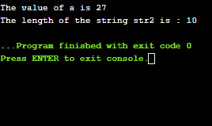

# 头文件

> 原文：<https://www.javatpoint.com/c-header-files>

### 什么是头文件？

头文件是具有。h 分机。头文件包含函数原型或函数声明，而源代码包含常量、宏、系统范围的全局变量。每当我们需要一个函数的定义时，我们只需要包含声明该函数的头文件。

程序中定义了两种类型的头文件:

*   **系统定义的头文件:**预定义的头文件称为系统定义的头文件。
*   **自定义头文件:**用户定义的头文件称为自定义头文件。

在使用预处理指令(#)的帮助下，用户定义和系统定义的头文件都可以包含在程序中。这些预处理器指令用于指示编译器在编译前处理这些文件。包含头文件有两种形式:

*   #包括
*   #包含“文件”

上面给出的头文件是有区别的。如果头文件是在预定义的源路径中定义的，我们可以在尖括号中指定头文件。如果头文件没有在预定义的源路径中定义，那么我们可以在双引号中指定头文件的完整路径。

**包括操作**

让我们假设 header.h 头文件包含以下声明:

```

int *test()

```

program.c 源文件的定义如下:

```

#include"header.h"
int main()
{
   puts(test());
   return 0;
} 

```

编译器将替换 header.h 头文件的定义，如下所示:

```

int *test()
int main()
{
   puts(test());
   return 0;
} 

```

**仅一次标题**

如果源代码中的头文件被包含了两次，那么它会导致一个错误，即多个声明。为了解决这个问题，有一种标准的方法将头文件的真实内容封装在一个条件中，如下所示:

```

#ifndef my_header_file
#define my_header_file
--
--
#endif

```

在上面的条件下，如果包含了表头，那么就不会再包含了。如果头文件不包括在内，那么头文件将包括在内。如果头文件被包含两次，并且预处理器将跳过文件的所有内容，编译器将忽略头文件的第二个声明，则构造“ifndef”将变为 false。

让我们通过一个例子来理解上面的场景。

Myheader.h

```

#ifndef my_header_file
#define my_header_file
int a = 10;
#endif

```

以下是包含头文件的源代码:

```

#include #include "header.h"
#include "header.h"
int main()
{
    printf("The value of a is : %d", a);
    return 0;
} 
 In the above code, we have included the header file twice but it will not throw any error. Since we have specified the condition in the header file that if the header file is included then the header file should not be included again. When the program control comes to the second statement of #include "header.h" then it will not include this header file again. 
```

**创建自己的头文件**

头文件用于避免编写大而复杂的代码。当我们创建自己的头文件时，我们可以简单地在任何地方使用。它增强了代码的可读性和功能性。

以下是创建我们自己的头文件的步骤:

*   首先，我们将编写自己的 C 或 C++代码，并用保存文件。h 分机。下面是创建头文件的示例:

```

// function to multiply two numbers and return the result.
int multiplyoftwonumbers(int a, int b)
{
    return (a*b);
}

```

假设文件名为**乘. h** 。

*   第二步是在主程序中包含头文件。

```

// C program to calculate the multiplication of two numbers
#include<stdio.h>

// including header file 
#include "multiply.h"
int main()
{
     int a =1, b = 2;  // definition of two numbers
     // function defined in multiply.h header file to calculate the multiplication.

cout << "Result of multiplication is : "
          << multiplyoftwonumbers(a, b);

} 

```

**部分头文件如下:**

*   #include <stdio.h>:用于借助 printf()和 scanf()功能进行输入输出操作。</stdio.h>
*   #include <string.h>:用于执行 strlen()、strcmp()等字符串相关功能。</string.h>
*   #include <iostream>:用于借助使用 cin 和 cout 对象进行输入输出操作。</iostream>
*   #include <math.h>:这个头文件包含一些预定义的执行数学运算的数学函数，比如 sqrt()，log2()，pow()，等。</math.h>
*   #include <iomanip.h>:包含 set()和 setprecision()函数的定义，限制变量中的小数位数。</iomanip.h>
*   #include <signal.h>:包含执行信号处理功能的函数定义，如 signal()，raise()。</signal.h>
*   #include <errno.h>:执行 errno()、strerror()、perror()等错误处理相关操作。</errno.h>

**我们通过一个例子来了解一下上面头文件的用法。**

```

// C program to understand the usage of header file.
#include #include <string.h>#include <math.h>int main()
{
    char str1[10] = "hello";
    char str2[10] = "javatpoint";

    // function defined in math.h header file
    long int a = pow(3, 3); 
    printf("The value of a is %d", a);
    // function defined in string.h to calculate the length of the string
    int length = strlen(str2);
    printf("\nThe length of the string str2 is : %d", length);

    return 0;
}</math.h></string.h> 
```

在上面的代码中，我们观察到了像 string.h 这样的头文件的用法，其中 strlen()函数被定义，pow()函数被定义在 math.h 头文件中。

**输出**



* * *