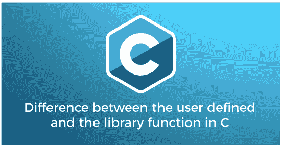

# C 语言中用户定义函数和库函数的区别

> 原文：<https://www.javatpoint.com/user-defined-vs-library-function-in-c>

本主题将讨论 C 编程语言中用户定义函数和库函数之间的区别。在进入主题之前，让我们先了解一下 C 语言中的函数。函数是一组独立的子程序，用于执行一些特定的、定义明确的任务。功能分为两部分:**用户自定义**和**库函数**。



## 用户定义的函数

顾名思义，用户定义函数是由用户编写的函数，用于编写任何程序代码和执行特定的操作。这些用户定义的函数可以根据程序员的要求进行修改和执行。程序员可以更改用户定义的函数，但是这些函数在 C 头文件中没有定义。用户定义的函数由函数声明、函数定义和函数调用组成。

### 函数定义

函数定义定义了执行程序中某些特定任务的函数的实际主体。

**语法:**

```

return_type function_name ( data_type arg1, data_type arg2, ... ) {
// define the variables
statement to be executed;
return (expr);
}

```

这里返回类型表示可以返回任何定义的数据类型值的函数。返回类型值可以是 int、float、char、double 等。，其中 function_name 表示包含多个参数的函数的名称。

### 函数调用

在定义了函数定义之后，我们需要调用程序中定义的函数来执行它的任务。然而，一个函数可以被多次调用，方法是写函数名，后跟参数列表。

**语法:**

```

function_name(arg1, arg2, ...) 

```

这里，arg1、arg2 是传递给 function_name 的实际参数。

### 函数声明

函数声明定义了函数名、返回类型和其中传递的参数。在任何 C 程序中，函数定义总是在 main()函数之外定义的。

**语法:**

```

return_type function_name (  data_type arg1, data_type arg2, ..) ;

```

### 用 C 语言自定义函数计算圆面积的程序

**c 区**

```

#include int func(int rad);
int main()
{
int r, result;

printf(" Enter the radius of a circle ");
scanf("%d", &r);
result = func(r);
printf (" The area of a circle is: %d", result);
return 0;
}
int func(int rad)
{
int area;
float pi = 3.14;
area = pi * rad * rad;
return area;
} 
```

**输出:**

```
Enter the radius of a circle: 5
The area of a circle is: 78

```

### 用 C 语言中用户定义的函数对两个数求和的程序

**Add.c**

```

#include int sum_numbers(int x, int y); // function prototype
int main()
{

int sum; // store the result
int num1, num2; // declare variables
printf(" Enter two numbers \n");
scanf("%d %d", &num1, &num2);

sum = sum_numbers(num1, num2); // function call
printf( " The addition of two numbers is %d", sum);
return 0;
}
int sum_numbers(int x, int y) // pass x and y as the parameters
{
int result;
result = x + y; //add two numbers
return result;
} 
```

**输出:**

```
Enter two numbers
5
6
The addition of two numbers is 11

```

## 库函数

c 编程语言提供了一些库函数来执行一些预定义的任务。这些函数也称为 C 头文件中的内置函数或预定义函数，其含义不能改变。当我们在任何程序上使用这些函数时，我们用适当的头文件调用函数名，因为这些函数是在头文件中定义的。换句话说，我们不需要编写完整的代码来执行特定的任务；相反，我们可以在需要时直接调用程序中的函数。例如:printf()，scanf()，getch()，等。，是预定义的库函数。

### 用 C 语言演示库函数的程序

**内置 c**

```

#include #include <conio.h>void main()
{
// use printf() function to print the statement 
printf (" Welcome to the JavaTpoint ");
printf (" \n It is a library function in the C program. ");
getch(); // It holds the console screen 
}</conio.h> 
```

**输出:**

```
Welcome to the JavaTpoint
It is a library function in the C program

```

在上面的程序中，我们使用了一个 **printf** ()和 **getch** ()内置函数，其含义或任务已经在 C 编译器中定义。因此，我们不需要编写完整的代码来使用 C 程序中的 printf()和 getch()函数。

## C 语言中用户定义函数和库函数的区别

| S.No | 用户定义的函数 | 图书馆功能 |
| 1. | 程序员根据程序的要求创建一个函数，称为用户自定义函数。 | 其原型已经在 C 库中定义的函数称为库函数。 |
| 2. | 在程序中使用用户定义的函数之前，需要编写完整的代码。 | 我们不需要编写完整的代码来在程序中使用库函数。 |
| 3. | 任何用户定义函数的名称都可以轻松更改。 | 我们不能更改或修改库函数的名称，因为这些函数的功能已经在编译器中定义了。 |
| 4. | 用户定义的函数在任何 C 程序中都不是必须使用的。 | 我们需要在每个 C 程序中使用库函数。 |
| 5. | 用户定义的函数不需要在头文件中编写任何代码。
例如:swap()函数不需要任何头文件。 | 所有库函数都是在头文件中预先定义的。
例如:printf()和 scanf()函数在 stdio.h 头文件中定义。和 strpcy()，strcmp()函数都在 string.h 头文件中定义。 |
| 6. | 用户定义的函数是程序的一部分。 | 库函数是 C 头文件的一部分。 |
| 7. | 程序员或用户在编写代码时定义函数。 | C 编译器中的开发人员预先定义了库函数。 |
| 8. | 例如:乘()，和()，除()，等。是程序中用户定义或用户创建的函数。 | 示例:printf()，sqrt()，strcpy()，等。 |

* * *