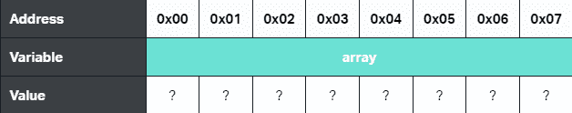
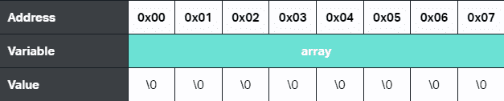

# 模因集 c

> 哎哎哎:# t0]https://www . javatppoint . com/memset-c

超过字母表的三分之一的单词，C 是一种严格编译的编程语言，它构成了当今编程世界中所有其他语言的基础。换句话说，用 C 语言编写的程序只有在编译后才能运行。c 受限于某些参数或函数，但包含一些不同的函数，用于某些特定的目的。在本文中，您将学习 C 语言中的 memset()以及与之相关的其他因素和用例。

## 什么是 memset()？

函数 memset(“**内存设置器**”)是一个标准的 C 语言库函数，它在语义上用一个值设置或填充一个内存块。

例如，假设您有一个 8 个字符的数组，在声明该数组时消耗了 8 个字节的内存，那么您的计算机会在您的系统中的可用堆上阻塞掉 8 个字节的内存。这种内存分配不是随机的。仅当像地址空间布局随机化这样的过程出于某些示例性目的或者地址在 0x00 到 0x07 范围内的十六进制分配时，随机化才发生。假设您声明了一个由 8 个字符组成的数组，如图所示。

```

char array[8];

```



最初，如果不初始化数组，您完全不知道数组占用的内存块的内容。虽然它可能什么也不是，但可能是您在以前的程序中使用过的旧值，或者内存中的块可能未定义。

一般来说，为了在使用 C 语言时跟上良好的实践，最好对任何给定程序中使用的任何内存进行完全控制。因此，您必须始终用一个已知或给定的值以及一个空字节( **\0** )来设置或填充内存，而不是让这 8 个字节的内存空着。通过这种方式，您可以确保完全控制由您定义的阵列消耗的内存块。请看下图，了解正在讨论的内容。



换句话说，你想要的只是记忆记忆的功能块。memset()采用以下参数。该函数接受三个参数，一个指向内存块的指针和一个后跟 **size_t** 的整数，后者只是一个无符号整数变量，用于保存数组的任何索引。

```

void *s, int c, size_t

```

第一个参数表示 void 类型的指针，因为存储块最初是空的或者将要被填充。类型**无效**表示指针可以引用内存，而与类型无关。

第二个参数是用指针分配填充的整数。请注意，该参数是作为整数参数接收的，当需要填充内存时，该参数将被转换为字符。这种转换确保函数只保留整数参数所需的 8 位。否则它可能会消耗比所需更多的内存。

第三个参数表示必须填充的内存块的给定大小。当指针引用内存位置来填充这个空间时，它不会告诉我们应该填充多少内存。因此，传递此参数的主要目的是确保适当的正大小，以便内存分配不会遭受内存损失。

### memset 的返回值()

memset()的默认返回值是 void *(没有返回类型的指针)。如果您希望得到您给这些函数的东西，那么您可能不会从 memset()那里得到任何东西。您可能只希望在函数转向并返回一个指针后得到一些输出，该指针与您尝试调用 memset 函数时传递的内存地址相同。

## 如何使用 memset()？

要在程序中使用 memset()，首先需要做的是在程序中包含字符串头文件，如下所示。

```

#include 
```

一旦 C 语言的字符串库包含在你的程序中，你就不再需要什么了。您可以直接轻松访问 memset 功能。为了使它更清晰和容易，考虑下面包含另外两个库如<stdio.h>和<stdlib.h>的代码片段(用于 exit 和 printf 目的)。</stdlib.h></stdio.h>

```

#include #include <stdlib.h>#include <string.h>int main(void)
{
    char memory[8];

    /* Fill the memory block with null bytes */
    memset(memory, '\0', 8);
    printf("%s\
", memory);

    /* Fill the memory block with hashes */
    memset(memory, '#', 8);
    printf("%s\
", memory);

    /* Fill the memory block with dollar signs */
    memset(memory, '/string.h>, 8);
    printf("%s\
", memory);

    return (EXIT_SUCCESS);
}</string.h></stdlib.h> 
```

## memset()是什么时候使用的？

如前所述，在用 C 语言编程时，在分配和初始化内存时严格控制和维护内存始终是最佳做法。如果不立即初始化，其他专用函数(如 strcpy)可能会开始使用。strcpy 的正确使用涉及到一种新的块内存分配方法，在实际使用字符串之前，将它的副本放在一边。因为它没有初始化，所以可能需要在实际使用 strcpy 之前先声明它。在这种情况下，memset()非常适合填充块或最初清除它们。考虑下面给出的例子，了解为什么使用 memset()。

```

#include #include <stdlib.h>#include <string.h>int main(void)
{
    char src[7] = "Source";
    char dest[7];

    /* Initialize dest with null bytes for good practice */
    memset(dest, '\0', sizeof(dest));

    /* Before copying */
    printf("String src before copy: %s\
", src);
    printf("String dest before copy: %s\
", dest);

    /* Copy src into dest */
    strcpy(dest, src);

    /* After copying */
    printf("String src after copy: %s\
", src);
    printf("String dest after copy: %s\
", dest);

    return (EXIT_SUCCESS);
}</string.h></stdlib.h> 
```

总的来说，memset()是在使用 C 和内存分配方法时需要考虑的一个很好的工具。简单来说，如果你不能初始化它，就记忆它。

## memset()的应用

到目前为止，您已经看到了特定 memset()实例的所有相关示例和用例。但是，为了更好地理解，您需要查看将作为 memset 应用程序讨论的多个示例。考虑下面描述其应用的例子。

**例 1**

```

#include #include <string.h>int main() {
    char a[] = {"Hello from JournalDev"};

    printf("a = %s\n", a);

    printf("Filling the first 5 characters a with 'H' using memset\n");

    memset(a, 'H', 5 * sizeof(char));

    printf("After memset, a = %s\n", a);

    return 0;
}</string.h> 
```

**输出:**

```
a = Hello from JournalDev
Filling the first five characters a with 'H' using memset
After memset, a = HHHHH from JournalDev

```

从前面和这个例子中可以很清楚地看到 memset()是如何处理初始化的。在上面给出的代码中，您可以看到 memset 如何与定义字符数组或字符串大小的变量一起工作。使用 memset()函数后，您会看到给定字符串中有五个重复的字符。

**例 2**

```

#include #include <string.h>int main() {
    char a[] = {"Hello from JournalDev"};

    printf("a = %s\n", a);

    printf("Filling the last 5 characters a with 'H' using memset\n");

    size_t a_len = strlen(a);

    //Using an offset of (a + a_len - 5), so that we can
    //fill the last 5 characters
    memset(a + (a_len - 5), 'H', 5 * sizeof(char));

    printf("After memset, a = %s\n", a);

    return 0;
}</string.h> 
```

**输出:**

```
a = Hello from JournalDev
Filling the last five characters a with 'H' using memset
After memset, a = Hello from JournHHHHH

```

这个例子类似于上一个带有吸引人的钩子的例子。了解相同程序在 memset()的不同使用技术下的变化很重要。在上面的示例中，您可以看到只有偏移位置被填充。在这个例子中，唯一的区别是最后五个字符用 H 填充，因为您可以看到内存位置或地址初始化已经完成。

## Memset() vs calloc() vs 天真迭代

有时，您可以选择使用 memset()将数组初始化为零。通常，其他函数存在一些性能问题，比如简单方法或使用 calloc()函数。还有一些速度问题和内存分配技术很难理解和实现。要了解 memset 如何解决这类问题，请参见下面的示例代码，了解为什么 memset()有利于使用，以及 memset()和 calloc()如何使用<time.h>头文件在 Linux 机器上运行。</time.h>

```

#include 
#include <stdlib.h>
#include <string.h>
#include <time.h>

void* init_with_memset(int* arr, size_t num_locations) {
    // Perform zero initialization with memset
    // on an integer array
    return memset(arr, 0, num_locations * sizeof(int)); 
}

void* init_with_calloc(int* arr, size_t num_locations) {
    arr = calloc(num_locations, sizeof(int));
    return arr;
}

void* init_with_iteration(int* arr, size_t num_locations) {
    // Naive unoptimized iteration using array indexing
    for (int i=0; i<num_locations i="" arr="" return="" int="" main="" set="" the="" array="" to="" initially="" for="" clock_t="" start_time="" end_time="" double="" total_time="" locations="" init_with_memset="" clocks_per_sec="" printf="" memset="" seconds="" init_with_calloc="" calloc="" init_with_iteration="" naive="" iteration="%.6f"></num_locations></time.h></string.h></stdlib.h>
```

**输出:**

```
Time for memset() = 0.000002 seconds
Time for calloc() = 0.000005 seconds
Time for naive iteration = 0.000006 seconds

```

在上面的例子中，您可以很容易地观察和理解 memset()的速度是本机迭代和 calloc()的三倍。它之所以这么快，是因为它已经基于 C 编译器提供的架构进行了优化，速度会自动提升。

## 结论

正如人们常说的，当你不初始化的时候，记得设置它。这句谚语通常谈论 memset 相对于其他方法(如 calloc()或本机迭代)的优势。在本文中，您看到了如何在空间空闲或未使用时初始化数组时处理此类问题。您在本文中发现的问题和解决方案告诉您，在使用像 c 这样的编程语言处理内存分配时，memset 如何成为一个重要的方面。

* * *