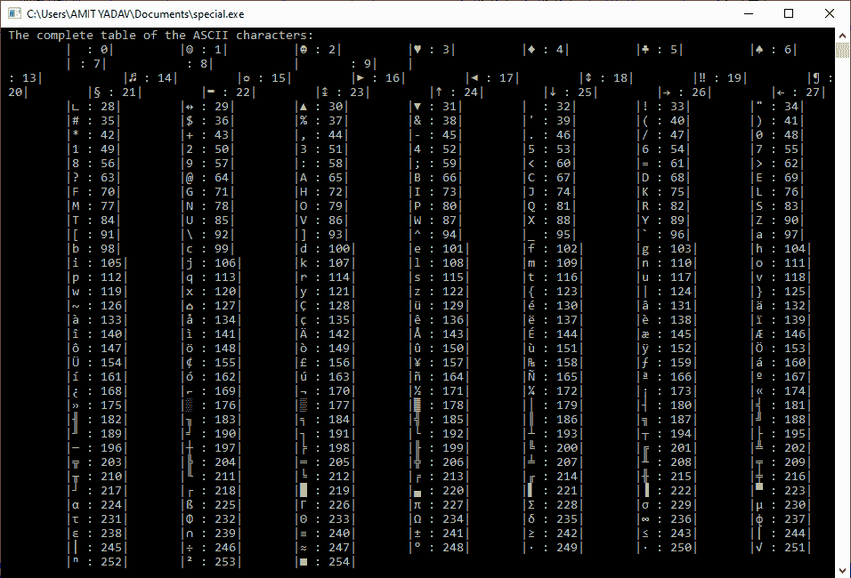

# 中的 ASCII 表

> 原文：<https://www.javatpoint.com/ascii-table-in-c>

本主题将讨论 ASCII 码以及如何用 C 编程语言编写程序来打印 ASCII 表。ASCII 代表**美国信息交换标准代码**。ASCII 码是一种字符编码方案，用于定义计算机和其他电子设备中交换信息的基本字符元素的值。


此外，ASCII 码是字符集 255 个符号的集合，分为两部分，标准 ASCII 码和扩展 ASCII 码。标准 ASCII 码从 0 到 127，7 位长，扩展 ASCII 码从 128 到 255，8 位长。这些字符是符号字母(大写和小写(a-z，AZ)，数字(0-9)，特殊字符(！、@、#、$，等等。)，标点符号和控制字符。因此，我们可以说，每个字符都有自己的 ASCII 值。

例如，当我们输入一个字符串作为“HELLO”时，计算机不会直接存储我们输入的字符串。相反，系统将字符串存储在它们的等效 ASCII 值中，如“7269767679”。H 的 ASCII 值是 72，E 是 69，L 是 76，O 是 79。

### 获取大写字母的 ASCII 值的程序

**程序代码**

```

#include int main()
{
	// declare local variable
	int caps;
	// use for loop to print the capital letter from A to Z
	for ( caps = 65; caps < 91; caps++)
	{
		printf (" \n The ASCII value of %c is %d ", caps, caps);
	}
	return 0;
} 
```

**输出**

```
The ASCII value of A is 65
 The ASCII value of B is 66
 The ASCII value of C is 67
 The ASCII value of D is 68
 The ASCII value of E is 69
 The ASCII value of F is 70
 The ASCII value of G is 71
 The ASCII value of H is 72
 The ASCII value of I is 73
 The ASCII value of J is 74
 The ASCII value of K is 75
 The ASCII value of L is 76
 The ASCII value of M is 77
 The ASCII value of N is 78
 The ASCII value of O is 79
 The ASCII value of P is 80
 The ASCII value of Q is 81
 The ASCII value of R is 82
 The ASCII value of S is 83
 The ASCII value of T is 84
 The ASCII value of U is 85
 The ASCII value of V is 86
 The ASCII value of W is 87
 The ASCII value of X is 88
 The ASCII value of Y is 89
 The ASCII value of Z is 90

```

### 程序获取小写字母的 ASCII 值

**程序 2.c**

```

#include int main()
{
	// declare local variable
	int small;
	// use for loop to print the small alphabets letter from a to z
	for ( small = 97; small < 123; small++)
	{
		// display ASCII values to its equivalent characters
		printf (" \n The ASCII value of %c is %d ", small, small);
	}
	return 0;	
} 
```

**输出**

```
The ASCII value of a is 97
 The ASCII value of b is 98
 The ASCII value of c is 99
 The ASCII value of d is 100
 The ASCII value of e is 101
 The ASCII value of f is 102
 The ASCII value of g is 103
 The ASCII value of h is 104
 The ASCII value of i is 105
 The ASCII value of j is 106
 The ASCII value of k is 107
 The ASCII value of l is 108
 The ASCII value of m is 109
 The ASCII value of n is 110
 The ASCII value of o is 111
 The ASCII value of p is 112
 The ASCII value of q is 113
 The ASCII value of r is 114
 The ASCII value of s is 115
 The ASCII value of t is 116
 The ASCII value of u is 117
 The ASCII value of v is 118
 The ASCII value of w is 119
 The ASCII value of x is 120
 The ASCII value of y is 121
 The ASCII value of z is 122

```

### 程序获取给定字符的 ASCII 值

**程序 3.c**

```

#include int main()
{

	char arr[30]; // declare the size of character array
	int count = 0; // declare a count variable

	// enter any name to get the ascii codes
	printf (" \n Enter the name to get the ASCII codes: ");
	scanf (" %s", &arr);

	// use while loop to sequentially iterate every characters of the array 
	while (arr[count] != '\0')
	{
		// display the character name one by one 
		printf (" \n The ascii code of the character %c is %d ", arr[count], arr[count]);
		count++; // increment one by one
		}	
		return 0;
} 
```

**输出**

```
Enter the name to get the ASCII codes: JAVATPOINT

 The ASCII code of the character J is 74
 The ASCII code of the character A is 65
 The ASCII code of the character V is 86
 The ASCII code of the character A is 65
 The ASCII code of the character T is 84
 The ASCII code of the character P is 80
 The ASCII code of the character O is 79
 The ASCII code of the character I is 73
 The ASCII code of the character N is 78
 The ASCII code of the character T is 84

```

### 程序获取特殊字符的 ASCII 值

**程序 4.c**

```

#include int main()
{
	// declare a variable
	int specialCh;

	for (specialCh = 33; specialCh < 48; specialCh++)
	{
		printf (" \n The ASCII value of '%c' special character is: %d", specialCh, specialCh);

	}

	for (specialCh = 58; specialCh < 65; specialCh++)
	{
		printf (" \n The ASCII value of '%c' special character is: %d", specialCh, specialCh);

	}

	for (specialCh = 123; specialCh < 127; specialCh++)
	{
		printf (" \n The ASCII value of '%c' special character is: %d", specialCh, specialCh);

	}
	return 0;
} 
```

**输出**

```
The ASCII value of '!' special character is: 33
 The ASCII value of '"' special character is: 34
 The ASCII value of '#' special character is: 35
 The ASCII value of '$' special character is: 36
 The ASCII value of '%' special character is: 37
 The ASCII value of '&' special character is: 38
 The ASCII value of ''' special character is: 39
 The ASCII value of '(' special character is: 40
 The ASCII value of ')' special character is: 41
 The ASCII value of '*' special character is: 42
 The ASCII value of '+' special character is: 43
 The ASCII value of ',' special character is: 44
 The ASCII value of '-' special character is: 45
 The ASCII value of '.' special character is: 46
 The ASCII value of '/' special character is: 47
 The ASCII value of ':' special character is: 58
 The ASCII value of ';' special character is: 59
 The ASCII value of '' special character is: 62
 The ASCII value of '?' special character is: 63
 The ASCII value of '@' special character is: 64
 The ASCII value of '{' special character is: 123
 The ASCII value of '|' special character is: 124
 The ASCII value of '}' special character is: 125
 The ASCII value of '~' special character is: 126

```

### 用 C 语言打印完整的 ASCII 表的程序

**程序 6.c**

```

#include int main()
{
	// declare a variable
	int asciTable;
	printf (" The complete ASCII table of the characters in the C ");
	for (asciTable = 0; asciTable < 255; asciTable++)
	{
		printf (" \n The value of '%c' character is: %d", asciTable, asciTable);

	}
	return 0;
} 
```

**输出**



* * *